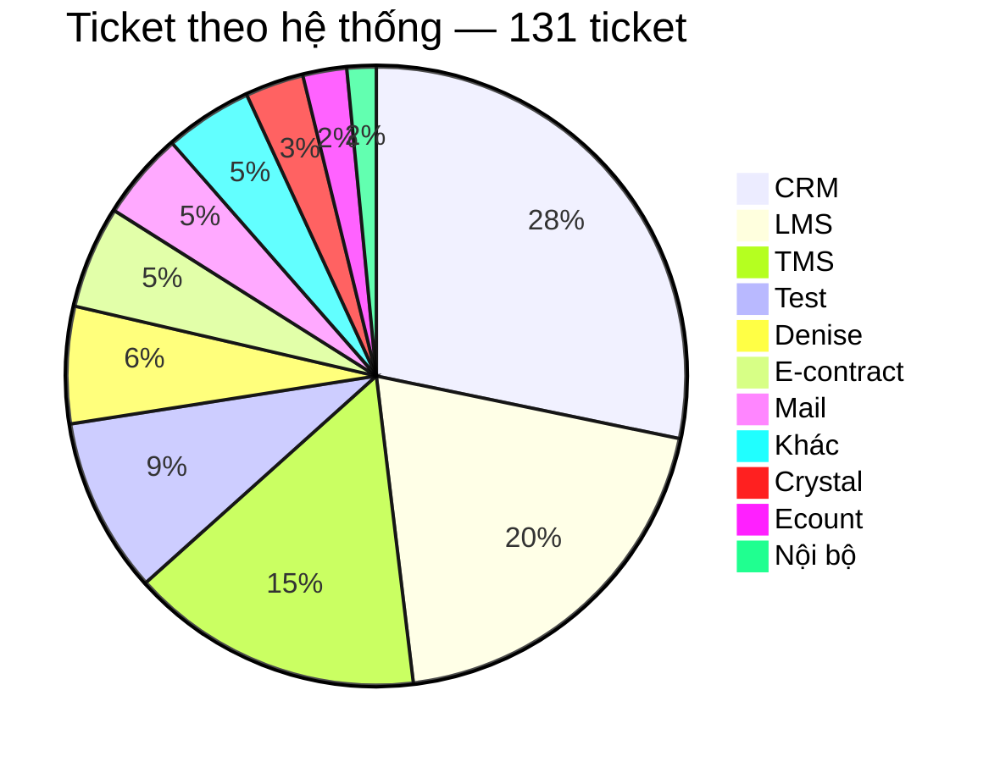
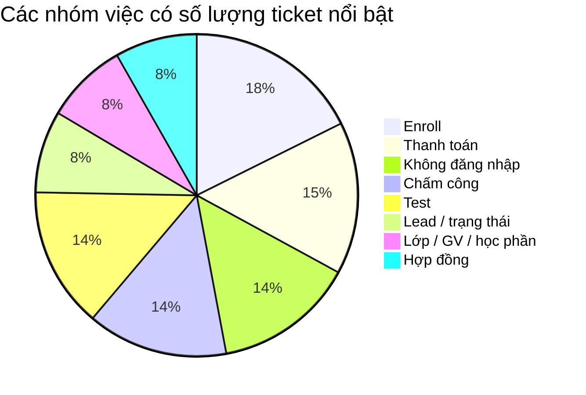
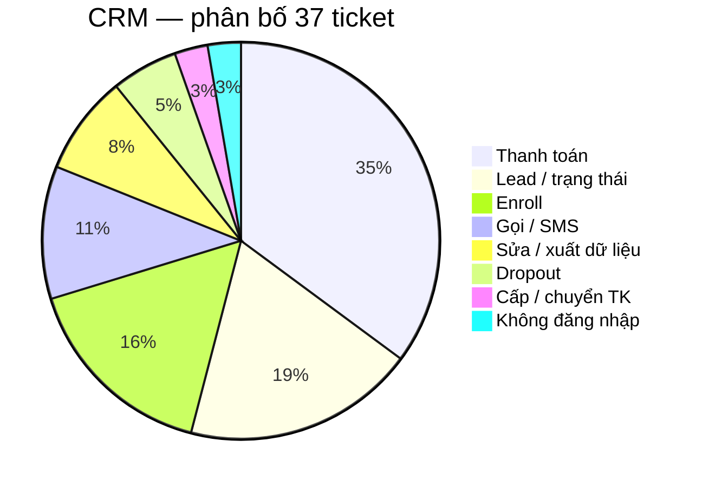
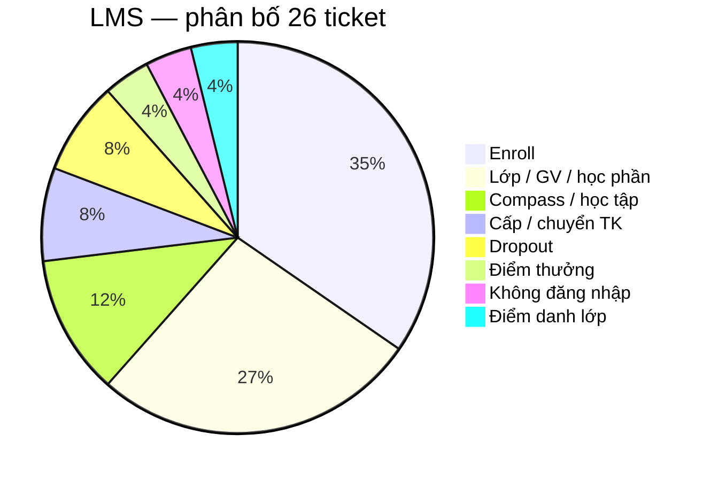
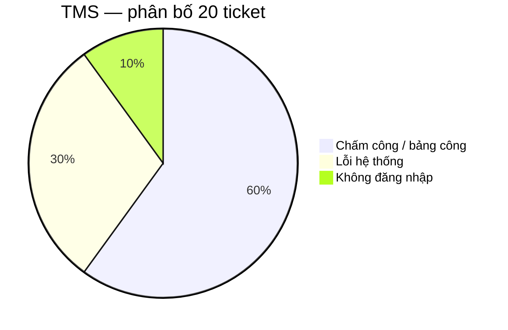
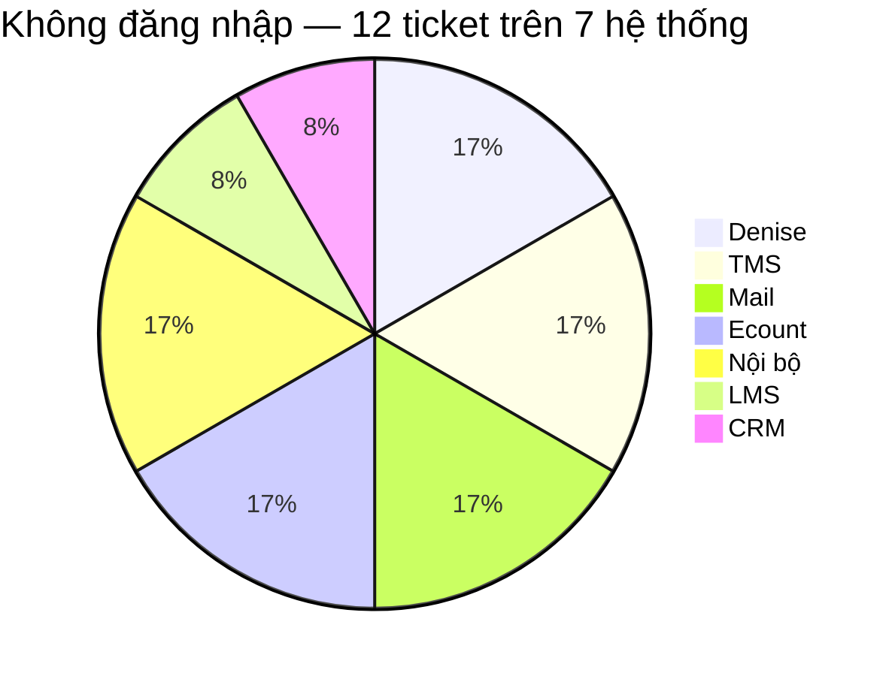
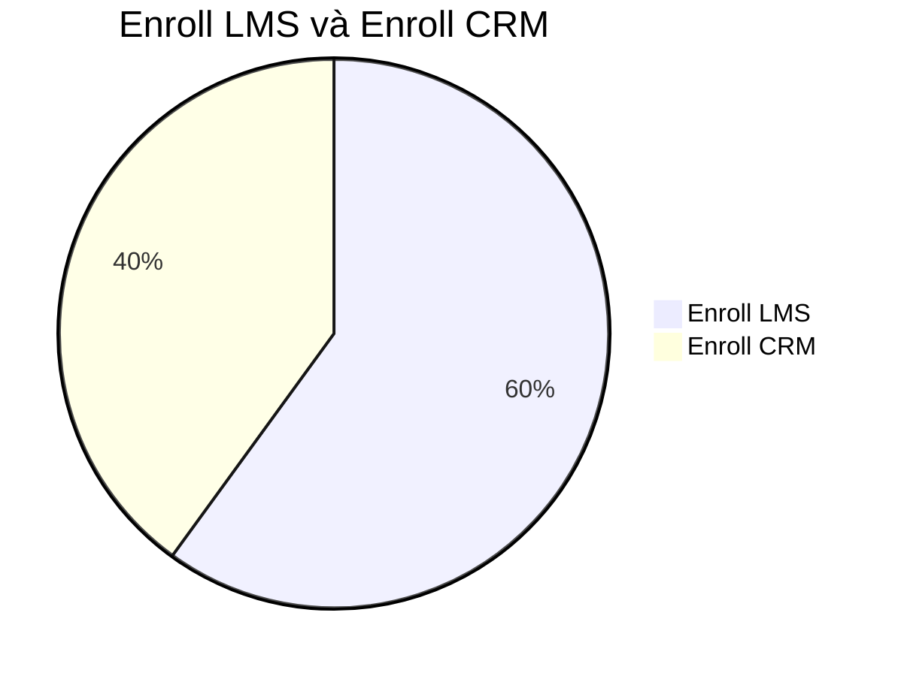
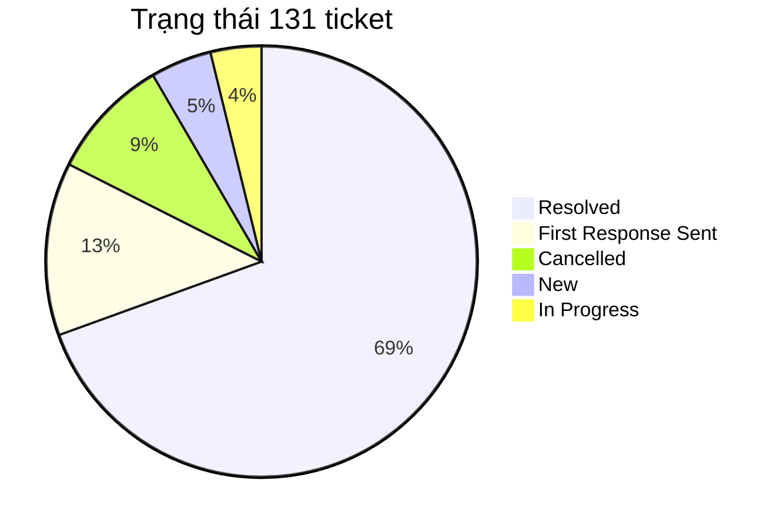
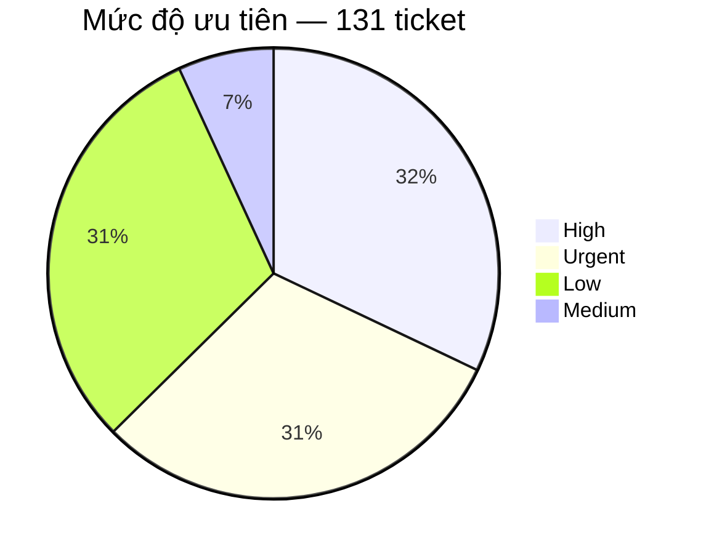

# BÁO CÁO PHÂN TÍCH TICKET — TECHNICAL SUPPORT

**Nguồn dữ liệu:** Helpdesk export `sample.xlsx` — Plan tuần 5  
**Bản dữ liệu dùng để phân tích:** `sample-tickets.csv`  
**Phạm vi:** 131 ticket Technical Support.

## 1. Mục tiêu

Báo cáo trả lời bốn câu hỏi:

- Ticket đang tập trung ở đâu?
- Trong các khu vực đó, người dùng thực sự đang gặp loại vấn đề nào?
- Support đang phải xử lý theo kiểu nào: hướng dẫn, xin quyền, điều tra lỗi, chuyển bộ phận hay thao tác lặp lại?
- Với từng kiểu vấn đề, hướng cải thiện nào hợp lý và cần đo thêm gì trước khi kết luận?

## 2. Bức tranh tổng thể: ticket đang tập trung ở đâu?

CRM, LMS và TMS có tổng cộng 83/131 ticket, chiếm 63,4% toàn bộ dữ liệu. Trong đó CRM có 37 ticket, LMS 26 và TMS 20.

Số lượng ticket cao không đồng nghĩa hệ thống đó có tỷ lệ lỗi cao. Dữ liệu hiện tại không có số người dùng của từng hệ thống, nên chưa thể tính số ticket trên mỗi người dùng. Một hệ thống có nhiều ticket có thể do lượng người dùng lớn, nghiệp vụ phức tạp, quyền hạn khó xử lý, người dùng chưa biết thao tác hoặc hệ thống thực sự lỗi.

## 3. Ticket đang tập trung vào loại công việc nào?

Các nhóm có số lượng nổi bật nhất là Enroll 15 (LMS 9, CRM 6), Thanh toán 13, Không đăng nhập 12, Chấm công 12 và Test 12.

13 ticket thanh toán đều trên CRM.

## 4. Phân tích ba hệ thống có nhiều ticket nhất

### 4.1. CRM — 37 ticket

Ba nhóm lớn nhất trên CRM là Thanh toán 13, Lead/trạng thái 7 và Enroll 6. Tổng cộng ba nhóm này có 26/37 ticket, chiếm 70,3% ticket CRM.

#### 4.1.1. Thanh toán — 13 ticket

Thanh toán là nhóm lớn nhất của CRM, chiếm 35,1% ticket CRM.

Các ticket không phải cùng một lỗi mà gồm nhiều loại yêu cầu: tạo QR, add/gỡ payment, hủy hoặc confirm giao dịch, cập nhật trạng thái đóng tiền, hóa đơn và mã giảm giá.

13 ticket payment là một nghiệp vụ tạo ra nhiều yêu cầu support, chưa chứng minh CRM có một lỗi payment lặp lại 13 lần.

Nguyên nhân có thể là: chưa biết thao tác; không có quyền; dữ liệu/CRM lỗi; hoặc nghiệp vụ bắt buộc người kiểm soát. File không có log xử lý nên chưa biết tỷ trọng từng loại.

Dữ liệu cần bổ sung: nguyên nhân cuối cùng → người/bộ phận xử lý → thao tác đã thực hiện → có phải hỏi thêm thông tin không → thời gian xử lý → kết quả.

#### 4.1.2. Lead / trạng thái — 7 ticket

Nhóm này chiếm gần 19% ticket CRM.

Cần tiếp tục tách xem ticket chủ yếu là yêu cầu đổi trạng thái, dữ liệu lead sai, không thao tác được, lỗi khi xử lý lead hay cần người có quyền cao hơn.

#### 4.1.3. Enroll trên CRM — 6 ticket

CRM có 6 ticket enroll. Nội dung chủ yếu liên quan đến enrollment hoặc chỉnh sửa thông tin trên enrollment.

### 4.2. LMS — 26 ticket

Hai nhóm lớn nhất là Enroll 9 và Lớp/GV/học phần 7, tổng cộng 16/26 ticket, chiếm 61,5% ticket LMS.

#### 4.2.1. Enroll trên LMS — 9 ticket

Các tình huống gồm thêm học viên, không tìm thấy lớp hoặc slot, enroll trùng và lỗi trong quá trình enroll.

Chỉ dựa trên Subject chưa thể biết root cause. Có ít nhất bốn khả năng: thao tác chưa đúng; dữ liệu học viên/lớp thiếu hoặc sai; tài khoản không đủ quyền; LMS lỗi.

File không ghi đã có guide hay chưa. Nếu chưa có thì viết bài enroll LMS. Nếu đã có mà ticket vẫn vào: user có tìm thấy bài không, bài còn đúng không, hay thực chất là quyền/lỗi hệ thống.

#### 4.2.2. Lớp / giáo viên / học phần — 7 ticket

Nhóm này gồm các yêu cầu như không thêm được giáo viên, điều chỉnh lớp hoặc lỗi liên quan đến học phần.

Cần tách: yêu cầu cần người có quyền chỉnh lớp/GV/học phần, hoặc chức năng lỗi. Loại sau ghi thao tác, dữ liệu đầu vào, ảnh lỗi và phạm vi ảnh hưởng rồi chuyển Dev.

### 4.3. TMS — 20 ticket

Có 18/20 ticket TMS, tương đương 90%, nằm ở chấm công hoặc lỗi hệ thống.

#### 4.3.1. Chấm công / bảng công — 12 ticket

Các triệu chứng gồm không hiển thị công, không duyệt được công, cần bù công, đi đúng ca nhưng hệ thống báo trễ và các vấn đề điểm danh/chấm công giáo viên.

Cần tách theo triệu chứng: không có dữ liệu → dữ liệu sai → không duyệt được → ghi nhận sai thời gian → vấn đề khác. Phạm vi: một người → một ca → một cơ sở → nhiều cơ sở.

Ticket TMS nên có thêm: cơ sở → thời điểm → ca làm việc → người bị ảnh hưởng → số người cùng gặp → triệu chứng → ảnh lỗi.

#### 4.3.2. Lỗi hệ thống — 6 ticket

Có 6 ticket mô tả mất dữ liệu, không hiển thị thông tin hoặc không thao tác được.

Đáng chú ý, ticket 233 và 234 cùng liên quan đến Tỉnh Nam 2, có triệu chứng tương tự và cùng nhắc đến lỗi từ ngày 31. Chưa đủ để khẳng định cùng root cause; so sánh hệ thống + khu vực + thời gian + triệu chứng rồi liên kết điều tra.

## 5. Pattern support xuất hiện trên nhiều hệ thống

### 5.1. Không đăng nhập / tài khoản — 12 ticket trên 7 hệ thống

Không có hệ thống nào chiếm phần lớn nhóm login. Chuỗi xử lý lặp: xác định user → kiểm tra trạng thái nhân sự → kiểm tra trạng thái tài khoản → xác định nguyên nhân → reset/mở khóa nếu đủ điều kiện → phản hồi.

Workflow hiện tại không cover hết 12 phiếu; chỉ phần nằm trong hệ thống tool truy cập được. Cần đo: tổng ticket vào workflow; xử lý hoàn toàn; chỉ hỗ trợ kiểm tra; không xử lý được; lý do; thời gian trước và sau.

### 5.2. Enroll LMS — 9 ticket; Enroll CRM — 6 ticket

**Enroll LMS (9):** thêm học viên, không tìm thấy lớp hoặc slot, enroll trùng, lỗi enroll.

**Enroll CRM (6):** thao tác enrollment, chỉnh sửa thông tin trên enrollment.

## 6. Ticket chậm, nhiều user, tính năng / deadline

### 6.1. Hệ thống chậm / timeout / tải lâu

File không có nhiều ticket loại “LMS chậm”, chưa thống kê thành nhóm lớn. Khi gặp loại này, hỏi:

- Một người hay nhiều người cùng gặp?
- Một cơ sở hay nhiều cơ sở?
- Khung giờ nào?
- Đã thử máy khác, mạng khác, trình duyệt khác chưa?
- Chậm ở bước nào: mở trang, tải file/video, lưu hay submit?
- Có thay đổi mạng, firewall hoặc release gần thời điểm đó không?

Phạm vi:

- Một user → môi trường người dùng trước.
- Nhiều user cùng cơ sở → mạng/cơ sở và dữ liệu chung.
- Nhiều cơ sở cùng thời điểm → hệ thống/server/CDN.

### 6.2. Nhiều người cùng triệu chứng

So sánh: hệ thống + khu vực + thời gian + triệu chứng + số người bị ảnh hưởng.

Trùng các yếu tố trên → một incident chính, liên kết các ticket liên quan.

### 6.3. Tính năng mới và yêu cầu có hạn chót

Tính năng mới: ghi nhận nhu cầu, người quyết định, không tự hứa thời gian release.

Yêu cầu có deadline: thời hạn thực tế, phạm vi ảnh hưởng, người có quyền xử lý.

## 7. Trạng thái và priority nói được gì — và chưa nói được gì?

### 7.1. Trạng thái

Có 91/131 ticket Resolved, tương đương 69,5%. Phần lớn ticket trong export đã đóng; chưa đủ để đánh giá tốc độ xử lý.

Cần thêm: thời gian Created → First Response, thời gian đến Resolved, SLA, reopen, assignee, số người/cơ sở bị ảnh hưởng.

### 7.2. Priority

High + Urgent có 82/131 ticket, chiếm 62,6%. Chưa kết luận đây là sự cố nghiêm trọng. Cần biết priority gán theo số người bị ảnh hưởng, nghiệp vụ, deadline hay người tạo tự chọn.

## 8. Hướng xử lý theo từng hệ thống

| Hệ thống | Việc | Số | Ticket đang gặp | Cần tách / chưa biết | Form | Tài liệu / auto-reply | Auto khác | Không auto | Việc tiếp / đo |
| --- | --- | ---: | --- | --- | --- | --- | --- | --- | --- |
| CRM | Thanh toán | 13 | Tạo QR; add/gỡ payment; hủy hoặc confirm giao dịch; cập nhật trạng thái đóng tiền; hóa đơn; mã giảm giá. 13 phiếu = một nghiệp vụ, chưa phải 13 lần cùng một lỗi CRM. | Tỷ trọng: chưa biết thao tác / thiếu quyền / thiếu field / CRM lỗi / bắt buộc người kiểm soát. File không có log xử lý. | Bắt buộc trước khi mở phiếu: mã lead, số tiền, việc cần làm (tạo QR / add-gỡ / hủy-confirm / đóng tiền / hóa đơn / mã giảm giá), thao tác đã thử. Thiếu field thì chưa mở phiếu. | Chưa có bài payment CRM và user tự làm được bước đó → viết bài payment CRM (QR, add/gỡ, hủy-confirm, đóng tiền, hóa đơn, mã giảm giá). Đã có bài mà ticket vẫn vào → bài có tìm thấy không, còn khớp thao tác hiện tại không, hay thực chất thiếu quyền / lỗi CRM. Chỉ khó tìm → auto-reply + gắn file payment CRM. Đo bằng số phiếu user tự xong sau khi nhận tài liệu. | Auto chuyển kế toán khi phiếu đủ field và việc thuộc kế toán. | Không auto sửa số tiền, trạng thái đóng tiền, hay bản ghi payment. | Ghi từng phiếu: nguyên nhân cuối, người xử lý, thao tác đã làm, có hỏi thêm không, thời gian, kết quả. Có tỷ trọng rồi mới tính workflow ghi dữ liệu. |
| CRM | Lead / trạng thái | 7 | Đổi trạng thái lead; dữ liệu lead sai; không thao tác được trên lead. | Thiếu thông tin đầu vào, thiếu quyền, hay lỗi CRM khi xử lý lead. | Bắt buộc: mã lead, trạng thái hiện tại, trạng thái mong muốn, lý do đổi. Thiếu field thì chưa mở phiếu. | Chưa có bài đổi trạng thái lead CRM và user tự làm được → viết bài lead CRM. Đã có bài mà ticket vẫn vào → bài có tìm thấy không, còn đúng không, hay thiếu quyền. Chỉ khó tìm → auto-reply + gắn file lead CRM. Đo bằng số phiếu user tự xong sau khi nhận tài liệu. | Auto chuyển người có quyền đổi trạng thái khi phiếu đủ field. | Không auto đổi trạng thái lead. | Ghi tỷ trọng: thao tác / quyền / lỗi. |
| CRM | Enroll | 6 | Thao tác enrollment trên CRM; chỉnh sửa thông tin trên enrollment. | Bước nào support đang làm tay lặp lại; thiếu field hay thiếu quyền. | Bắt buộc: mã enrollment / lead, trường cần sửa, giá trị hiện tại / mong muốn. Thiếu field thì chưa mở phiếu. | Chưa có bài enrollment CRM và user tự sửa được → viết bài enroll CRM. Đã có bài mà ticket vẫn vào → bài có tìm thấy không, còn đúng không. Chỉ khó tìm → auto-reply + gắn file enroll CRM. Đo bằng số phiếu user tự xong sau khi nhận tài liệu. | — | Không auto ghi enrollment CRM trong tuần 5. | Workflow enroll CRM: sau này, khi có API và field đủ. |
| LMS | Enroll | 9 | Thêm học viên; không tìm thấy lớp hoặc slot; enroll trùng; lỗi trong quá trình enroll. | Thao tác chưa đúng / dữ liệu HV-lớp thiếu hoặc sai / không đủ quyền / LMS lỗi. File không ghi đã có guide hay chưa. | Bắt buộc: mã lớp, tên HV, SĐT, thao tác đã thử. Thiếu field thì chưa mở phiếu. | Chưa có bài enroll LMS và user tự enroll được → viết bài enroll LMS (add HV, tìm lớp/slot, enroll trùng). Đã có bài mà ticket vẫn vào → user có tìm thấy bài không, bài còn đúng giao diện hiện tại không, hay thực chất là quyền / lỗi LMS. Chỉ khó tìm → auto-reply + gắn file enroll LMS. Đo bằng số phiếu user tự xong sau khi nhận tài liệu. | — | Không auto ghi enroll LMS trong tuần 5. | Workflow enroll LMS: sau này, khi có API LMS và field đủ. |
| LMS | Lớp / GV / học phần | 7 | Không thêm được giáo viên; điều chỉnh lớp; lỗi học phần. | Yêu cầu cần người có quyền chỉnh lớp/GV/học phần, hay chức năng lỗi. | Bắt buộc: mã lớp / học phần, việc cần làm, ảnh lỗi nếu không thao tác được. Thiếu field thì chưa mở phiếu. | Chưa có bài chỉnh lớp/GV/học phần LMS và user tự làm được → viết bài lớp-GV-học phần LMS. Đã có bài mà ticket vẫn vào → bài có tìm thấy không, còn đúng không, hay thiếu quyền / lỗi chức năng. Chỉ khó tìm → auto-reply + gắn file lớp LMS. Đo bằng số phiếu user tự xong sau khi nhận tài liệu. | Auto chuyển người có quyền nếu là nghiệp vụ. | Không auto sửa lớp/GV/học phần. | Lỗi chức năng: ghi thao tác, dữ liệu đầu vào, ảnh lỗi, phạm vi ảnh hưởng → Dev. |
| TMS | Chấm công | 12 | Không hiển thị công; không duyệt được công; cần bù công; đi đúng ca nhưng hệ thống báo trễ; điểm danh / chấm công giáo viên. | Triệu chứng: không có dữ liệu / dữ liệu sai / không duyệt được / ghi nhận sai thời gian. Phạm vi: một người / một ca / một cơ sở / nhiều cơ sở. Root cause chưa có. | Bắt buộc: cơ sở, thời điểm, ca làm việc, người bị ảnh hưởng, số người cùng gặp, triệu chứng, ảnh lỗi. Thiếu field thì chưa mở phiếu. | Chưa có bài duyệt/xem công TMS và user tự làm được bước đó → viết bài chấm công TMS. Đã có bài mà ticket vẫn vào → bài có tìm thấy không, còn đúng không, hay dữ liệu/hệ thống lỗi. Chỉ khó tìm → auto-reply + gắn file chấm công TMS. Đo bằng số phiếu user tự xong sau khi nhận tài liệu. | Auto gắn / gợi ý các phiếu cùng cơ sở + thời điểm + triệu chứng. | Không auto sửa bảng công. | Người xác nhận incident. Ghi nguyên nhân từng cụm phiếu. |
| TMS | Lỗi hệ thống | 6 | Mất dữ liệu; không hiển thị thông tin; không thao tác được. Ticket 233 và 234 cùng Tỉnh Nam 2, triệu chứng tương tự, cùng nhắc lỗi từ ngày 31. | Cùng root cause hay không. Chưa đủ dữ liệu để khẳng định. | Bắt buộc: cơ sở, thời điểm, triệu chứng, số người bị ảnh hưởng, ảnh lỗi. Thiếu field thì chưa mở phiếu. | Không lấy bài hướng dẫn thao tác làm hướng chính. | Auto gom phiếu trùng hệ thống + khu vực + thời gian + triệu chứng (ví dụ cụm Nam 2). | Không để máy tự kết luận cùng root cause. | Support xác nhận incident rồi liên kết điều tra. |
| Denise, TMS, Mail, Ecount, Nội bộ, LMS, CRM | Không đăng nhập / khóa / quên mật khẩu | 12 | 12 phiếu trên 7 hệ thống (Denise 2, TMS 2, Mail 2, Ecount 2, Nội bộ 2, LMS 1, CRM 1). Không hệ thống nào chiếm phần lớn. Chuỗi: xác định user → trạng thái nhân sự → trạng thái tài khoản → nguyên nhân → reset/mở khóa nếu đủ điều kiện → phản hồi. | Workflow đang cover được bao nhiêu hệ thống trong 7 hệ thống trên. | Bắt buộc: hệ thống, user/email, triệu chứng (quên mật khẩu / khóa / không vào được). Thiếu field thì chưa mở phiếu. | Chưa có bài đăng nhập từng hệ thống và user tự làm được bước không cần reset → viết bài đúng hệ thống đó. Đã có bài mà ticket vẫn vào → bài có tìm thấy không, còn đúng không. Chỉ khó tìm → auto-reply + gắn file đúng hệ thống. Đo bằng số phiếu user tự xong sau khi nhận tài liệu. Phần còn lại vào workflow. | **Đã triển khai** workflow login (tuần 5). Chỉ chạy trên hệ thống tool truy cập được. | Không giả định 12 phiếu đều vào được workflow. | Đo: số phiếu vào workflow; xử lý hết; chỉ hỗ trợ kiểm tra; không xử lý được + lý do; thời gian trước/sau. |

## 9. Kết luận

Phân tích 131 ticket cho thấy khối lượng support tập trung chủ yếu tại CRM, LMS và TMS, với tổng cộng 83 ticket, chiếm 63,4%.

Trên CRM, Payment là nhóm lớn nhất nhưng gồm nhiều loại yêu cầu nghiệp vụ và chưa có dữ liệu root cause. Có thể auto-reply, form và chuyển kế toán. Chưa auto sửa payment trong tuần 5.

Trên LMS, ticket tập trung vào Enroll (9) và quản lý lớp/giáo viên/học phần (7).

Trên TMS, 90% ticket nằm ở chấm công hoặc lỗi hệ thống. Các ticket có cùng thời gian, khu vực và triệu chứng cần kiểm tra theo hướng incident chung.

Login không phải nhóm đông nhất; tuần 5 làm workflow login trước. Đánh giá theo tỷ lệ xử lý hoàn toàn, tỷ lệ vẫn cần support và thời gian thực tế.

Hướng ưu tiên:

- Đo hiệu quả workflow login đã triển khai.
- Payment / Enroll / Lead: form, auto-reply, chuyển đội khi phù hợp; workflow ghi dữ liệu làm sau.
- TMS: auto gợi ý ticket cùng triệu chứng; người xác nhận incident.
