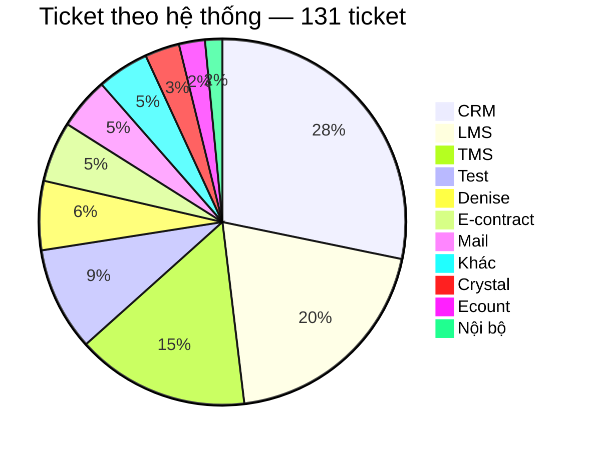
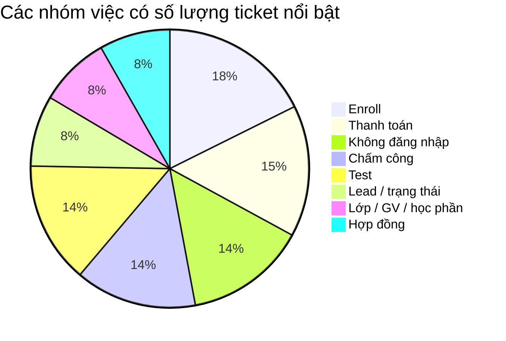
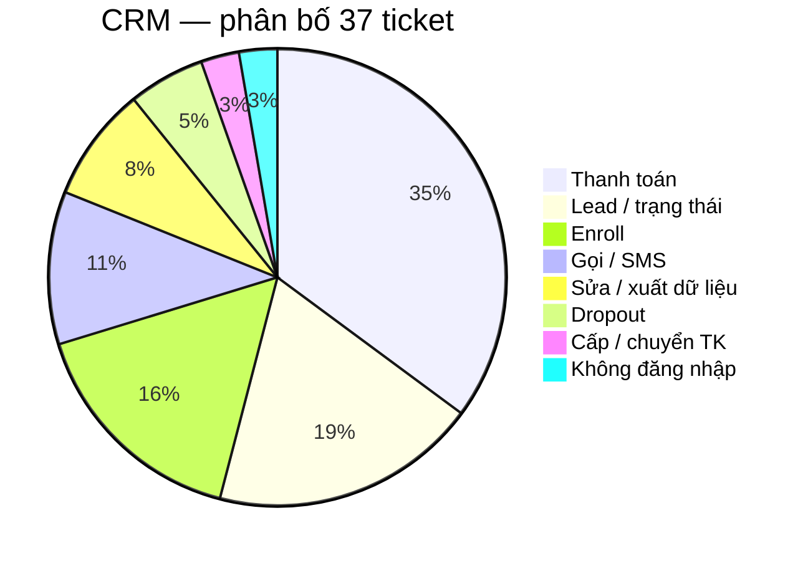
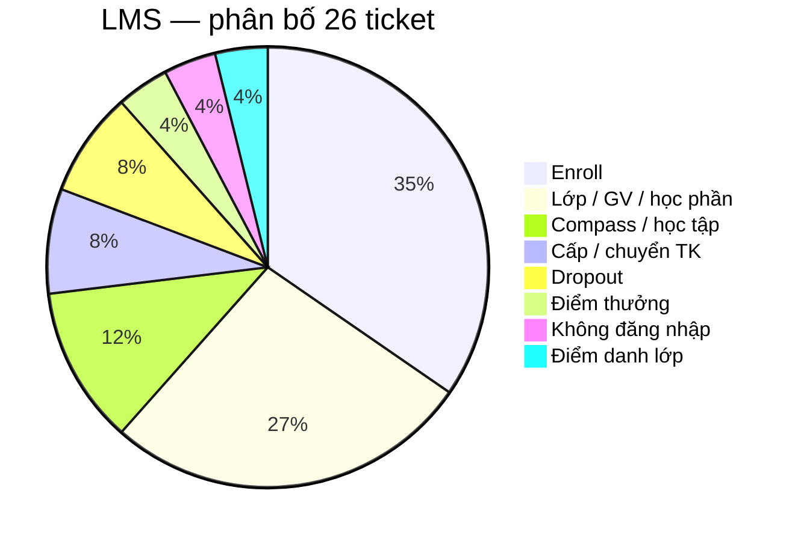
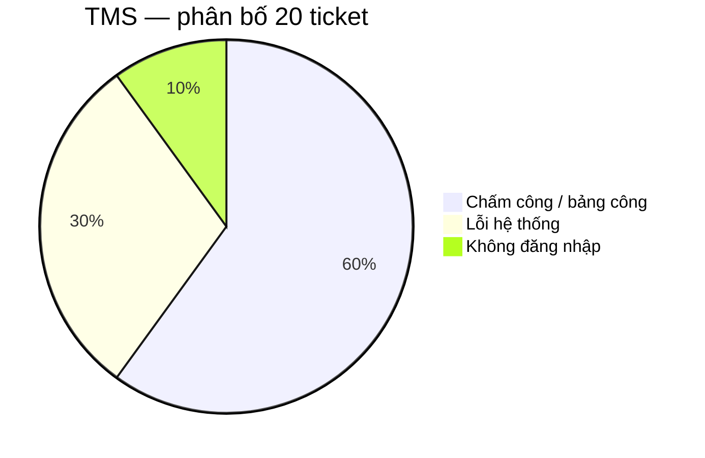
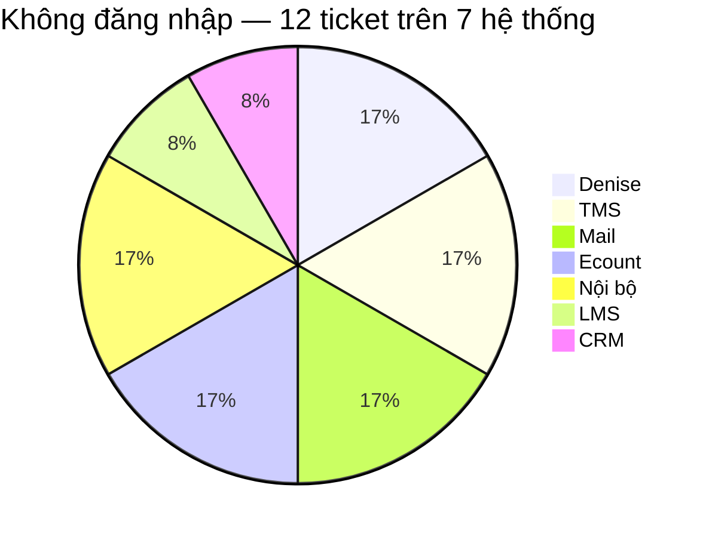
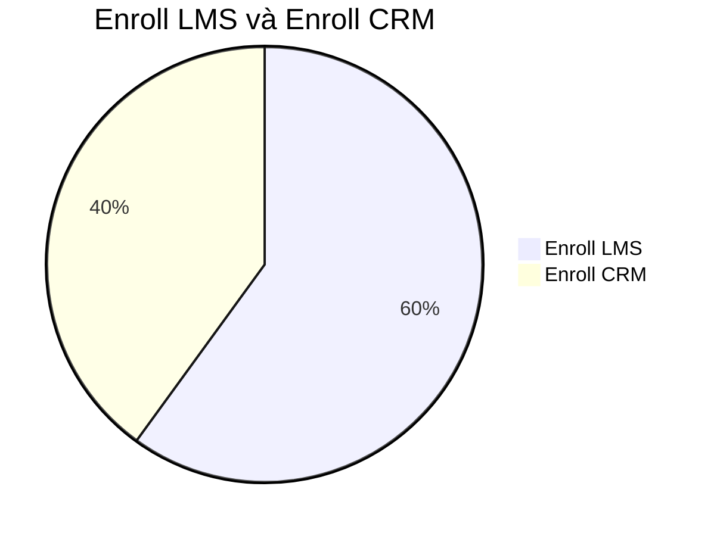
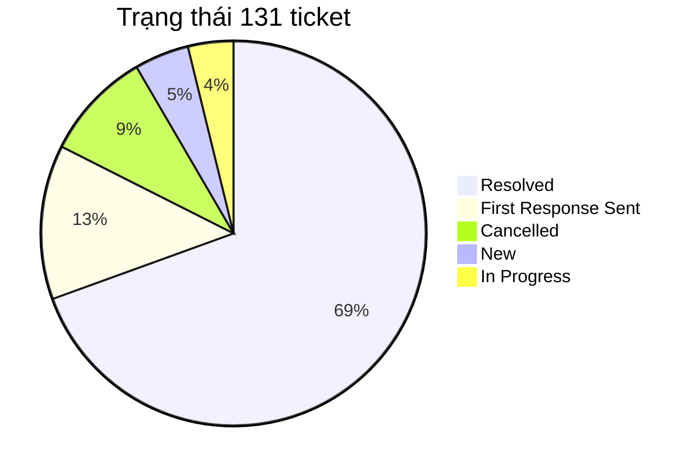
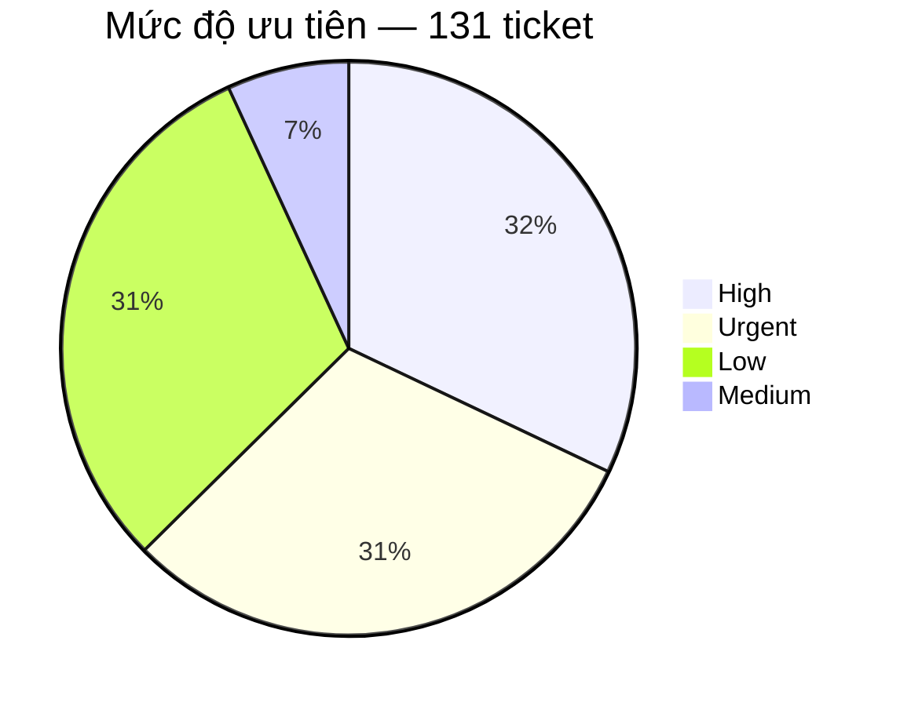

# BÁO CÁO PHÂN TÍCH TICKET — TECHNICAL SUPPORT

Nguồn dữ liệu: Helpdesk export `sample.xlsx` — Plan tuần 5  
Bản dữ liệu dùng để phân tích: `sample-tickets.csv`  
Phạm vi: 131 ticket Technical Support.

## 1. Mục tiêu

Báo cáo trả lời bốn câu hỏi:

- Ticket đang tập trung ở đâu?
- Trong các khu vực đó, người dùng thực sự đang gặp loại vấn đề nào?
- Support đang phải xử lý theo kiểu nào: hướng dẫn, xin quyền, điều tra lỗi, chuyển bộ phận hay thao tác lặp lại?
- Với từng kiểu vấn đề, hướng cải thiện nào hợp lý và cần đo thêm gì trước khi kết luận?

## 2. Bức tranh tổng thể: ticket đang tập trung ở đâu?

CRM, LMS và TMS có tổng cộng **83/131 ticket**, chiếm **63,4%** toàn bộ dữ liệu. Trong đó CRM có 37 ticket, LMS 26 và TMS 20.

Số lượng ticket cao không đồng nghĩa hệ thống đó có tỷ lệ lỗi cao. Dữ liệu hiện tại không có số người dùng của từng hệ thống, nên chưa thể tính số ticket trên mỗi người dùng. Một hệ thống có nhiều ticket có thể do lượng người dùng lớn, nghiệp vụ phức tạp, quyền hạn khó xử lý, người dùng chưa biết thao tác hoặc hệ thống thực sự lỗi.

## 3. Ticket đang tập trung vào loại công việc nào?

Các nhóm có số lượng nổi bật nhất là Enroll 15 (LMS 9, CRM 6), Thanh toán 13, Không đăng nhập 12, Chấm công 12 và Test 12.

Riêng nhóm Thanh toán có 13 ticket và toàn bộ đều phát sinh trên CRM. Vì vậy nhóm này được phân tích sâu trong phần CRM thay vì xem như một pattern xuyên nhiều hệ thống.

## 4. Phân tích ba hệ thống có nhiều ticket nhất

### 4.1. CRM — 37 ticket

Ba nhóm lớn nhất trên CRM là Thanh toán 13, Lead/trạng thái 7 và Enroll 6. Tổng cộng ba nhóm này có **26/37 ticket**, chiếm **70,3%** ticket CRM.

#### 4.1.1. Thanh toán — 13 ticket

Thanh toán là nhóm lớn nhất của CRM, chiếm **35,1%** ticket CRM.

Các ticket không phải cùng một lỗi mà gồm nhiều loại yêu cầu: tạo QR, add/gỡ payment, hủy hoặc confirm giao dịch, cập nhật trạng thái đóng tiền, hóa đơn và mã giảm giá.

13 ticket Payment cho thấy đây là một nghiệp vụ tạo ra nhiều yêu cầu support, nhưng chưa chứng minh CRM đang lặp lại cùng một lỗi 13 lần.

Các ticket có thể xuất phát từ nhiều nguyên nhân: người dùng chưa biết thao tác, không có quyền, dữ liệu hoặc CRM xảy ra lỗi, hoặc nghiệp vụ bắt buộc phải có người kiểm soát. File export không có log xử lý nên chưa xác định được nguyên nhân nào chiếm nhiều nhất.

Để đánh giá chính xác, cần bổ sung nguyên nhân cuối cùng, người hoặc bộ phận xử lý, thao tác đã thực hiện, việc support có phải hỏi thêm thông tin hay không, thời gian xử lý và kết quả. Những dữ liệu này sẽ cho biết support đang mất thời gian chủ yếu ở bước nào.

#### 4.1.2. Lead / trạng thái — 7 ticket

Nhóm này chiếm gần **19%** ticket CRM.

Cần tiếp tục phân biệt ticket thuộc yêu cầu đổi trạng thái, dữ liệu lead sai, không thao tác được, lỗi khi xử lý lead hay cần người có quyền cao hơn. Việc tách này cần thiết vì mỗi nguyên nhân dẫn tới cách xử lý khác nhau.

#### 4.1.3. Enroll trên CRM — 6 ticket

CRM có 6 ticket enroll. Nội dung chủ yếu liên quan đến enrollment hoặc chỉnh sửa thông tin trên enrollment.

### 4.2. LMS — 26 ticket

Hai nhóm lớn nhất là Enroll 9 và Lớp/GV/học phần 7, tổng cộng **16/26 ticket**, chiếm **61,5%** ticket LMS.

#### 4.2.1. Enroll trên LMS — 9 ticket

Các tình huống gồm thêm học viên, không tìm thấy lớp hoặc slot, enroll trùng và lỗi trong quá trình enroll.

Chỉ dựa trên Subject chưa thể biết root cause. Có ít nhất bốn khả năng: thao tác chưa đúng; dữ liệu học viên/lớp thiếu hoặc sai; tài khoản không đủ quyền; LMS lỗi.

File không ghi đã có guide hay chưa. Nếu chưa có thì viết bài enroll LMS. Nếu đã có mà ticket vẫn vào: user có tìm thấy bài không, bài còn đúng không, hay thực chất là quyền/lỗi hệ thống.

#### 4.2.2. Lớp / giáo viên / học phần — 7 ticket

Nhóm này gồm các yêu cầu như không thêm được giáo viên, điều chỉnh lớp hoặc lỗi liên quan đến học phần.

Nhóm này cần phân biệt giữa yêu cầu nghiệp vụ cần người có quyền chỉnh lớp/GV/học phần và trường hợp chức năng thực sự xảy ra lỗi. Nếu là lỗi chức năng, support cần ghi lại thao tác gây lỗi, dữ liệu đầu vào, ảnh lỗi và phạm vi ảnh hưởng trước khi chuyển Dev. Nếu chỉ thiếu quyền, ticket nên được chuyển đến đúng người có quyền.

### 4.3. TMS — 20 ticket

Có **18/20 ticket TMS**, tương đương **90%**, nằm ở chấm công hoặc lỗi hệ thống.

#### 4.3.1. Chấm công / bảng công — 12 ticket

Các triệu chứng gồm không hiển thị công, không duyệt được công, cần bù công, đi đúng ca nhưng hệ thống báo trễ và các vấn đề điểm danh/chấm công giáo viên.

Các ticket chấm công cần được tách theo triệu chứng, chẳng hạn không có dữ liệu, dữ liệu sai, không duyệt được hoặc ghi nhận sai thời gian. Đồng thời cần xác định phạm vi ảnh hưởng: chỉ một người, một ca, một cơ sở hay nhiều cơ sở.

Ticket TMS nên bổ sung cơ sở, thời điểm xảy ra, ca làm việc, người bị ảnh hưởng, số người cùng gặp, triệu chứng cụ thể và ảnh lỗi. Những thông tin này giúp support phân biệt vấn đề cá nhân với một sự cố có phạm vi lớn hơn.

#### 4.3.2. Lỗi hệ thống — 6 ticket

Có 6 ticket mô tả mất dữ liệu, không hiển thị thông tin hoặc không thao tác được.

Đáng chú ý, ticket **233** và **234** cùng liên quan đến Tỉnh Nam 2, có triệu chứng tương tự và cùng nhắc đến lỗi từ ngày 31. Đây là dấu hiệu để kiểm tra khả năng hai ticket thuộc cùng một incident, nhưng chưa đủ để khẳng định cùng root cause. Support cần đối chiếu thêm khu vực, thời gian và triệu chứng trước khi liên kết điều tra.

## 5. Pattern support xuất hiện trên nhiều hệ thống

### 5.1. Không đăng nhập / tài khoản — 12 ticket trên 7 hệ thống

Không có hệ thống nào chiếm phần lớn nhóm login. Chuỗi xử lý lặp: xác định user → kiểm tra trạng thái nhân sự → kiểm tra trạng thái tài khoản → xác định nguyên nhân → reset/mở khóa nếu đủ điều kiện → phản hồi.

Workflow hiện tại không cover hết 12 phiếu; chỉ phần nằm trong hệ thống tool truy cập được. Cần đo: tổng ticket vào workflow; xử lý hoàn toàn; chỉ hỗ trợ kiểm tra; không xử lý được; lý do; thời gian trước và sau.

### 5.2. Enroll LMS — 9 ticket; Enroll CRM — 6 ticket

**Enroll LMS (9):** thêm học viên, không tìm thấy lớp hoặc slot, enroll trùng, lỗi enroll.

**Enroll CRM (6):** thao tác enrollment, chỉnh sửa thông tin trên enrollment.

## 6. Ticket chậm, nhiều user, tính năng / deadline

### 6.1. Hệ thống chậm / timeout / tải lâu

File hiện tại không có nhiều ticket thuộc nhóm "LMS chậm", vì vậy đây không được xem là một pattern lớn. Phần này chỉ dùng để minh họa cách support điều tra một triệu chứng trước khi kết luận nguyên nhân. Khi gặp ticket chậm, timeout hoặc tải lâu, cần làm rõ:

- Một người hay nhiều người cùng gặp?
- Một cơ sở hay nhiều cơ sở?
- Khung giờ nào?
- Đã thử máy khác, mạng khác, trình duyệt khác chưa?
- Chậm ở bước nào: mở trang, tải file/video, lưu hay submit?
- Có thay đổi mạng, firewall hoặc release gần thời điểm đó không?

**Phạm vi:**

- Một user → môi trường người dùng trước.
- Nhiều user cùng cơ sở → mạng/cơ sở và dữ liệu chung.
- Nhiều cơ sở cùng thời điểm → hệ thống/server/CDN.

### 6.2. Nhiều người cùng triệu chứng

So sánh: hệ thống + khu vực + thời gian + triệu chứng + số người bị ảnh hưởng.

Trùng các yếu tố trên → một incident chính, liên kết các ticket liên quan.

### 6.3. Tính năng mới và yêu cầu có hạn chót

**Tính năng mới:** ghi nhận nhu cầu, người quyết định, không tự hứa thời gian release.

**Yêu cầu có deadline:** thời hạn thực tế, phạm vi ảnh hưởng, người có quyền xử lý.

## 7. Trạng thái và priority nói được gì — và chưa nói được gì?

### 7.1. Trạng thái

Có **91/131 ticket** ở trạng thái Resolved, tương đương **69,5%**. Con số này cho biết phần lớn ticket trong export đã được đóng, nhưng chưa phản ánh support xử lý nhanh hay chậm.

Cần thêm: thời gian Created → First Response, thời gian đến Resolved, SLA, reopen, assignee, số người/cơ sở bị ảnh hưởng.

### 7.2. Priority

High và Urgent có tổng cộng **82/131 ticket**, chiếm **62,6%**. Đây là tỷ lệ đáng chú ý nhưng chưa thể kết luận 62,6% ticket đều là sự cố nghiêm trọng. Cần biết priority được gán theo phạm vi ảnh hưởng, nghiệp vụ, deadline hay do người tạo ticket tự chọn.

## 8. Hướng xử lý và cải thiện theo từng nhóm ticket

Phần trên cho biết ticket đang tập trung ở đâu và có những pattern nào. Phần này trả lời câu hỏi tiếp theo: với từng nhóm, support nên xử lý và cải thiện theo hướng nào?

Không phải nhóm có nhiều ticket thì đều nên làm automation. Nếu nguyên nhân là người dùng thiếu hướng dẫn, giải pháp có thể là guide hoặc auto-reply. Nếu ticket thiếu thông tin, cần cải thiện form. Nếu người dùng thiếu quyền, cần routing đúng người. Nếu hệ thống có dấu hiệu lỗi, support phải thu thập đủ dữ liệu để điều tra. Automation chỉ phù hợp khi quy trình lặp lại, có điều kiện rõ và rủi ro có thể kiểm soát.

### 8.1. CRM — Thanh toán (13 ticket)

Thanh toán là nhóm lớn nhất trên CRM. Các ticket gồm tạo QR, add/gỡ payment, hủy hoặc confirm giao dịch, cập nhật trạng thái đóng tiền, hóa đơn và mã giảm giá.

Các ticket này cùng thuộc nghiệp vụ thanh toán nhưng chưa thể coi là cùng một lỗi. Support cần xác định ticket do người dùng chưa biết thao tác, thiếu thông tin, thiếu quyền, CRM/dữ liệu lỗi hay nghiệp vụ bắt buộc cần người kiểm soát.

**Hướng xử lý:** Form nên yêu cầu sẵn mã lead, số tiền, loại yêu cầu và thao tác người dùng đã thử để giảm việc hỏi lại. Nếu người dùng được phép tự thao tác nhưng chưa biết cách, có thể dùng guide. Nếu đã có guide mà ticket vẫn phát sinh, cần kiểm tra tài liệu có dễ tìm và còn đúng không; nếu vấn đề chỉ là khó tìm thì có thể auto-reply kèm đúng tài liệu.

Nếu ticket cần quyền đặc biệt, hệ thống có thể hỗ trợ chuyển đến đúng người hoặc bộ phận sau khi đủ thông tin. Hiện chưa nên tự động thay đổi số tiền, trạng thái đóng tiền hoặc dữ liệu payment vì file chưa cho thấy quy trình đủ rõ để automation an toàn.

**Cần xác minh thêm:** nguyên nhân cuối cùng và cách support thực tế xử lý từng ticket. Khi biết phần lớn 13 ticket thuộc trường hợp nào mới xác định được giải pháp giúp giảm workload nhiều nhất.

### 8.2. CRM — Lead / trạng thái (7 ticket)

Nhóm này gồm yêu cầu đổi trạng thái lead, dữ liệu lead không đúng hoặc không thao tác được trên lead.

Điểm cần xác định là support đang mất thời gian vì thiếu thông tin, người dùng thiếu quyền hay CRM thực sự lỗi.

**Hướng xử lý:** Form nên có mã lead, trạng thái hiện tại, trạng thái mong muốn và lý do thay đổi. Nếu người dùng có thể tự thao tác nhưng chưa biết cách, có thể dùng guide hoặc auto-reply. Nếu thao tác cần quyền đặc biệt, ticket nên được chuyển đến đúng người có quyền sau khi đủ thông tin.

Chưa nên tự động thay đổi trạng thái lead cho đến khi xác định rõ quy tắc nghiệp vụ, quyền thực hiện và các trường hợp ngoại lệ.

### 8.3. CRM — Enroll (6 ticket)

CRM có 6 ticket liên quan đến thao tác enrollment hoặc chỉnh sửa thông tin trên enrollment. Nhóm này cần được xử lý riêng với Enroll trên LMS vì dữ liệu và thao tác của hai hệ thống khác nhau.

**Hướng xử lý:** Ticket nên có mã enrollment hoặc mã lead, trường cần sửa, giá trị hiện tại và giá trị mong muốn. Nếu người dùng được phép tự sửa và vấn đề chủ yếu do chưa biết thao tác, có thể dùng guide riêng cho CRM. Nếu cần quyền đặc biệt thì chuyển đúng người xử lý.

Hiện chưa đủ dữ liệu để xác định có bước nào được support thực hiện lặp lại đủ nhiều và đủ an toàn để tự động ghi dữ liệu enrollment. Trước mắt nên ưu tiên chuẩn hóa thông tin đầu vào và cách xử lý.

### 8.4. LMS — Enroll (9 ticket)

Có 9 ticket LMS liên quan đến thêm học viên, không tìm thấy lớp hoặc slot, enroll trùng và lỗi trong quá trình enroll.

Các triệu chứng này có thể xuất phát từ thao tác chưa đúng, dữ liệu học viên/lớp sai, thiếu quyền hoặc LMS lỗi. Vì vậy không nên mặc định tất cả ticket Enroll đều giải quyết bằng guide.

**Hướng xử lý:** Ticket nên có mã lớp, thông tin học viên, thao tác đã thử và lỗi đang gặp. Nếu nguyên nhân là chưa biết thao tác, có thể dùng guide Enroll LMS. Nếu đã có guide nhưng ticket vẫn phát sinh, cần kiểm tra tài liệu có dễ tìm và còn đúng với giao diện hiện tại hay không.

Nếu dữ liệu đầu vào đúng nhưng chức năng vẫn không hoạt động, support cần thu thập ảnh lỗi và thông tin liên quan trước khi chuyển Dev. Nếu vấn đề là quyền enroll thì chuyển người có quyền thay vì tiếp tục hướng dẫn.

Hiện chưa nên tự động enroll học viên vì file chưa cho thấy đủ quy tắc và điều kiện để thực hiện thao tác này an toàn.

### 8.5. LMS — Lớp / giáo viên / học phần (7 ticket)

Nhóm này gồm các yêu cầu không thêm được giáo viên, điều chỉnh lớp và lỗi liên quan đến học phần.

Cần phân biệt hai trường hợp: người dùng cần một người có quyền thực hiện thay đổi, hoặc chức năng đúng ra phải hoạt động nhưng đang xảy ra lỗi.

**Hướng xử lý:** Ticket nên có mã lớp hoặc học phần, yêu cầu cụ thể và ảnh lỗi nếu có. Nếu chỉ thiếu quyền, ticket được chuyển đến đúng người xử lý. Nếu chức năng lỗi, support cần ghi lại thao tác gây lỗi, dữ liệu đầu vào, ảnh lỗi và phạm vi người dùng bị ảnh hưởng trước khi chuyển Dev.

Guide chỉ phù hợp với những thao tác người dùng thực sự được phép tự thực hiện.

### 8.6. TMS — Chấm công (12 ticket)

TMS có 12 ticket liên quan đến chấm công, gồm không hiển thị công, không duyệt được công, cần bù công, ghi nhận sai thời gian và các vấn đề điểm danh/chấm công giáo viên.

Cùng tên "chấm công" nhưng các ticket có triệu chứng khác nhau. Support cần xác định cả triệu chứng và phạm vi ảnh hưởng. Một người bị sai công có thể là vấn đề dữ liệu cá nhân; nhiều người trong cùng một ca hoặc cơ sở cùng gặp có thể là một sự cố chung; nhiều cơ sở cùng gặp trong cùng thời điểm làm tăng khả năng có incident ở mức hệ thống.

**Hướng xử lý:** Ticket nên có cơ sở, thời điểm, ca làm việc, người bị ảnh hưởng, số người cùng gặp, triệu chứng và ảnh lỗi. Hệ thống có thể hỗ trợ tìm các ticket có cùng cơ sở, thời gian và triệu chứng để gợi ý cho support rằng chúng có thể thuộc cùng một incident.

Support vẫn là người xác nhận các ticket có thực sự liên quan hay không. Không nên tự động sửa bảng công vì dữ liệu này cần được kiểm tra và xác nhận.

### 8.7. TMS — Lỗi hệ thống (6 ticket)

Có 6 ticket mô tả mất dữ liệu, không hiển thị thông tin hoặc không thao tác được trên TMS.

Ticket **233** và **234** cùng liên quan đến Tỉnh Nam 2, có triệu chứng tương tự và cùng nhắc đến lỗi từ ngày 31. Điều này chưa chứng minh hai ticket có cùng root cause, nhưng đủ để kiểm tra khả năng đây là một incident chung.

**Hướng xử lý:** Cần thu thập cơ sở, thời điểm, triệu chứng, số người bị ảnh hưởng và ảnh lỗi. Nếu nhiều ticket trùng khu vực, thời gian và triệu chứng, hệ thống có thể gợi ý liên kết chúng để support kiểm tra.

Mục tiêu là tránh nhiều người cùng điều tra một sự cố dưới nhiều ticket khác nhau. Guide không phải hướng xử lý chính của nhóm này vì vấn đề có dấu hiệu nằm ở dữ liệu hoặc hệ thống.

### 8.8. Không đăng nhập / khóa / quên mật khẩu (12 ticket)

Có 12 ticket Login trên 7 hệ thống: Denise, TMS, Mail, Ecount, hệ thống nội bộ, LMS và CRM.

Khác với Payment hay Enroll, điểm đáng chú ý của Login là quy trình support có nhiều bước giống nhau:

Xác định người dùng → kiểm tra trạng thái nhân sự → kiểm tra tài khoản → xác định nguyên nhân → reset/mở khóa nếu đủ điều kiện → phản hồi.

Đây là quy trình có điều kiện tương đối rõ và nhiều bước kiểm tra lặp lại, vì vậy phù hợp để workflow hỗ trợ.

**Hướng xử lý:** Ticket đầu vào cần có hệ thống, user/email và triệu chứng cụ thể. Workflow Login đã được triển khai trong tuần 5, nhưng tool chỉ xử lý được những hệ thống và dữ liệu mà nó có quyền truy cập. Vì vậy không thể mặc định cả 12 ticket đều được tự động hóa.

Hiệu quả workflow cần được đo bằng số ticket được đưa vào workflow, số ticket xử lý hoàn toàn, số ticket chỉ được hỗ trợ một phần, số ticket vẫn phải xử lý thủ công cùng lý do và thời gian xử lý trước/sau.

Nếu một số trường hợp chỉ cần hướng dẫn người dùng tự xử lý thì guide hoặc auto-reply có thể giải quyết trước khi ticket đi vào workflow.

**Kết luận của nhóm Login:** đây là nhóm phù hợp nhất để tiếp tục thử automation trong dữ liệu hiện tại, không phải vì có nhiều ticket nhất mà vì quy trình support có tính lặp lại và điều kiện xử lý tương đối rõ.

## 9. Kết luận

Phân tích 131 ticket cho thấy workload support tập trung chủ yếu tại CRM, LMS và TMS, với tổng cộng **83 ticket**, chiếm **63,4%**. Tuy nhiên, số lượng ticket chỉ cho biết nên ưu tiên nhìn vào đâu; nó chưa cho biết nguyên nhân và cũng chưa đủ để quyết định giải pháp.

**Trên CRM,** Payment là nhóm lớn nhất với 13 ticket, tiếp theo là Lead/trạng thái và Enroll. Payment có volume cao nhưng gồm nhiều loại yêu cầu nghiệp vụ, vì vậy trước mắt cần xác định nguyên nhân thực tế và chuẩn hóa thông tin đầu vào. Chưa có đủ cơ sở để tự động thay đổi dữ liệu payment.

**Trên LMS,** ticket tập trung vào Enroll và quản lý lớp/giáo viên/học phần. Các ticket cần được phân biệt giữa thiếu hướng dẫn, thiếu dữ liệu, thiếu quyền và lỗi chức năng. Guide chỉ phù hợp khi nguyên nhân thực sự nằm ở việc người dùng thiếu hướng dẫn.

**Trên TMS,** 18/20 ticket liên quan đến chấm công hoặc lỗi hệ thống. Đây là nhóm cần chú ý đến phạm vi ảnh hưởng. Các ticket trùng khu vực, thời gian và triệu chứng nên được kiểm tra theo hướng cùng một incident để tránh nhiều support điều tra lặp lại.

**Nhóm Login** không tập trung ở một hệ thống nhưng có chuỗi kiểm tra tương đối lặp lại và điều kiện xử lý rõ. Vì vậy đây là nhóm phù hợp nhất trong dữ liệu hiện tại để tiếp tục thử workflow. Hiệu quả cần được chứng minh bằng tỷ lệ xử lý hoàn toàn, tỷ lệ vẫn cần support can thiệp và thời gian xử lý thực tế.

Từ toàn bộ phân tích, có bốn hướng ưu tiên:

1. Đo hiệu quả workflow Login đã triển khai thay vì chỉ xác nhận tool chạy được.
2. Với Payment, Enroll và Lead, chuẩn hóa thông tin đầu vào và ghi nhận nguyên nhân xử lý thực tế trước khi quyết định automation.
3. Với TMS, bổ sung thông tin về thời gian, khu vực và phạm vi ảnh hưởng để phát hiện incident.
4. Với guide và auto-reply, chỉ áp dụng khi xác nhận ticket phát sinh do người dùng thiếu hướng dẫn hoặc khó tìm tài liệu.

Volume cho biết nên nhìn vào đâu. Pattern cho biết support đang lặp lại việc gì. Root cause cho biết vì sao ticket phát sinh. Từ đó mới chọn được giải pháp phù hợp để giảm workload support.
