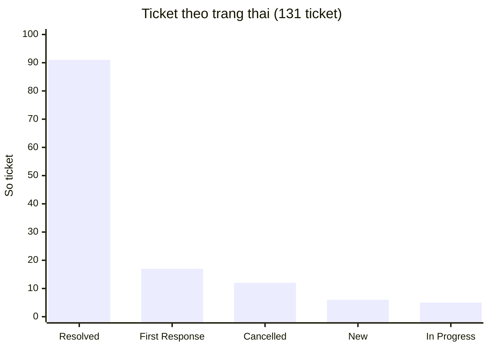
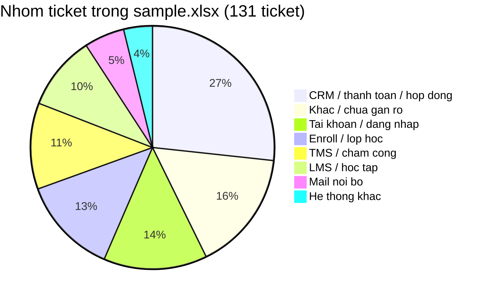

# Phân tích ticket và hướng xử lý (Tuần 5)

Nguồn số liệu: file export Helpdesk `sample.xlsx` (plan tuần 5).  
Em đếm được **131 ticket** của team Technical Support. Một số dòng trong file là tiêu đề nhóm trạng thái, không tính là ticket.

---

## 1. Kết luận

Trong data thật, ticket **không dồn một loại**. Nhiều nhất là việc trên **CRM / thanh toán / hợp đồng**. Tiếp theo là **tài khoản / đăng nhập**, **enroll lớp**, **TMS / chấm công**.

Em làm tool cho **đăng nhập / cấp lại mật khẩu** vì bước xử lý giống nhau và máy kiểm tra được (HR + LMS). Nhưng chỉ một tool không đủ. Các hướng khác:

* Ticket hỏi việc đã có (hoặc giả định sẽ có): bài hướng dẫn → viết guide, hoặc auto-reply + gắn tài liệu
* CRM / enroll lặp → form / checklist / chuyển đúng team, không để support làm tay mãi
* TMS / LMS lỗi hàng loạt → giả định điều tra trước, rồi mới chuyển Dev Team.

---

## 2. File data có gì

Mỗi dòng là một phiếu Technical Support. Cột dùng được: tiêu đề (Subject), mã ticket, người gửi, tag, mức ưu tiên, trạng thái trên bảng.

Nhiều cột khác (rating, SLA, icon) gần như trống. **64 / 131 ticket không có tag**, nên em gom nhóm theo **tiêu đề + tag**, không chỉ nhìn cột Tags.

---

## 3. Số liệu support

### 3.1. Ticket đang ở bước nào

| Trạng thái trên file | Số ticket |
| --- | ---: |
| Resolved | 91 |
| First Response Sent | 17 |
| Cancelled | 12 |
| New | 6 |
| In Progress | 5 |
| **Tổng** | **131** |

Phần lớn đã đóng (Resolved). Vẫn còn New / First Response / In Progress — việc chưa xong vẫn vào hàng support.

### 3.2. Mức ưu tiên

| Priority | Số ticket |
| --- | ---: |
| High | 42 |
| Urgent | 40 |
| Low | 40 |
| Medium | 9 |

Urgent + High = **82 / 131 (~63%)**. Nhiều phiếu được đánh khẩn. File không có cột “bao nhiêu người bị ảnh hưởng”, nên em không bịa số học viên.

### 3.3. Ticket thuộc hệ thống / việc gì

| Nhóm (gom từ tiêu đề + tag) | Số | Tỷ lệ |
| --- | ---: | ---: |
| CRM / thanh toán / hợp đồng | 35 | 27% |
| Khác / chưa gắn rõ | 21 | 16% |
| Tài khoản / đăng nhập | 18 | 14% |
| Enroll / lớp học | 17 | 13% |
| TMS / chấm công | 15 | 11% |
| LMS / học tập | 13 | 10% |
| Mail nội bộ | 7 | 5% |
| Hệ thống khác (Crystal, dropout, book phòng) | 5 | 4% |

Tag có sẵn trong file (chỉ khoảng nửa ticket): CRM 23, LMS 14, TMS 9, mail 4, Denise 3. Khớp hướng: CRM nhiều, rồi LMS/TMS.

### 3.4. Ticket gần với tool login

Lọc tiêu đề có chữ đăng nhập, mật khẩu, không vào được, tài khoản bị khóa, cấp lại tài khoản: **13 ticket** (~10%). Ví dụ:

* Cấp lại mật khẩu LMS cho giáo viên
* Không đăng nhập được CRM / TMS / hệ thống nội bộ
* Tài khoản Ecount bị khóa / không vào được
* Quên mật khẩu email TMS

Không phải 13 ticket đều giống scenario tuần 4 (LMS giáo viên). Nhưng cùng kiểu: **hỏi tài khoản, support kiểm rồi mở / cấp lại**.

---

## 4. Đọc số rồi làm gì

* **Nhiều nhất:** CRM (QR, lead, payment, hợp đồng). Support hay phải nhờ kế toán / tech sửa trên hệ thống. Khó một tool “tự sửa CRM”. Có thể giảm ticket bằng form đủ thông tin + bài hướng dẫn thao tác thường gặp.
* **Làm tool được ngay:** tài khoản / đăng nhập (~14%, trong đó ~10% rất sát login/mật khẩu). Đã làm.
* **Lặp rõ:** enroll vào lớp (17). Hay nhờ “add giúp học viên”. Checklist + quyền đúng người làm, hơn là support làm hộ từng phiếu.
* **TMS / LMS lỗi hàng loạt** (không hiện công, không thao tác được): không phải quên mật khẩu. Cần giả định điều tra, xem có sự cố chung không.

Tuần 4 em từng thấy “LMS chậm” ảnh hưởng nhiều người trong bài tập. **Trong sample.xlsx ít tiêu đề kiểu trang chậm.** Data thật nghiêng việc nội bộ / BU (CRM, enroll, TMS). Report này theo file data.

---

## 5. Sáu tình huống tuần 4 — chỉ để nhớ bài luyện

Em vẫn để ngắn, vì tool bám scenario login tuần 4. Đây **không phải** bảng số liệu chính.

| Tình huống | Nhóm | Ghi chú |
| --- | --- | --- |
| 01 Đăng nhập / quên mật khẩu | Tài khoản | Lặp bước, máy kiểm tra được. Đã làm tool. |
| 02 LMS chậm | Hệ thống | Ảnh hưởng một lớp. Support không tự sửa LMS. |
| 03 Không nộp bài / sập | Hệ thống | Nhiều người, chuyển Dev Team. |
| 04 Xin tính năng | Product | Không tự làm, không hứa ngày ra feature. |
| 05 Video lỗi nhiều người | Hệ thống | Gom ticket, xem lỗi chung hay từng máy. |
| 06 Báo cáo có hạn chót | Nội bộ | Cần người có quyền, máy không tự duyệt. |

---

## 6. Nhiều hướng, không chỉ một tool

### Hướng A — Tài khoản / đăng nhập (đã làm)

Support chuyển ticket sang **Đang xử lý** → tool kiểm HR + LMS.

* Còn làm việc + có tài khoản: mở khóa / đặt mật khẩu, gửi mail, ghi chú.
* Nghỉ việc, không thấy hồ sơ, không thấy tài khoản: ghi chú, support xem tay.
* Không chạy khi đang soạn ticket. Ticket máy đã làm thì không làm lại.

Ước lượng từ lúc luyện tuần 4: làm tay khoảng **8 phút**, có tool còn khoảng **1 phút** nếu đủ điều kiện. Với ~13 ticket giống login trong file, nếu đều làm tay thì khoảng **1.5–2 giờ**. Đây là ước lượng, file không ghi phút thật.

Về sau: nếu nhiều tài khoản khóa vì rule 30 ngày (giả định), đề xuất mail nhắc trước khi khóa.

### Hướng B — Guide (giả định, hai nhánh)

Em **không biết** công ty đã có bài hướng dẫn trên Helpdesk / KB hay chưa. Nên tách giả định:

**Giả định 1 — chưa có guide**  
Bổ sung bài ngắn cho việc hay gặp trong file:

* Quên mật khẩu / không đăng nhập LMS, CRM, TMS
* Enroll học viên cần gửi đủ mã lớp, SĐT, tên
* BU nhờ hủy / confirm payment trên CRM

**Giả định 2 — đã có guide**  
Hỏi tiếp: **sao vẫn còn ticket?** Có thể khách không tìm thấy bài, hoặc vẫn thích gửi phiếu cho nhanh.

Hướng lúc đó: **tool auto-reply + gắn tài liệu**. Ticket khớp từ khóa (quên mật khẩu, enroll, QR…) thì gửi sẵn link/file hướng dẫn, rồi mới để support vào nếu khách vẫn kẹt. Không thay tool login (login vẫn phải kiểm HR/LMS). Cái này giảm ticket “hỏi lại bước đã viết sẵn”.

### Hướng C — CRM / enroll (nhiều nhất trong file)

Không viết tool tự sửa CRM.

* Form: thiếu field nào thì chưa tạo ticket
* Nếu giả định đã có guide mà vẫn vào → auto-reply như hướng B
* Ticket “nhờ kế toán hủy confirm / sửa giá” → chuyển đúng đội, không nằm mãi ở Technical Support nếu không phải lỗi hệ thống

### Hướng D — TMS / LMS lỗi — giả định điều tra

Với ticket “TMS không hiện thông tin”, “không thao tác được từ ngày 31”, “không xem chấm công”:

Em **không có log**. Giả định support kiểm trước khi chuyển Dev:

1. Một người hay cả cơ sở / cả tỉnh? (file có ticket tỉnh Nam 2, nhiều BU)
2. Cùng một buổi hay kéo dài nhiều ngày?
3. Chỉ TMS hay kèm CRM/LMS?
4. User vừa đổi máy / trình duyệt / hết hạn mật khẩu? (lẫn với hướng A)
5. Có đợt cập nhật hệ thống hôm đó không?

Nếu nhiều người cùng lúc → một ticket chính + cập nhật chung, không để 10 phiếu riêng.  
Nếu chỉ một user → thử đăng xuất, trình duyệt khác, rồi mới escalate.

**LMS chậm (bài tuần 4):** giả định thêm tải trang chậm do nhiều lớp vào cùng giờ, video nặng, mạng cơ sở, hoặc server. Support hỏi: bao nhiêu người, cơ sở nào, giờ nào, thử mạng khác chưa. Không tự kết luận “do server” nếu chưa có dấu hiệu chung.

### Hướng E — Xin tính năng / việc có hạn chót (tuần 4)

Vẫn: ghi nhận, không hứa ngày có tính năng. Việc có giờ chết thì hỏi rõ scope, xin người có quyền. Máy không tự duyệt.

---

## 7. Tool login hoạt động thế nào

**Tạo ticket → support kiểm → Đang xử lý → tool chạy.**

Đủ điều kiện: kiểm trạng thái tài khoản → mở khóa hoặc reset mật khẩu → mail khách → ghi chú → đánh dấu đã xử lý.

Không đủ: không đổi tài khoản, chỉ ghi chú.

Chặn thêm: không chạy lúc soạn; không chạy lại ticket đã xử lý; bật lại server thì quét ticket còn sót.

---

## 8. Tool mang lại gì, và chưa mang lại gì

* Nhanh hơn với ticket đăng nhập đủ điều kiện.
* Ít quên bước kiểm HR trước khi mở khóa.
* **Không** làm giảm ticket CRM/enroll (nhóm lớn nhất trong file).
* **Không** sửa LMS/TMS chậm hay sập.

Muốn đo sau này (khi có thêm export):

* Bao nhiêu ticket/tuần thuộc đăng nhập
* Bao nhiêu cái tool xử lý hết, bao nhiêu phải xem tay
* Ticket CRM/enroll còn bao nhiêu sau khi có guide hoặc auto-reply

---

## 9. Tóm lại

* Số liệu support lấy từ **`sample.xlsx` (131 ticket)**, không lấy 6 ticket tuần 4.
* Nhiều nhất: **CRM / thanh toán**. Tool login không giải quyết nhóm này.
* Em làm tool **tài khoản / đăng nhập** vì lặp bước và có trong data (~10–14%).
* Guide viết theo **giả định**: chưa có thì bổ sung; có rồi mà vẫn còn ticket thì xét auto-reply + gắn tài liệu.
* TMS/LMS lỗi: **giả định điều tra** phạm vi (một người hay cả hệ thống), không chỉ viết “chuyển Dev”.

Chart nằm trong report này. Đối chiếu từng dòng thì mở `sample.xlsx` ở plan tuần 5.
