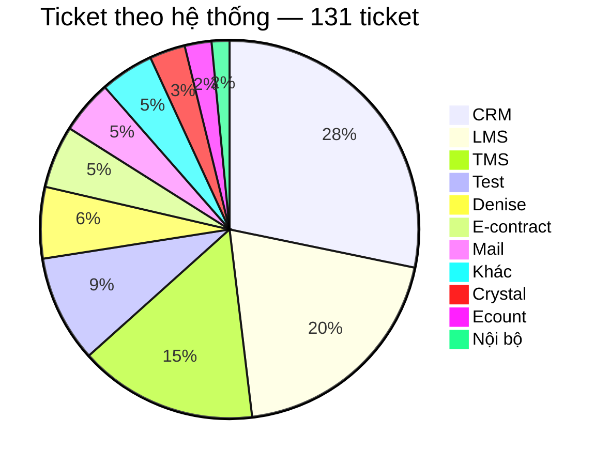
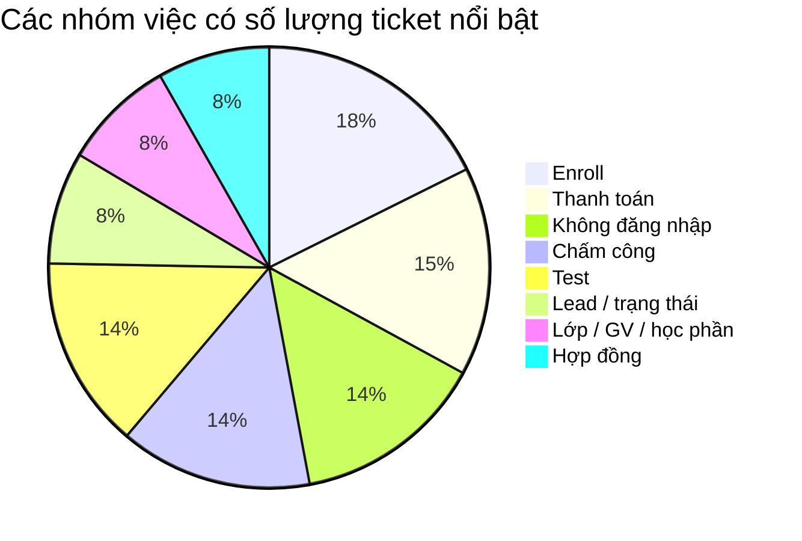
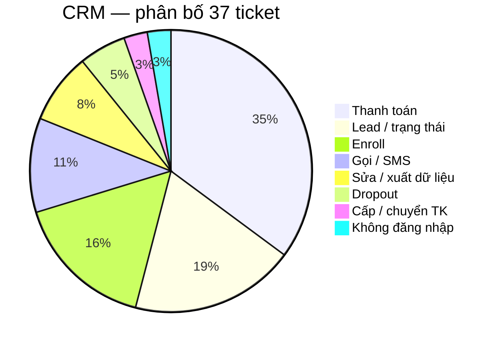
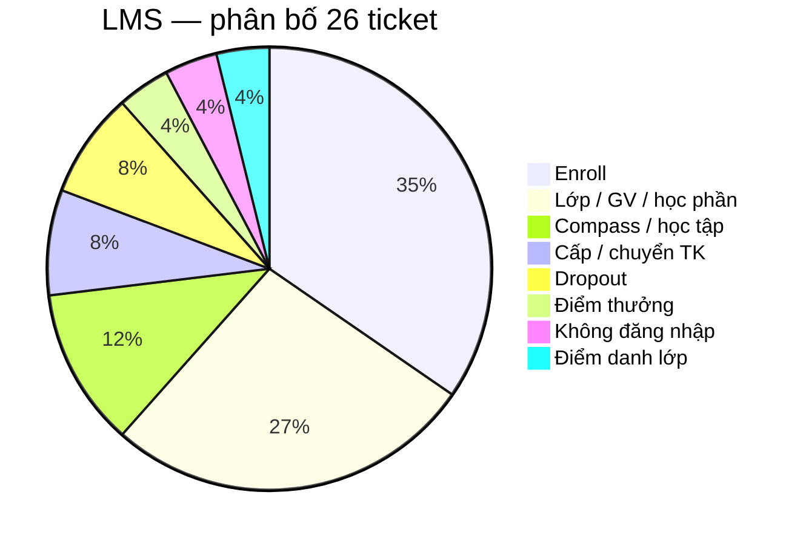
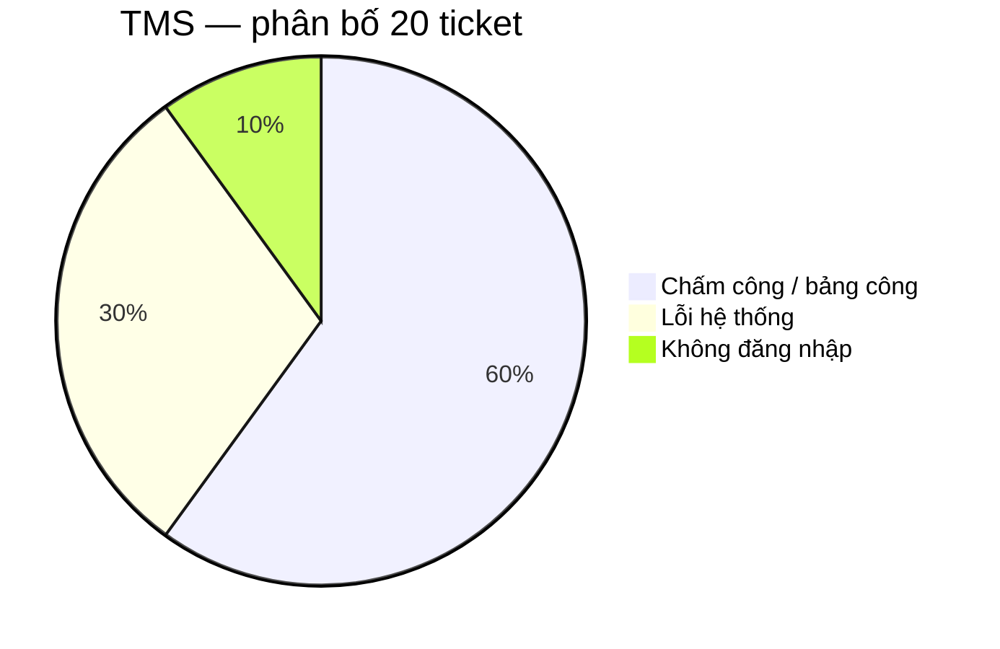
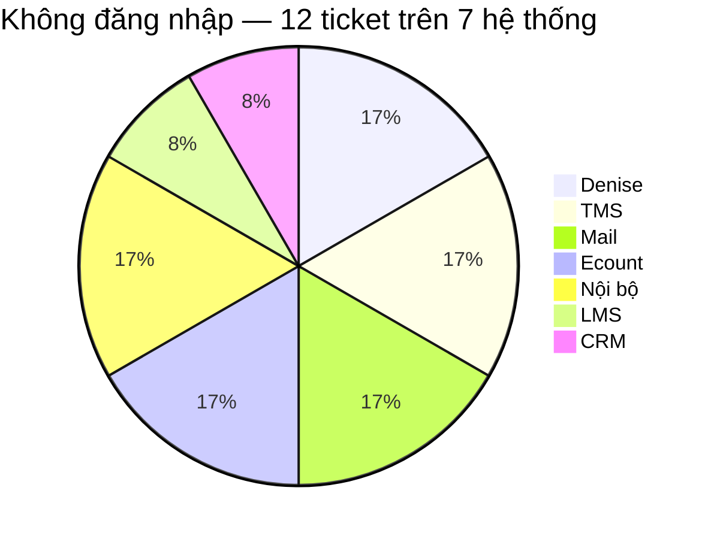
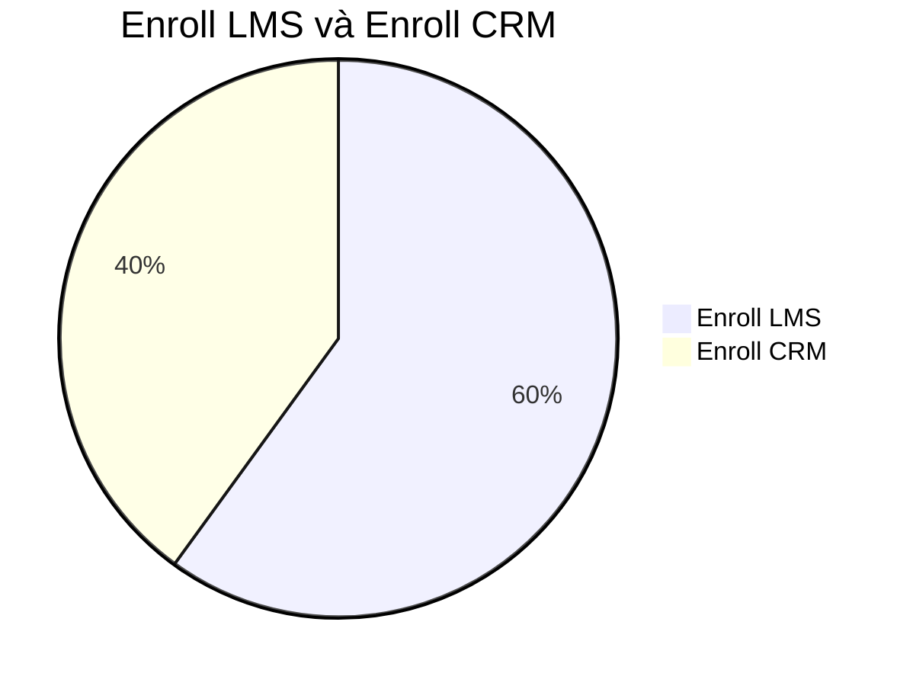
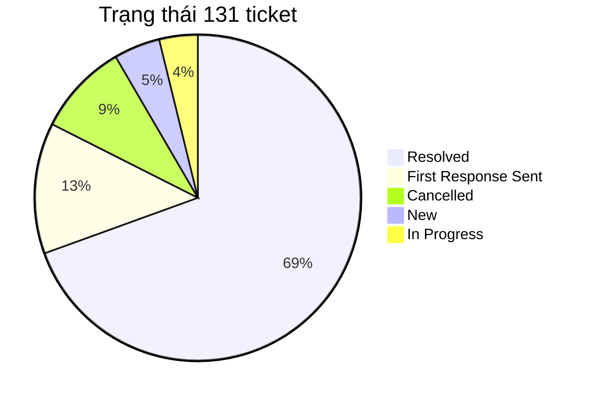
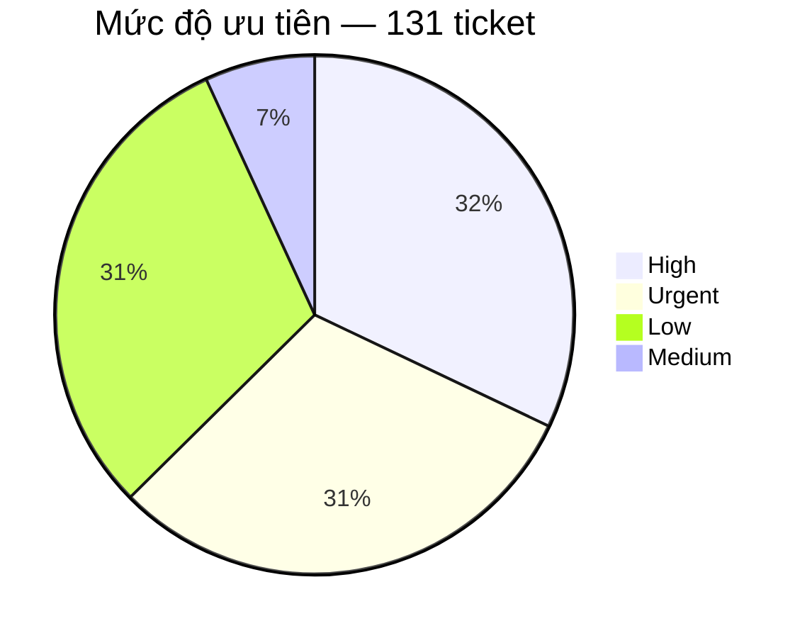

# BÁO CÁO PHÂN TÍCH TICKET — TECHNICAL SUPPORT

**Nguồn dữ liệu:** Helpdesk export `sample.xlsx` — Plan tuần 5  
**Bản dữ liệu dùng để phân tích:** `sample-tickets.csv`  
**Phạm vi:** 131 ticket Technical Support.

## 1. Mục tiêu

Báo cáo trả lời bốn câu hỏi:

- Ticket đang tập trung ở đâu?
- Trong các khu vực đó, người dùng thực sự đang gặp loại vấn đề nào?
- Support đang phải xử lý theo kiểu nào: hướng dẫn, xin quyền, điều tra lỗi, chuyển bộ phận hay thao tác lặp lại?
- Với từng kiểu vấn đề, hướng cải thiện nào hợp lý và cần đo thêm gì trước khi kết luận?

## 2. Bức tranh tổng thể: ticket đang tập trung ở đâu?

CRM, LMS và TMS có tổng cộng 83/131 ticket, chiếm 63,4% toàn bộ dữ liệu. Trong đó CRM có 37 ticket, LMS 26 và TMS 20.

Điều này cho thấy phần lớn workload support trong tập dữ liệu hiện tại đang nằm ở ba hệ thống trên. Vì vậy, nếu cần chọn nơi để phân tích sâu thì CRM, LMS và TMS là ba hệ thống cần xem trước.

Tuy nhiên, số lượng ticket cao không đồng nghĩa hệ thống đó có tỷ lệ lỗi cao. Dữ liệu hiện tại không có số người dùng của từng hệ thống, nên chưa thể tính số ticket trên mỗi người dùng. Một hệ thống có nhiều ticket có thể do lượng người dùng lớn, nghiệp vụ phức tạp, quyền hạn khó xử lý, người dùng chưa biết thao tác hoặc hệ thống thực sự lỗi.

Kết luận của bước này: khối lượng support tập trung ở CRM, LMS và TMS; cần đi sâu vào nội dung ticket của ba hệ thống để biết support đang mất công ở đâu.

## 3. Ticket đang tập trung vào loại công việc nào?

Các nhóm có số lượng nổi bật nhất là Enroll 15 (LMS 9, CRM 6), Thanh toán 13, Không đăng nhập 12, Chấm công 12 và Test 12.

13 ticket thanh toán đều trên CRM.

Từ đây báo cáo tách thành hai góc nhìn:

- Theo hệ thống: để xem từng hệ thống đang tạo ra loại ticket gì.
- Theo pattern support: để xem loại quy trình nào đang lặp lại và có thể cải thiện.

## 4. Phân tích ba hệ thống có nhiều ticket nhất

### 4.1. CRM — 37 ticket

Ba nhóm lớn nhất trên CRM là Thanh toán 13, Lead/trạng thái 7 và Enroll 6. Tổng cộng ba nhóm này có 26/37 ticket, chiếm 70,3% ticket CRM.

Điều này cho thấy ticket CRM không phân tán đều. Nếu muốn giảm workload support trên CRM thì ba nhóm trên là nơi cần điều tra trước.

#### 4.1.1. Thanh toán — 13 ticket

Thanh toán là nhóm lớn nhất của CRM, chiếm 35,1% ticket CRM.

Các ticket không phải cùng một lỗi mà gồm nhiều loại yêu cầu: tạo QR, add/gỡ payment, hủy hoặc confirm giao dịch, cập nhật trạng thái đóng tiền, hóa đơn và mã giảm giá.

Điểm quan trọng là:

13 ticket payment cho thấy đây là một nghiệp vụ tạo ra nhiều yêu cầu support, nhưng chưa chứng minh CRM có một lỗi payment lặp lại 13 lần.

Trước khi chọn giải pháp, cần tách nguyên nhân theo ít nhất bốn hướng:

**A. Người dùng chưa biết thao tác**  
→ Có thể xử lý bằng hướng dẫn hoặc auto-reply nếu thao tác đơn giản và đã có tài liệu.

**B. Người dùng biết thao tác nhưng không có quyền**  
→ Vấn đề nằm ở phân quyền hoặc routing; cần chuyển đúng người có quyền.

**C. Dữ liệu hoặc CRM thực sự lỗi**  
→ Cần thu thập bằng chứng và chuyển người phụ trách CRM/Dev điều tra.

**D. Nghiệp vụ bắt buộc có người kiểm soát**  
→ Có thể auto-reply hoặc chuyển đúng đội. Không nên để máy tự sửa số tiền / payment.

File hiện tại không có log xử lý hoặc root cause cuối cùng nên chưa biết tỷ trọng A/B/C/D.

Dữ liệu cần bổ sung cho 13 ticket payment:

Nguyên nhân cuối cùng → người/bộ phận xử lý → thao tác đã thực hiện → có phải hỏi thêm thông tin không → thời gian xử lý → kết quả.

Sau khi có dữ liệu này mới quyết định được giải pháp chính là guide, form, routing hay automation.

#### 4.1.2. Lead / trạng thái — 7 ticket

Nhóm này chiếm gần 19% ticket CRM.

Cần tiếp tục tách xem ticket chủ yếu là yêu cầu đổi trạng thái, dữ liệu lead sai, không thao tác được, lỗi khi xử lý lead hay cần người có quyền cao hơn.

Nếu support thường xuyên phải hỏi lại cùng các thông tin như mã lead, trạng thái hiện tại, trạng thái mong muốn, lý do thay đổi, có thể chuẩn hóa form đầu vào.

Nếu nguyên nhân chủ yếu là thiếu quyền thì hướng phù hợp là routing (có thể tự chuyển ticket). Không nên để máy tự đổi trạng thái lead. Auto-reply + form vẫn dùng được nếu phiếu thiếu thông tin.

#### 4.1.3. Enroll trên CRM — 6 ticket

CRM có 6 ticket enroll. Nội dung chủ yếu liên quan đến enrollment hoặc chỉnh sửa thông tin trên enrollment.

### 4.2. LMS — 26 ticket

Hai nhóm lớn nhất là Enroll 9 và Lớp/GV/học phần 7, tổng cộng 16/26 ticket, chiếm 61,5% ticket LMS.

Điều này cho thấy phần lớn ticket LMS trong tập dữ liệu hiện tại xoay quanh đưa học viên vào lớp và quản lý lớp/học phần.

#### 4.2.1. Enroll trên LMS — 9 ticket

Các tình huống gồm thêm học viên, không tìm thấy lớp hoặc slot, enroll trùng và lỗi trong quá trình enroll.

Chỉ dựa trên Subject chưa thể biết root cause. Có ít nhất bốn khả năng:

- Người dùng thao tác chưa đúng.
- Dữ liệu học viên/lớp thiếu hoặc sai.
- Tài khoản không đủ quyền.
- LMS thực sự lỗi.

Bốn nguyên nhân này dẫn tới bốn hướng xử lý khác nhau:

- Guide / auto-reply nếu người dùng thiếu hướng dẫn.
- Form nếu support thường phải hỏi lại mã lớp, học viên hoặc dữ liệu đầu vào.
- Routing nếu cần người có quyền enroll.
- Dev nếu nhiều ticket có cùng triệu chứng lỗi hệ thống.

Điểm cần tránh là kết luận ngay “9 ticket enroll → viết guide”.

Nếu chưa có guide, viết guide là một hướng hợp lý. Nhưng nếu đã có guide mà ticket vẫn tiếp tục phát sinh thì phải kiểm tra tiếp: người dùng có biết tài liệu tồn tại không, tài liệu có dễ tìm không, còn đúng với giao diện hiện tại không, người dùng đọc rồi nhưng vẫn không thao tác được hay ticket thực chất là vấn đề quyền/lỗi hệ thống.

Vì vậy, guide chỉ là một trong các hướng xử lý, không phải kết luận cuối cùng từ số lượng ticket.

#### 4.2.2. Lớp / giáo viên / học phần — 7 ticket

Nhóm này gồm các yêu cầu như không thêm được giáo viên, điều chỉnh lớp hoặc lỗi liên quan đến học phần.

Cần tách hai loại:

- Yêu cầu nghiệp vụ: cần người có quyền chỉnh lớp/GV/học phần.
- Lỗi hệ thống: chức năng đúng ra phải dùng được nhưng không hoạt động.

Nếu là yêu cầu nghiệp vụ thì giải pháp là routing hoặc quy trình quyền. Nếu là lỗi hệ thống thì cần ghi nhận thao tác, dữ liệu đầu vào, ảnh lỗi và phạm vi ảnh hưởng để Dev kiểm tra.

### 4.3. TMS — 20 ticket

Có 18/20 ticket TMS, tương đương 90%, nằm ở chấm công hoặc lỗi hệ thống. Đây là hệ thống có pattern tập trung rõ nhất trong ba hệ thống chính.

#### 4.3.1. Chấm công / bảng công — 12 ticket

Các triệu chứng gồm không hiển thị công, không duyệt được công, cần bù công, đi đúng ca nhưng hệ thống báo trễ và các vấn đề điểm danh/chấm công giáo viên.

Vì vậy, 12 ticket chấm công không phải 12 bản sao của cùng một lỗi.

Cần tách tiếp theo triệu chứng:

Không có dữ liệu → dữ liệu sai → không duyệt được → ghi nhận sai thời gian → vấn đề khác

Sau đó xác định phạm vi:

Một người → một ca → một cơ sở → nhiều cơ sở

Ví dụ, một người không thấy công có thể là dữ liệu cá nhân hoặc thao tác. Nhưng nếu nhiều người cùng cơ sở, cùng ca và cùng lỗi thì có thể là một incident. Nếu nhiều cơ sở cùng thời điểm thì mới tăng mạnh nghi ngờ lỗi hệ thống chung.

Ticket TMS nên có thêm các field:

Cơ sở → thời điểm → ca làm việc → người bị ảnh hưởng → số người cùng gặp → triệu chứng → ảnh lỗi

Mục tiêu không chỉ là đủ thông tin để xử lý, mà còn giúp support nhận ra nhiều ticket có thể đang nói về cùng một sự cố.

#### 4.3.2. Lỗi hệ thống — 6 ticket

Có 6 ticket mô tả mất dữ liệu, không hiển thị thông tin hoặc không thao tác được.

Đáng chú ý, ticket 233 và 234 cùng liên quan đến Tỉnh Nam 2, có triệu chứng tương tự và cùng nhắc đến lỗi từ ngày 31.

Dữ liệu này chưa đủ để khẳng định cùng root cause, nhưng đủ để tạo giả thuyết rằng hai ticket có thể thuộc cùng một incident.

Hướng xử lý phù hợp là so sánh:

Hệ thống + khu vực + thời gian + triệu chứng

Nếu trùng nhiều yếu tố, support liên kết chúng để cùng điều tra. Việc xác nhận cùng root cause vẫn phải dựa trên điều tra thực tế.

## 5. Pattern support xuất hiện trên nhiều hệ thống

Sau khi xem riêng CRM, LMS và TMS, bước tiếp theo là tìm quy trình support lặp lại xuyên hệ thống.

Đây là phần quan trọng vì automation không nhất thiết phải chọn nhóm có volume lớn nhất. Một nhóm nhỏ hơn nhưng quy trình rõ, lặp lại và ít rủi ro có thể phù hợp hơn.

### 5.1. Không đăng nhập / tài khoản — 12 ticket trên 7 hệ thống

Không có hệ thống nào chiếm phần lớn nhóm login. Điểm đáng chú ý không nằm ở volume từng hệ thống mà ở cấu trúc xử lý lặp lại.

Một ticket login thường có thể đi qua chuỗi:

Xác định user → kiểm tra trạng thái nhân sự → kiểm tra trạng thái tài khoản → xác định nguyên nhân → reset/mở khóa nếu đủ điều kiện → phản hồi

Đây là dạng quy trình phù hợp để automation hỗ trợ vì đầu vào có thể chuẩn hóa, có điều kiện kiểm tra rõ và nhiều bước là truy vấn trạng thái.

Tuy nhiên, 12 ticket login không đồng nghĩa workflow hiện tại xử lý được cả 12. Các hệ thống có cơ chế tài khoản khác nhau và workflow hiện tại chỉ xử lý được phần nằm trong phạm vi hệ thống mà tool truy cập.

Vì vậy, mục tiêu tiếp theo là đo:

- tổng ticket đưa vào workflow;
- số ticket xử lý hoàn toàn;
- số ticket chỉ hỗ trợ kiểm tra;
- số ticket không xử lý được;
- lý do không xử lý được;
- thời gian trước và sau workflow.

Khi có số liệu này mới đánh giá được automation coverage và hiệu quả thực tế.

### 5.2. Enroll LMS — 9 ticket; Enroll CRM — 6 ticket

**Enroll LMS (9):** thêm học viên, không tìm thấy lớp hoặc slot, enroll trùng, lỗi enroll.

**Enroll CRM (6):** thao tác enrollment, chỉnh sửa thông tin trên enrollment.

Mỗi nhóm xử lý trên hệ thống của nó. Hướng auto từng nhóm ghi ở mục 8.

## 6. Những tình huống không nên vội chốt nguyên nhân

### 6.1. Hệ thống chậm / timeout / tải lâu

File hiện tại không có nhiều ticket loại “LMS chậm”, nên chưa thể thống kê thành một nhóm lớn. Tuy nhiên, khi gặp loại ticket này, không nên kết luận ngay “server chậm”.

Cần hỏi theo thứ tự:

- Một người hay nhiều người cùng gặp?
- Một cơ sở hay nhiều cơ sở?
- Xảy ra trong khung giờ nào?
- Đã thử máy khác, mạng khác, trình duyệt khác chưa?
- Chậm ở bước nào: mở trang, tải file/video, lưu hay submit?
- Có thay đổi mạng, firewall hoặc release hệ thống gần thời điểm đó không?

Cách suy luận:

- Một user → kiểm tra môi trường người dùng trước.
- Nhiều user cùng cơ sở → kiểm tra mạng/cơ sở và dữ liệu chung.
- Nhiều cơ sở cùng thời điểm → tăng khả năng sự cố phía hệ thống/server/CDN.

“Chậm” là triệu chứng, không phải root cause.

### 6.2. Nhiều người cùng triệu chứng

Khi nhiều ticket giống nhau, support cần kiểm tra xem đây là nhiều lỗi độc lập hay một incident.

Thông tin tối thiểu để so sánh:

Hệ thống + khu vực + thời gian + triệu chứng + số người bị ảnh hưởng

Nếu trùng các yếu tố trên, tạo một incident chính và liên kết các ticket liên quan có thể giúp tránh nhiều support cùng điều tra một nguyên nhân.

### 6.3. Tính năng mới và yêu cầu có hạn chót

Hai loại này không nên xử lý giống bug.

Tính năng mới: ghi nhận nhu cầu, xác định người quyết định, không tự hứa thời gian release.

Yêu cầu có deadline: xác định thời hạn thực tế, phạm vi ảnh hưởng và người có quyền xử lý.

Những việc cần quyền phê duyệt không nên đưa vào automation chỉ vì có deadline.

## 7. Trạng thái và priority nói được gì — và chưa nói được gì?

### 7.1. Trạng thái

Có 91/131 ticket Resolved, tương đương 69,5%.

Con số này cho biết phần lớn ticket trong export đã được đóng, nhưng không đủ để đánh giá support đang làm nhanh hay chậm.

Để đánh giá hiệu quả xử lý cần thêm thời gian từ Created đến First Response, thời gian đến Resolved, SLA, reopen, assignee và số người/cơ sở bị ảnh hưởng.

Ví dụ, 69,5% resolved có thể tốt nếu ticket được xử lý trong thời gian ngắn, nhưng cũng có thể chưa tốt nếu phần lớn ticket mất nhiều ngày mới đóng.

### 7.2. Priority

High + Urgent có 82/131 ticket, chiếm 62,6%.

Đây là tỷ lệ đáng chú ý, nhưng chưa thể kết luận 62,6% ticket là sự cố nghiêm trọng. Cần biết priority được gán theo tiêu chí nào: số người bị ảnh hưởng, nghiệp vụ, deadline hay do người tạo ticket tự chọn.

Nếu không có quy tắc gán priority rõ ràng, tỷ lệ High/Urgent cao có thể làm giảm ý nghĩa của chính trường priority.

## 8. Hướng xử lý theo từng hệ thống

**Form:** trước khi tạo ticket, bắt buộc điền field (ví dụ enroll LMS: mã lớp, tên, SĐT; payment: mã lead, số tiền, việc cần làm). Thiếu field thì chưa mở phiếu, bớt hỏi lại.

**Auto-reply:** ticket vừa tạo, tiêu đề khớp từ khóa thì hệ thống gửi mail/trả lời sẵn và **gắn file hướng dẫn**. Support chỉ vào nếu người dùng vẫn kẹt.

Hai việc này là auto hỗ trợ. Khác workflow login: login còn reset/mở khóa tài khoản.

Tuần 5 đã làm workflow login. Các hàng dưới vẫn auto được theo cột “Có thể auto”; chưa làm hết trong tuần 5.

| Hệ thống | Việc | Số | Đã biết | Chưa biết | Có thể auto | Việc làm |
| --- | --- | ---: | --- | --- | --- | --- |
| CRM | Thanh toán | 13 | QR, add/gỡ payment, hủy–confirm, đóng tiền, hóa đơn, mã giảm giá | Tỷ trọng: chưa biết thao tác / thiếu quyền / thiếu field / lỗi CRM | Auto-reply + form (mã lead, số tiền, việc cần). Auto chuyển kế toán | Không auto sửa số tiền. Ghi nguyên nhân từng phiếu rồi mới tính workflow ghi dữ liệu |
| CRM | Lead / trạng thái | 7 | Đổi trạng thái, dữ liệu lead, không thao tác được | Thiếu thông tin, thiếu quyền hay lỗi | Form (mã lead, trạng thái hiện tại / mong muốn). Auto chuyển người có quyền | Không auto đổi trạng thái lead |
| CRM | Enroll | 6 | Enrollment, sửa thông tin trên enrollment | Bước lặp lại khi xử lý tay | Form enrollment CRM. Auto-reply bài CRM | Workflow enroll CRM: sau này, khi có API và field đủ |
| LMS | Enroll | 9 | Add HV, không thấy lớp/slot, enroll trùng, lỗi enroll | Thao tác / thiếu dữ liệu / quyền / lỗi LMS | Form (mã lớp, tên, SĐT, thao tác đã thử). Auto-reply bài LMS | Workflow enroll LMS: sau này, khi có API LMS và field đủ |
| LMS | Lớp / GV / học phần | 7 | Không add GV, chỉnh lớp, lỗi học phần | Yêu cầu quyền hay lỗi chức năng | Auto chuyển người có quyền nếu là nghiệp vụ | Lỗi chức năng: ghi thao tác, ảnh, phạm vi → Dev |
| TMS | Chấm công | 12 | Không hiện công, không duyệt, bù công, báo trễ, điểm danh GV | Một người hay cả cơ sở; root cause | Auto gắn các phiếu cùng cơ sở / thời điểm / triệu chứng | Không auto sửa bảng công. Người xác nhận incident |
| TMS | Lỗi hệ thống | 6 | Mất dữ liệu, không hiện, không thao tác. Có cụm Nam 2 (233, 234) | Cùng root cause hay không | Auto gom phiếu trùng hệ thống + khu vực + thời gian + triệu chứng | Support xác nhận incident; không để máy tự kết luận |
| Denise, TMS, Mail, Ecount, Nội bộ, LMS, CRM | Không đăng nhập / khóa / quên mật khẩu | 12 | Chuỗi: user → HR → tài khoản → reset/mở khóa nếu đủ điều kiện → phản hồi | Workflow đang cover được bao nhiêu hệ thống | **Đã triển khai** workflow (tuần 5) | Đo: số phiếu vào workflow; xử lý hết; vẫn cần support; không xử lý được + lý do; thời gian trước/sau |

Tài liệu hướng dẫn (áp cho từng việc trên, không viết một bài chung):

- Chưa có bài và user tự làm được → viết bài đúng hệ thống + đúng việc.
- Đã có bài mà ticket vẫn vào → kiểm tra bài có tìm thấy không, còn đúng không. Nếu chỉ khó tìm → auto-reply + gắn đúng file. Đo bằng số phiếu user tự xong sau khi nhận tài liệu, không đo số lần gửi file.

## 9. Kết luận

Phân tích 131 ticket cho thấy khối lượng support tập trung chủ yếu tại CRM, LMS và TMS, với tổng cộng 83 ticket, chiếm 63,4%.

Tuy nhiên, số lượng ticket chỉ giúp xác định nơi cần ưu tiên xem xét, chưa đủ để quyết định giải pháp.

Trên CRM, Payment là nhóm lớn nhất nhưng gồm nhiều loại yêu cầu nghiệp vụ và chưa có dữ liệu root cause. Vẫn có thể auto-reply, form và chuyển kế toán. Chưa auto sửa payment trong tuần 5; workflow ghi dữ liệu chỉ tính sau khi biết tỷ trọng nguyên nhân.

Trên LMS, ticket tập trung vào Enroll (9) và quản lý lớp/giáo viên/học phần (7). Enroll LMS xử lý trên LMS: phân biệt thao tác, dữ liệu lớp/học viên, quyền hay lỗi hệ thống.

Trên TMS, 90% ticket nằm ở chấm công hoặc lỗi hệ thống. Các ticket có cùng thời gian, khu vực và triệu chứng cần được kiểm tra theo hướng incident chung để tránh xử lý lặp lại.

Nhóm Login không phải nhóm đông nhất, nhưng chuỗi kiểm tra rõ và rủi ro thấp hơn sửa tiền hoặc enroll. Vì vậy tuần 5 làm workflow login trước. Các nhóm khác vẫn có hướng auto (auto-reply, form, routing, gom incident); chưa làm trong tuần 5 vì điều kiện hoặc rủi ro chưa bằng login. Việc đánh giá workflow login cần dựa trên tỷ lệ xử lý hoàn toàn, tỷ lệ vẫn cần support và thời gian xử lý thực tế.

Từ dữ liệu hiện tại, hướng ưu tiên là:

- Đo hiệu quả thực tế của workflow login đã triển khai.
- Payment / Enroll / Lead: triển khai auto hỗ trợ (form, auto-reply, chuyển đội) khi nguyên nhân phù hợp; workflow ghi dữ liệu làm sau.
- TMS: auto gợi ý ticket cùng triệu chứng; người xác nhận incident.
- Chỉ auto thao tác dữ liệu khi điều kiện đủ rõ và rủi ro chấp nhận được.
