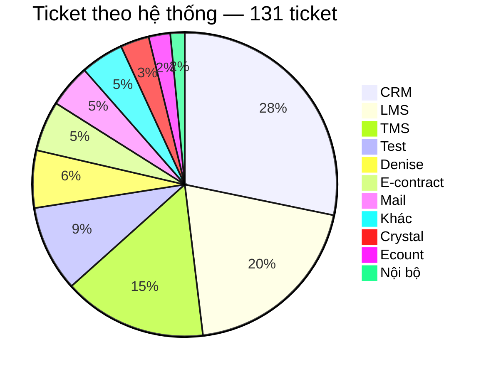
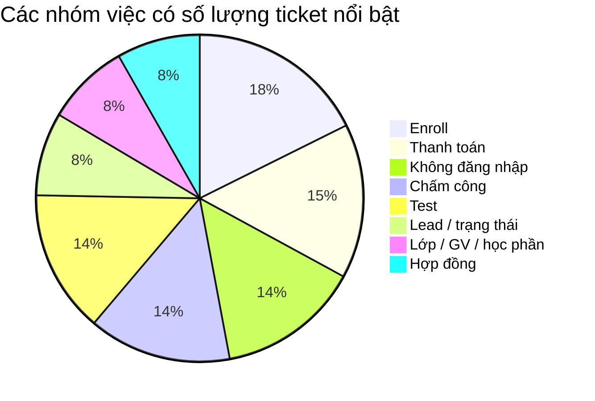
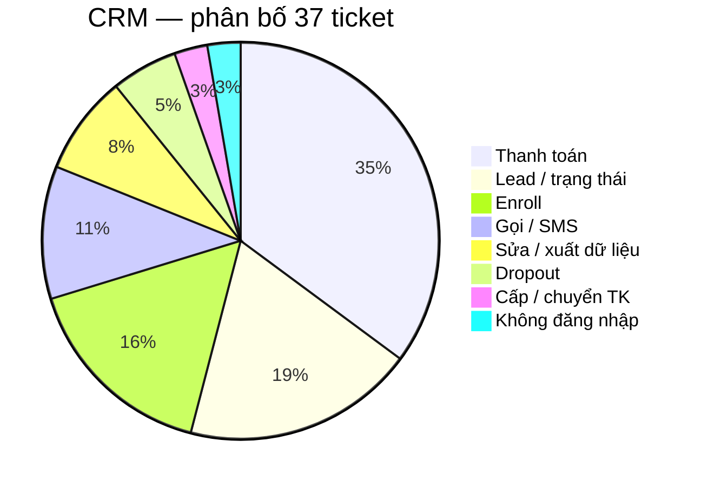
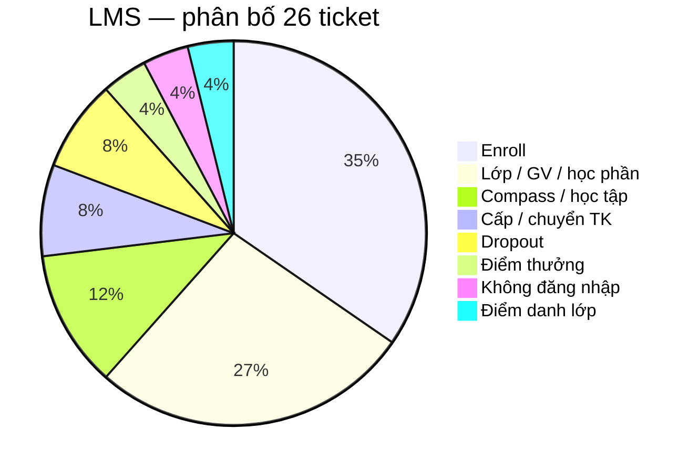
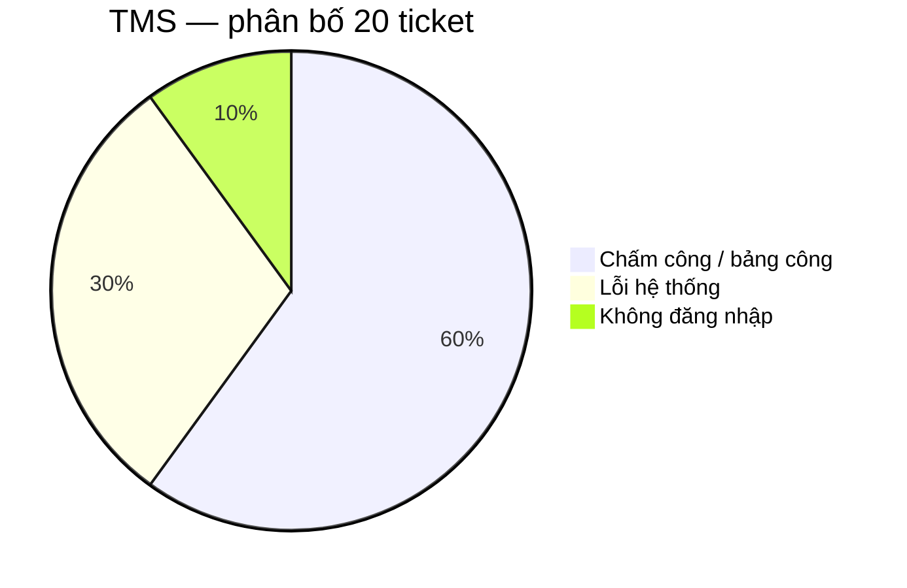
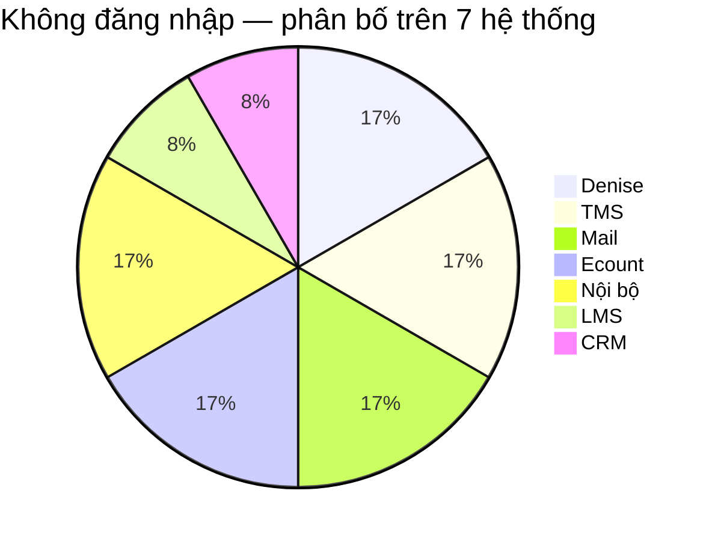
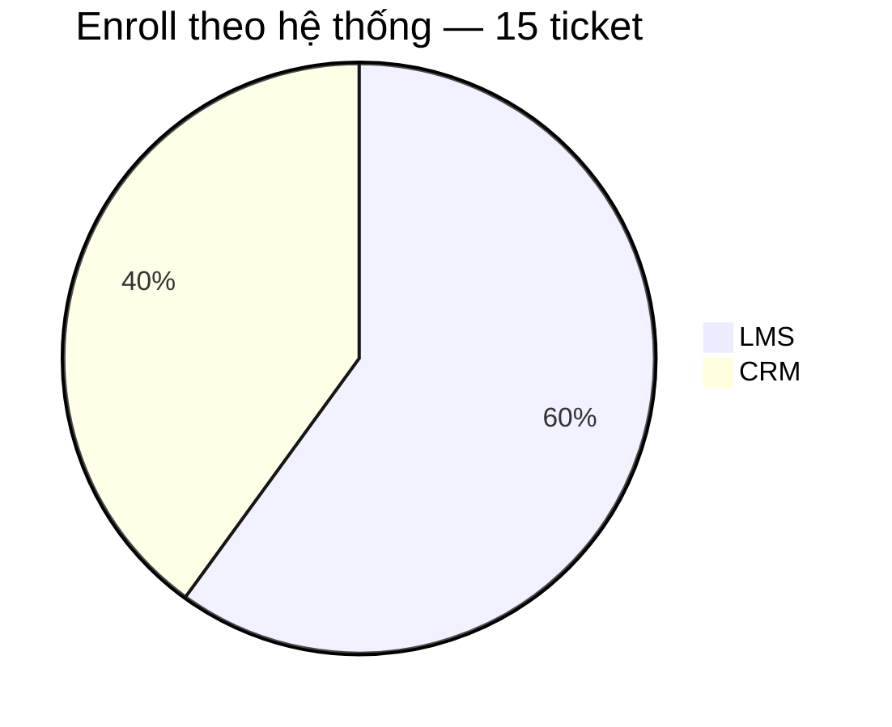
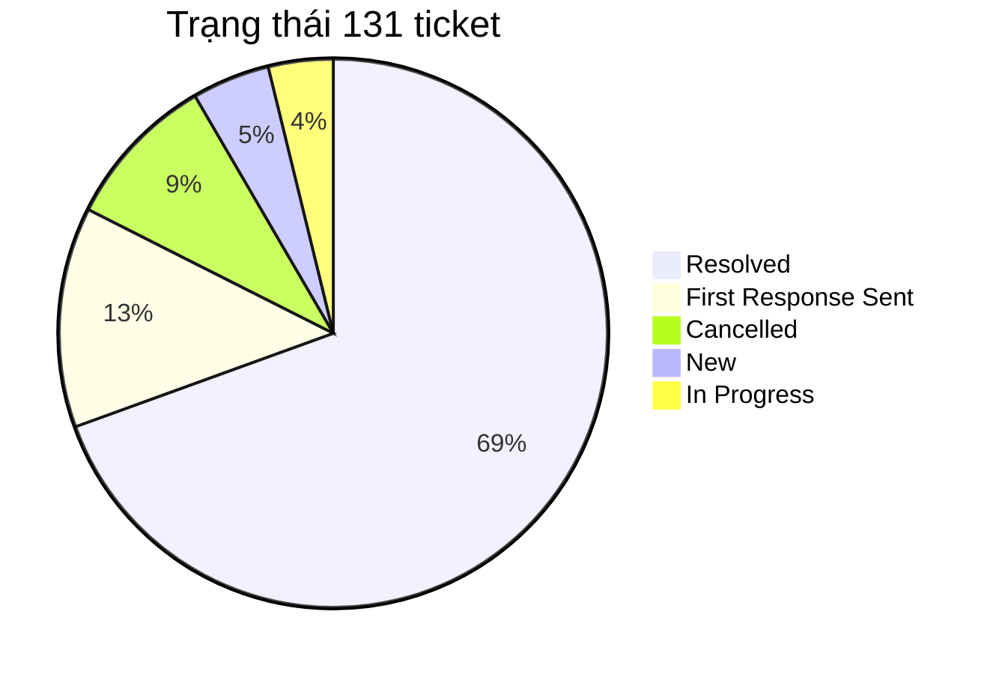
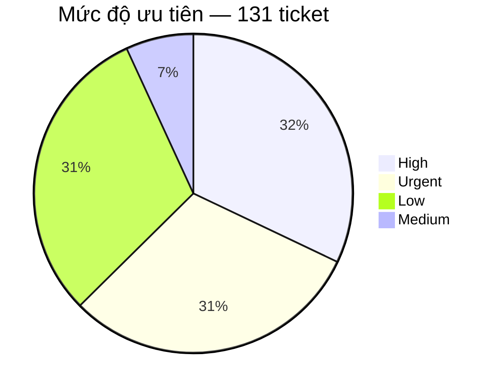

# BÁO CÁO PHÂN TÍCH TICKET — TECHNICAL SUPPORT

**Nguồn số liệu support:** export Helpdesk `sample.xlsx` (plan tuần 5). Bản làm việc: `sample-tickets.csv`.  
**Phạm vi:** 131 ticket Technical Support có mã không trùng. File có 183 dòng; phần còn lại là hàng nhóm trạng thái và tag phụ, không tính là ticket.  
Số liệu lấy từ export trên. Sáu tình huống tuần 4 không cộng vào 131; chúng dùng làm **khung loại tình huống**: login, hiệu năng, sự cố nhiều người, tính năng mới, hạn chót — để nhận các ticket cùng kiểu trong file, kể cả khi tiêu đề không trùng bài luyện.

**Cách phân loại:** Ticket được phân nhóm dựa trên hệ thống xảy ra vấn đề và nội dung yêu cầu trong Subject. Những ticket có cùng tên vấn đề nhưng xảy ra trên các hệ thống khác nhau không được mặc định là cùng một nguyên nhân hoặc cùng một cách xử lý.

## 1. Mục tiêu phân tích

Báo cáo này được thực hiện để trả lời ba câu hỏi:

- Ticket hiện tập trung nhiều nhất ở hệ thống và nhóm vấn đề nào?
- Với từng nhóm ticket lớn, người dùng đang gặp những tình huống gì và support cần xử lý theo hướng nào?
- Nhóm nào phù hợp để cải thiện quy trình hoặc tự động hóa, và nhóm nào cần điều tra thêm trước khi đưa ra giải pháp?

Mục tiêu của báo cáo không chỉ là đếm số lượng ticket, mà là xác định khu vực support đang phải xử lý lặp lại nhiều nhất, từ đó lựa chọn đúng vấn đề để cải thiện.

## 2. Tổng quan 131 ticket

### 2.1. Ticket tập trung ở hệ thống nào?

CRM, LMS và TMS có tổng cộng 83/131 ticket, chiếm 63,4% tổng số ticket. Trong đó CRM có số lượng lớn nhất với 37 ticket, tiếp theo là LMS với 26 ticket và TMS với 20 ticket.

Điều này cho thấy phần lớn khối lượng hỗ trợ trong tập dữ liệu hiện tại đang tập trung ở ba hệ thống trên. Vì vậy, nếu cần ưu tiên khu vực để phân tích sâu thì CRM, LMS và TMS là ba hệ thống cần được xem trước.

Tuy nhiên, số lượng ticket cao chưa đủ để kết luận một hệ thống đang có nhiều lỗi hơn hệ thống khác. Một hệ thống có nhiều ticket có thể do lượng người dùng lớn hơn, quy trình nghiệp vụ phức tạp hơn, người dùng chưa quen thao tác hoặc bản thân hệ thống có lỗi.

Dữ liệu hiện tại không có số lượng người sử dụng từng hệ thống nên báo cáo chỉ kết luận được ticket đang tập trung ở đâu, chưa thể tính tỷ lệ lỗi trên mỗi người dùng.

### 2.2. Các nhóm việc xuất hiện nhiều nhất

Enroll là nhóm có số lượng lớn nhất với 15 ticket. Tiếp theo là thanh toán với 13 ticket; không đăng nhập, chấm công và ticket test đều có 12 ticket.

Tuy nhiên, không nên lựa chọn giải pháp chỉ dựa vào tên nhóm. Ví dụ, 15 ticket enroll nằm trên hai hệ thống khác nhau: 9 ticket trên LMS và 6 ticket trên CRM. Hai hệ thống có màn hình, dữ liệu và cách xử lý khác nhau nên cần tiếp tục tách theo từng cặp hệ thống + vấn đề.

## 3. Phân tích ticket theo từng hệ thống

Phần này đi vào từng hệ thống có số ticket lớn nhất: CRM, LMS và TMS.

### 3.1. CRM — 37 ticket

CRM có 37/131 ticket, chiếm 28,2% tổng số ticket, là hệ thống có khối lượng ticket lớn nhất.

Ba nhóm thanh toán, lead/trạng thái và enroll có tổng cộng 26/37 ticket CRM, tương đương 70,3% ticket CRM. Vì vậy, nếu cần cải thiện support trên CRM thì nên bắt đầu từ ba nhóm này thay vì xử lý dàn trải tất cả loại ticket.

#### 3.1.1. Thanh toán — 13 ticket

Thanh toán là nhóm lớn nhất trên CRM với 13/37 ticket, chiếm 35,1% ticket CRM.

Các ticket trong nhóm này không phải cùng một lỗi duy nhất. Nội dung gồm nhiều tình huống khác nhau như:

- tạo QR thanh toán;
- add hoặc gỡ payment;
- hủy hoặc xác nhận giao dịch;
- cập nhật trạng thái đóng tiền;
- hóa đơn;
- mã giảm giá.

Điểm cần lưu ý là 13 ticket payment không có nghĩa CRM gặp cùng một lỗi payment 13 lần. Đây là một nhóm nghiệp vụ đang tạo ra nhiều yêu cầu hỗ trợ.

**Điều cần xác định thêm**

Trước khi chọn giải pháp, cần tách nguyên nhân ticket thành ít nhất ba hướng:

- Người dùng chưa biết hoặc thao tác chưa đúng.
- Người dùng không có quyền thực hiện thao tác.
- CRM hoặc dữ liệu thực sự xảy ra lỗi.

Ba nguyên nhân này dẫn đến ba cách xử lý khác nhau.

Ba hướng xử lý tương ứng: hướng dẫn thao tác (mục 9), chuyển đúng người có quyền, hoặc điều tra lỗi hệ thống. Chưa có log hay ghi chú xử lý trong file nên **chưa chọn một hướng rồi đóng**.

**Hướng xử lý hiện tại**

Chưa nên xây tool tự động sửa payment chỉ vì nhóm này có nhiều ticket. Đây là nghiệp vụ liên quan trực tiếp đến dữ liệu tài chính và có khả năng ảnh hưởng đến giao dịch thực tế.

Bước phù hợp hơn là bổ sung dữ liệu cho từng ticket:

Nguyên nhân → người/bộ phận xử lý → thao tác đã thực hiện → thời gian xử lý → kết quả.

Sau khi có dữ liệu này mới có thể kết luận nên cải thiện bằng guide, form, routing hay automation.

#### 3.1.2. Lead / trạng thái — 7 ticket

CRM có 7 ticket liên quan đến lead và trạng thái lead.

Nhóm này có số lượng thấp hơn payment nhưng vẫn chiếm gần 19% ticket CRM. Cần tiếp tục xem các ticket này chủ yếu là:

- yêu cầu thay đổi trạng thái;
- dữ liệu lead không đúng;
- không thực hiện được thao tác;
- lỗi khi gọi hoặc xử lý lead;
- hay yêu cầu cần người có quyền cao hơn xử lý.

Nếu support thường phải hỏi lại cùng một loại thông tin như mã lead, trạng thái hiện tại, trạng thái mong muốn hoặc lý do thay đổi thì có thể chuẩn hóa form đầu vào.

Nếu thao tác cần quyền đặc biệt, nên ưu tiên routing đúng người thay vì tự động sửa dữ liệu CRM.

#### 3.1.3. Enroll trên CRM — 6 ticket

Có 6 ticket enroll xảy ra trên CRM.

Các trường hợp này cần được tách khỏi enroll trên LMS vì dù cùng liên quan đến học viên và lớp, thao tác xử lý nằm trên hai hệ thống khác nhau.

Với CRM, ticket enroll chủ yếu liên quan đến thao tác enrollment hoặc chỉnh sửa thông tin trên enrollment.

Do đó, nếu sau này xây guide hoặc auto-reply thì phải xác định ticket đang phát sinh trên CRM hay LMS trước khi gửi hướng dẫn.

### 3.2. LMS — 26 ticket

LMS có 26 ticket, đứng thứ hai sau CRM.

Hai nhóm lớn nhất là Enroll (9) và Lớp/GV/học phần (7), tổng cộng 16/26 ticket, tương đương 61,5% ticket LMS.

Như vậy, phần lớn ticket LMS trong tập dữ liệu hiện tại liên quan đến việc đưa học viên vào lớp và quản lý lớp/học phần.

#### 3.2.1. Enroll trên LMS — 9 ticket

Các ticket gồm các trường hợp như:

- thêm học viên vào lớp;
- không tìm thấy lớp hoặc slot enroll;
- enroll trùng lớp;
- lỗi trong quá trình enroll.

Tuy nhiên, chỉ dựa trên Subject chưa thể kết luận 9 ticket này có cùng nguyên nhân.

Cần tiếp tục phân biệt:

- người dùng thao tác chưa đúng;
- thiếu hoặc sai dữ liệu học viên/lớp;
- tài khoản không đủ quyền;
- LMS thực sự xảy ra lỗi.

Hướng có thể đi song song: form bắt buộc mã lớp / SĐT / tên; tài liệu hoặc auto-reply (mục 9); chuyển người có quyền enroll; hoặc Dev nếu nhiều phiếu cùng một lỗi màn hình.

#### 3.2.2. Lớp / giáo viên / học phần — 7 ticket

Nhóm này gồm các vấn đề như không thêm được giáo viên, điều chỉnh lớp hoặc lỗi liên quan đến học phần.

Đây cũng là nhóm cần phân biệt giữa yêu cầu nghiệp vụ và lỗi hệ thống.

Ví dụ, trường hợp người dùng cần người có quyền chỉnh lớp sẽ có hướng xử lý khác với trường hợp chức năng thêm giáo viên thực sự bị lỗi.

Ở lần phân tích tiếp theo nên bổ sung nguyên nhân và thao tác support thực tế cho từng ticket để xác định nhóm nào có thể giải quyết bằng hướng dẫn, nhóm nào cần chuyển đúng người và nhóm nào cần Dev kiểm tra.

### 3.3. TMS — 20 ticket

TMS có 20 ticket và mức độ tập trung vấn đề rất rõ.

Có 18/20 ticket TMS, tương đương 90%, nằm trong hai nhóm chấm công hoặc lỗi hệ thống.

Điều này cho thấy nếu muốn giảm khối lượng support trên TMS thì hai nhóm này cần được ưu tiên điều tra.

#### 3.3.1. Chấm công / bảng công — 12 ticket

Các ticket trong nhóm này gồm nhiều triệu chứng khác nhau:

- không hiển thị công;
- không duyệt được công;
- cần bù công;
- đi đúng ca nhưng hệ thống báo trễ;
- vấn đề điểm danh hoặc chấm công giáo viên.

Do đó, 12 ticket chấm công không nên được coi là một lỗi duy nhất.

**Cần phân loại sâu hơn theo triệu chứng**

Có thể tách tiếp thành:

Không có dữ liệu → dữ liệu sai → không duyệt được → ghi nhận sai thời gian → vấn đề khác.

Ngoài triệu chứng, cần xác định phạm vi ảnh hưởng.

Ví dụ, một người không thấy công có thể là vấn đề cá nhân. Nhưng nếu nhiều giáo viên tại cùng cơ sở cùng không thấy dữ liệu trong cùng thời điểm thì cần nghĩ tới khả năng đây là một incident chung.

**Thông tin nên bổ sung khi tạo ticket**

- cơ sở hoặc khu vực;
- thời điểm xảy ra lỗi;
- ca làm việc;
- người bị ảnh hưởng;
- một người hay nhiều người cùng gặp;
- triệu chứng cụ thể;
- ảnh chụp hoặc thông báo lỗi nếu có.

Những thông tin này giúp support xác định nhanh hơn ticket cá nhân hay sự cố hệ thống.

#### 3.3.2. Lỗi hệ thống — 6 ticket

Có 6 ticket mô tả tình trạng mất dữ liệu, không hiển thị thông tin hoặc không thao tác được trên TMS.

Đáng chú ý, ticket 233 và 234 cùng phản ánh vấn đề tại cụm Tỉnh Nam 2, với triệu chứng tương tự và cùng liên quan đến lỗi từ ngày 31.

Điều này chưa đủ để khẳng định hai ticket có cùng root cause, nhưng là dấu hiệu nên điều tra theo hướng incident chung.

**Hướng cải thiện**

Khi nhận nhiều ticket TMS, có thể so sánh:

hệ thống + khu vực/cơ sở + thời gian + triệu chứng.

Nếu nhiều ticket trùng các yếu tố trên, support có thể liên kết chúng vào một incident chính để theo dõi thay vì điều tra từng ticket độc lập.

Quyết định gom ticket vẫn nên do support xác nhận, không nên để hệ thống tự động kết luận hai ticket chắc chắn có cùng nguyên nhân.

## 4. Không đăng nhập / tài khoản — 12 ticket

Nhóm không đăng nhập, khóa tài khoản hoặc quên mật khẩu có 12 ticket, phân bố trên 7 hệ thống.

Không có hệ thống nào chiếm phần lớn nhóm login. Điều đáng chú ý ở nhóm này không phải số lượng ticket trên từng hệ thống mà là quy trình support có tính lặp lại.

Một ticket login thường có thể cần các bước:

1. Xác định người dùng.
2. Kiểm tra người dùng còn hoạt động hay không.
3. Kiểm tra trạng thái tài khoản.
4. Xác định tài khoản bị khóa, sai thông tin hay cần reset.
5. Thực hiện thao tác nếu đủ điều kiện.
6. Phản hồi lại người dùng.

Đây là lý do login phù hợp để tiếp tục thử automation hơn các nghiệp vụ như payment: quy trình kiểm tra có điều kiện tương đối rõ và có khả năng để máy thực hiện một phần.

Tuy nhiên, 12 ticket login không đồng nghĩa workflow hiện tại xử lý được toàn bộ 12 ticket. Các hệ thống khác nhau có thể có cơ chế tài khoản khác nhau. Nếu nguyên nhân phổ biến là rule khóa sau thời gian không dùng, đó cũng là trường hợp “đã có quy định mà ticket vẫn vào” — cần nhắc user trước ngày khóa, không chỉ reset từng phiếu.

**Chỉ số cần đo với workflow login**

Cần ghi nhận ít nhất:

- tổng số ticket đưa vào workflow;
- số ticket xử lý hoàn toàn tự động;
- số ticket workflow chỉ hỗ trợ kiểm tra nhưng vẫn cần support can thiệp;
- số ticket workflow không xử lý được;
- thời gian xử lý trung bình trước và sau khi dùng workflow.

Ví dụ, nếu thử trên 20 ticket và tool tự xử lý hoàn toàn được 15 ticket thì khi đó mới có thể kết luận automation coverage đạt 75%.

Hiện tại chưa nên khẳng định mức tiết kiệm thời gian nếu chưa có số liệu đo thực tế.

## 5. Enroll — 15 ticket trên hai hệ thống

Enroll là nhóm có số lượng lớn nhất khi nhìn theo loại việc, nhưng 15 ticket này nằm trên hai hệ thống khác nhau.

LMS: chủ yếu liên quan đến thêm học viên, lớp, slot và enroll trùng.

CRM: chủ yếu liên quan đến thao tác enrollment hoặc thông tin trên enrollment.

Vì vậy, việc gộp thành “15 ticket enroll” chỉ hữu ích để nhìn tổng volume. Khi tìm giải pháp phải tách LMS và CRM.

Nếu xây guide, form hoặc auto-reply thì hệ thống cần xác định trước ticket đang xảy ra trên LMS hay CRM để đưa đúng hướng dẫn.

## 6. Tình huống cần điều tra trước khi chốt nguyên nhân

Một số ticket trông giống “lỗi hệ thống” nhưng chưa đủ để kết luận do server, do mạng, do một user hay do cả cơ sở. File không có số người bị ảnh hưởng và không có log. Các hướng dưới đây là **giả định điều tra**, dùng chung cho mọi hệ thống — không chỉ LMS.

### 6.1. Hiệu năng (chậm, timeout, tải mãi)

Trong `sample.xlsx` ít tiêu đề kiểu “LMS chậm” hay “nộp bài sập”. Vẫn cần sẵn cách hỏi khi phiếu loại này xuất hiện (LMS, CRM, TMS, Denise, Crystal đều có thể chậm).

Chưa kết luận do server. Ghi nhận:

1. Một máy hay cả cơ sở / nhiều cơ sở?
2. Khung giờ nào? Có trùng giờ cao điểm không?
3. Đã thử mạng khác, máy khác, trình duyệt khác chưa?
4. Chậm lúc vào trang, lúc tải file/video, hay lúc lưu/nộp?
5. Cơ sở vừa đổi mạng, firewall, hay hệ thống vừa cập nhật?

Một user → thử môi trường khác rồi mới chuyển Dev.  
Nhiều người cùng giờ, nội dung nặng → nghi tải phía client hoặc băng thông cơ sở.  
Nhiều cơ sở cùng lúc → mới nghi server / CDN; một ticket chính, cập nhật chung.

Không dùng workflow login để xử lý phiếu chậm.

### 6.2. Nhiều người cùng triệu chứng

Cùng logic với “một user hay nhiều user”. Trong file, dấu hiệu rõ nhất là TMS: ticket 233 và 234 (Tỉnh Nam 2, không hiện thông tin / không thao tác từ ngày 31). Cùng kiểu đó có thể gặp ở CRM không gọi được, Crystal không book phòng, Denise lệch điểm thưởng — nếu nhiều BU cùng lúc.

So sánh: hệ thống + khu vực + thời điểm + triệu chứng. Trùng thì gom một incident, không để nhiều support điều tra song song. Support xác nhận trước khi kết luận cùng root cause.

### 6.3. Yêu cầu tính năng và việc có hạn chót

Hai loại này ít khi hiện thành nhóm volume lớn, nhưng cách xử lý khác hẳn bug.

- Tính năng mới / upsale / đổi chương trình: ghi nhận, không hứa ngày ra tính năng, chuyển Product hoặc người có quyền.
- Việc có giờ chết (duyệt công trước hết tháng, PH cần ký HĐ trong ngày): chốt phạm vi, xin người có quyền; không để máy tự duyệt.

File có tín hiệu kiểu này (ví dụ duyệt công sát cuối tháng, yêu cầu upsale) nhưng không đủ để thống kê riêng.

## 7. Trạng thái ticket

Có 91/131 ticket ở trạng thái Resolved, tương đương 69,5%.

Con số này cho biết phần lớn ticket trong file đã được đóng, nhưng chưa đủ để đánh giá hiệu quả của đội support.

Để đánh giá chất lượng xử lý cần thêm các chỉ số như:

- thời gian từ lúc tạo ticket đến first response;
- thời gian từ lúc tạo ticket đến resolved;
- số lần ticket bị reopen;
- SLA;
- người hoặc nhóm xử lý;
- số người dùng bị ảnh hưởng.

Ví dụ, 69,5% ticket resolved có thể là kết quả tốt nếu thời gian xử lý ngắn, nhưng cũng có thể chưa tốt nếu ticket tồn tại quá lâu trước khi được đóng.

## 8. Mức độ ưu tiên

High và Urgent có tổng cộng 82/131 ticket, chiếm 62,6%.

Tỷ lệ này khá cao, nhưng chưa nên kết luận rằng 62,6% ticket là sự cố nghiêm trọng.

Có thể xảy ra các trường hợp:

- priority phản ánh đúng mức độ ảnh hưởng;
- người tạo ticket có xu hướng chọn High/Urgent để được xử lý nhanh;
- từng loại nghiệp vụ có quy tắc priority khác nhau.

Do file hiện tại không có số người dùng bị ảnh hưởng hoặc tiêu chí gán priority, báo cáo chưa thể kiểm chứng nguyên nhân.

Đây là một điểm nên tiếp tục điều tra nếu muốn đánh giá chất lượng phân loại ticket.

## 9. Đánh giá hướng cải thiện theo từng nhóm

Dựa trên dữ liệu hiện tại, không nên áp dụng cùng một giải pháp cho tất cả nhóm ticket.

| Nhóm | Số ticket | Điều dữ liệu đang cho thấy | Các hướng có thể làm |
| --- | ---: | --- | --- |
| CRM — Thanh toán | 13 | Nhiều yêu cầu nghiệp vụ, chưa rõ root cause | Form đủ field; chuyển kế toán; guide hoặc auto-reply. Không script sửa payment. |
| LMS — Enroll | 9 | Nhiều dạng tình huống trên LMS | Form mã lớp / SĐT / tên; guide LMS; auto-reply nếu đã có tài liệu. |
| CRM — Enroll | 6 | Cùng tên với LMS, khác hệ thống | Quy trình và guide riêng cho CRM. |
| TMS — Chấm công | 12 | Nhiều triệu chứng khác nhau | Tách triệu chứng; xác định một user hay cả cơ sở. |
| TMS — Lỗi hệ thống | 6 | Có ticket tương tự (Nam 2) | Điều tra incident chung, rồi Dev. |
| Login | 12 | Bước kiểm tra lặp lại | Workflow HR + LMS (đã triển khai). Nếu nhiều phiếu do rule khóa tài khoản: mail nhắc, không chỉ reset. |
| CRM — Lead / trạng thái | 7 | Volume đáng kể | Form; routing đúng người. |
| Hiệu năng / hàng loạt | TMS có cụm; LMS chậm ít trong file | Chưa có số người bị ảnh hưởng | Điều tra phạm vi trước (mục 6). Không kết luận server ngay. |
| Tính năng / hạn chót | Lẻ trong file | Không phải bug lặp | Ghi nhận hoặc xin người có quyền. Không automate. |

Một hướng (workflow login, hoặc chỉ viết guide) **không giảm** hết thanh toán, enroll, chấm công và sự cố hàng loạt. Từng nhóm chọn hướng phù hợp, có thể đi song song.

Volume giúp xác định nên nhìn vào đâu. Root cause và quy trình xử lý thực tế mới quyết định nên làm gì.

## 10. Khi chưa rõ đã có tài liệu hay chưa

File export không ghi Helpdesk/KB đã có bài hay chưa, người dùng đã mở bài hay chưa. Mọi kết luận “cần viết guide” dưới đây là giả định — áp dụng cho **mọi nhóm hướng dẫn thao tác**, không chỉ enroll.

**Chưa có bài** → viết ngắn theo từng việc (đăng nhập từng hệ thống, enroll LMS, enroll CRM, payment, chấm công, gọi/SMS). Không gộp một bài cho cả hệ thống.

**Đã có bài mà ticket vẫn vào** → chưa chắc bài vô ích. Có thể người dùng không tìm thấy, bài khó hiểu, bài cũ so với hệ thống, hoặc gửi ticket cho nhanh.

Hướng tiếp, cùng lúc với viết/sửa bài:

- auto-reply + gắn đúng file khi tiêu đề khớp;
- form bắt buộc field để bớt hỏi lại;
- routing nếu thiếu quyền chứ không thiếu kiến thức.

Auto-reply không thay bước phải đụng dữ liệu (reset mật khẩu, sửa payment, enroll hộ). Những bước đó vẫn cần workflow hoặc người có quyền.

Cùng logic “đã có quy định mà vẫn còn ticket”: nếu nhiều phiếu login do tài khoản bị khóa theo rule (ví dụ lâu không đăng nhập), hướng thêm là nhắc trước ngày khóa — không chỉ reset từng phiếu.

## 11. Kế hoạch phân tích tiếp theo

### 11.1. Đo hiệu quả workflow login

Không chỉ ghi nhận tool đã chạy được mà cần đo bằng số liệu.

Mỗi ticket thử nghiệm nên ghi:

Ticket → workflow xử lý tới bước nào → có cần support can thiệp không → thời gian xử lý → kết quả cuối cùng.

Sau một số lượng ticket đủ lớn có thể tính:

- Automation coverage.
- Tỷ lệ cần support can thiệp.
- Thời gian trung bình trước và sau automation.
- Các lý do khiến workflow không xử lý được.

Khi đó mới có thể kết luận tool thực sự giảm bao nhiêu thao tác support.

### 11.2. Phân tích sâu Payment và Enroll

Payment và Enroll đều có volume cao nhưng dữ liệu hiện tại mới chủ yếu cho biết nội dung yêu cầu.

Cần lấy mẫu ticket và bổ sung:

Nguyên nhân → thao tác support → người/bộ phận xử lý → thời gian → kết quả.

Sau đó mới quyết định giải pháp phù hợp.

Có thể có bốn hướng:

- Guide: nếu người dùng chưa biết thao tác.
- Form: nếu support thường xuyên phải hỏi lại thông tin.
- Routing: nếu ticket thường phải chuyển cho đúng người có quyền.
- Automation: nếu quy trình có điều kiện rõ, lặp lại và an toàn để máy thực hiện.

### 11.3. Gom ticket cùng sự cố

Không chỉ TMS. Mọi phiếu chậm, không thao tác, mất dữ liệu, không gọi được nên bổ sung:

thời gian + cơ sở + số người bị ảnh hưởng + triệu chứng.

Trùng các yếu tố đó thì kiểm tra incident chung, tránh nhiều support điều tra một nguyên nhân dưới các ticket khác nhau.

### 11.4. Đo thử auto-reply + tài liệu

Sau khi gắn auto-reply, cần đếm:

- số ticket enroll / thanh toán / mật khẩu được gửi tài liệu ngay;
- số ticket người dùng tự xử lý xong, không cần support vào;
- số ticket vẫn phải hỗ trợ tay sau khi đã nhận guide.

## 12. Kết luận

Phân tích 131 ticket cho thấy khối lượng support tập trung chủ yếu tại CRM, LMS và TMS với 83 ticket, chiếm 63,4% tổng số.

Ở từng hệ thống, vấn đề tập trung khác nhau:

- CRM: nổi bật nhất là thanh toán, lead/trạng thái và enroll.
- LMS: chủ yếu là enroll và quản lý lớp/giáo viên/học phần.
- TMS: phần lớn ticket liên quan đến chấm công hoặc lỗi hệ thống.

Điểm quan trọng là nhiều ticket không đồng nghĩa nên tự động hóa ngay.

Payment có volume lớn nhưng liên quan đến dữ liệu tài chính và chưa rõ nguyên nhân chính.

Enroll có volume lớn nhưng phải tách LMS và CRM.

TMS có dấu hiệu một số ticket có thể thuộc cùng incident, cần bổ sung thời gian, khu vực và phạm vi ảnh hưởng để xác nhận.

Login không phải nhóm lớn nhất trên một hệ thống cụ thể, nhưng quy trình kiểm tra có tính lặp lại và điều kiện tương đối rõ. Vì vậy đây là nhóm phù hợp để tiếp tục thử workflow và đo hiệu quả bằng số liệu thực tế.

Chưa xác nhận Helpdesk đã có bài hay chưa. Chưa có thì viết từng việc. Có rồi mà ticket vẫn vào thì không dừng ở “đã có guide”: thử auto-reply + gắn file, hoặc form / routing nếu vấn đề là quyền và thiếu thông tin.

Ticket chậm, mất dữ liệu hoặc nhiều người cùng triệu chứng: hỏi phạm vi trước, chưa gán nguyên nhân server. Cách này dùng cho LMS, TMS, CRM hay hệ thống khác — không chờ đúng tiêu đề “LMS chậm”.

Tính năng mới và việc có hạn chót ghi nhận hoặc xin người có quyền, không đưa vào automation.
