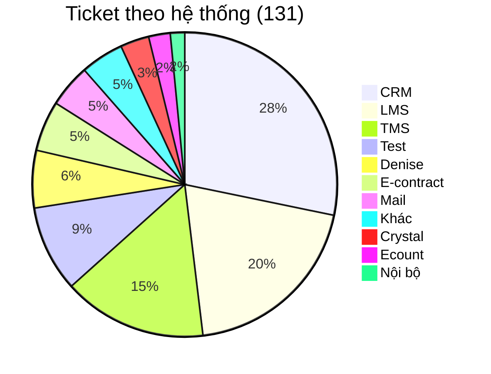
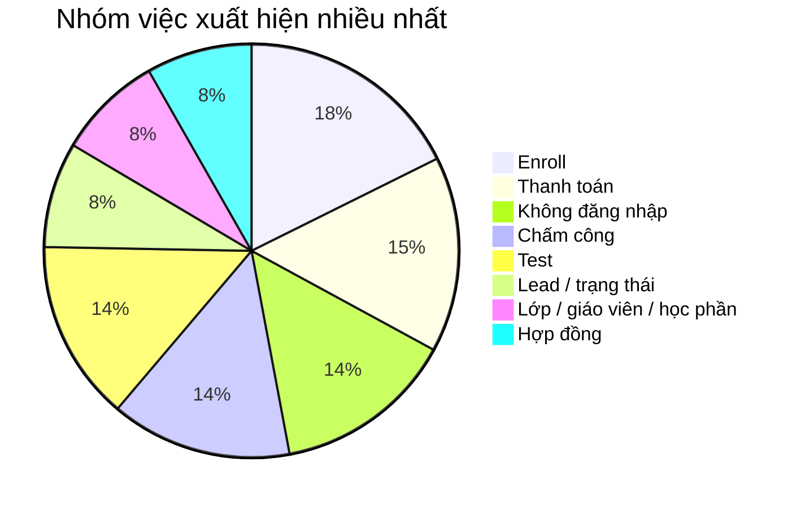
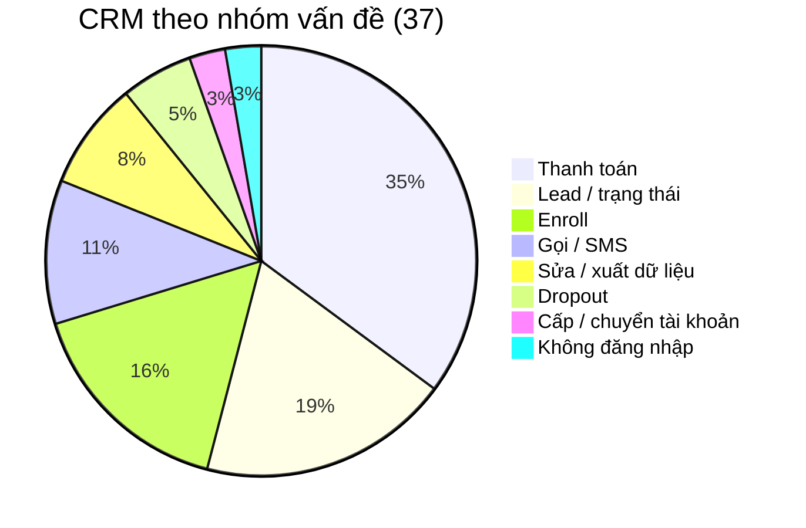
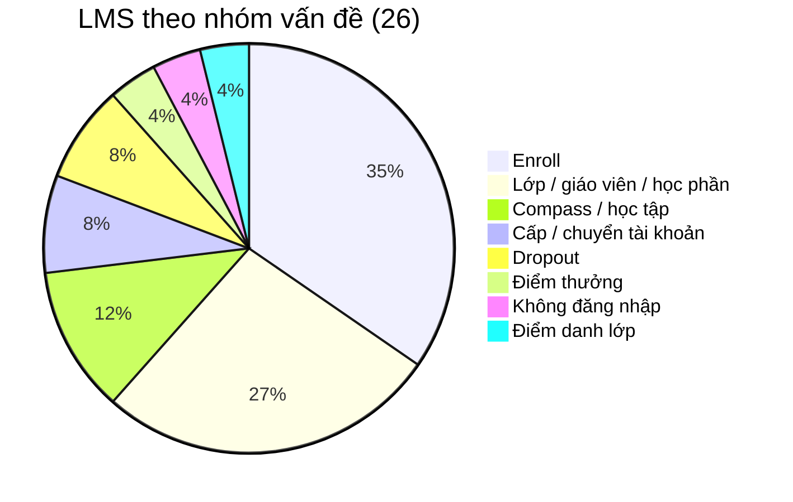
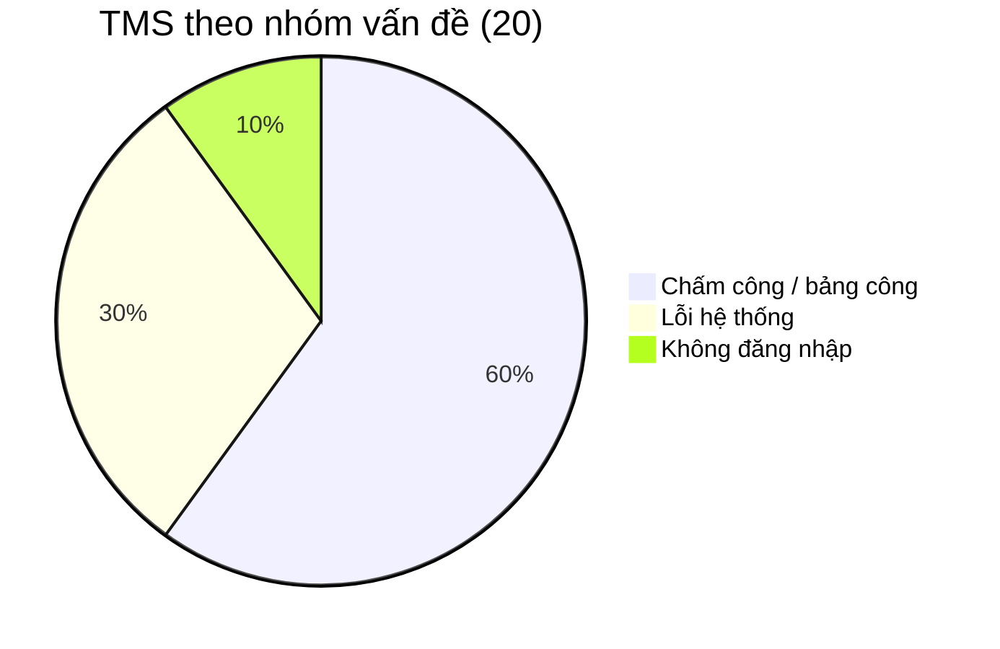
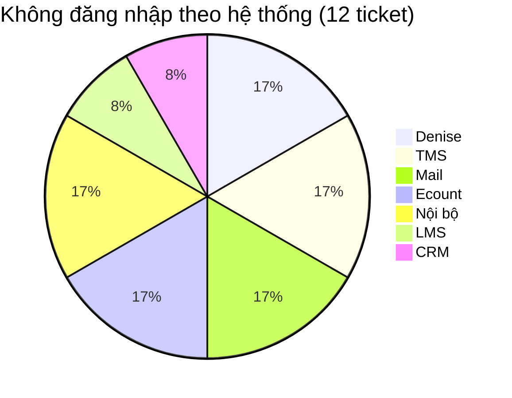
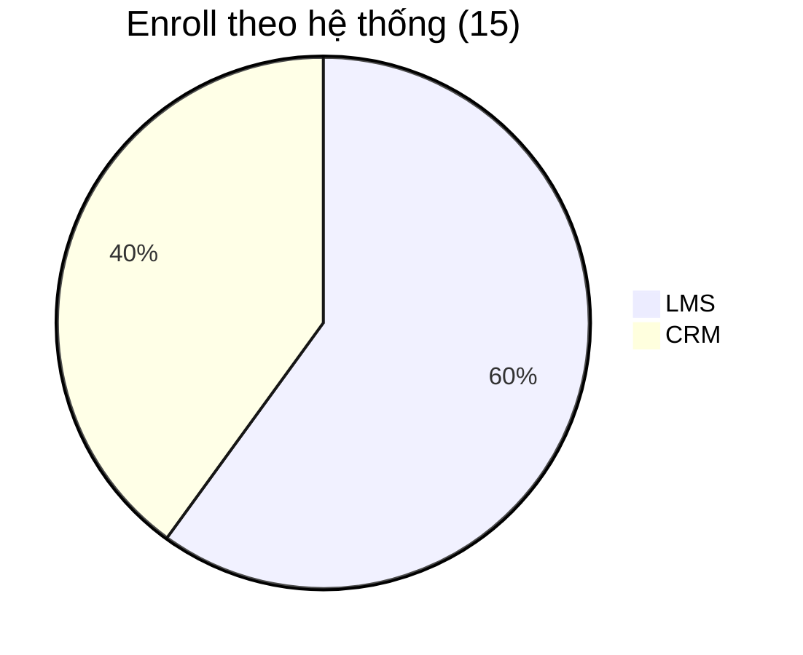
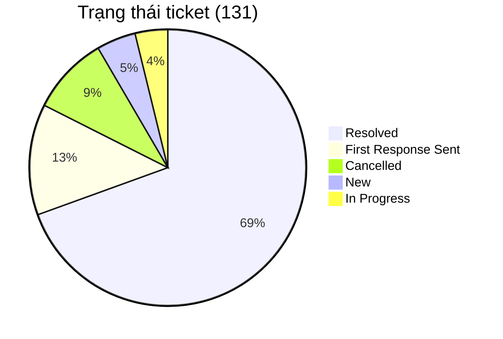
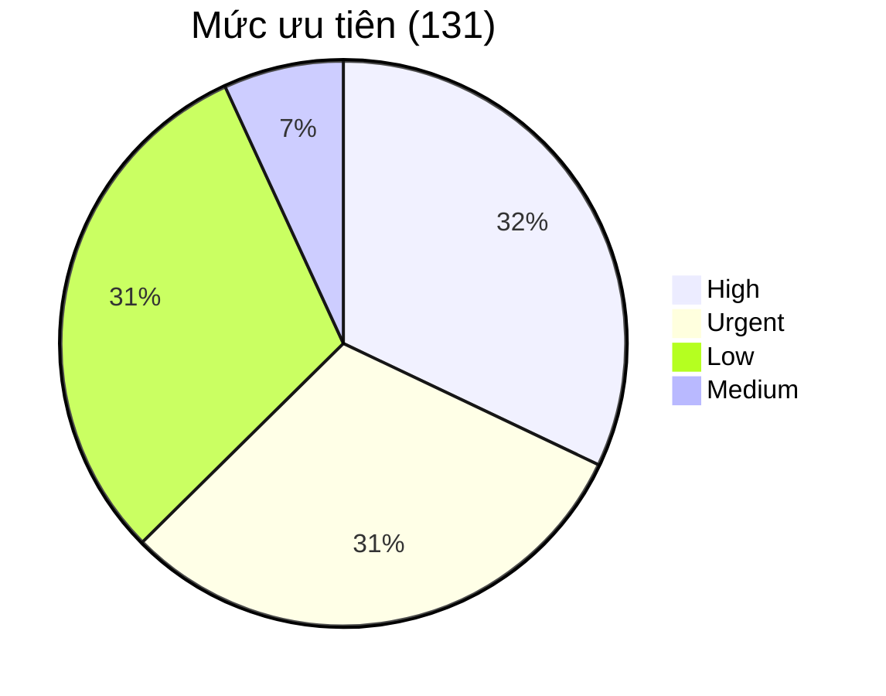

# BÁO CÁO PHÂN TÍCH TICKET — TECHNICAL SUPPORT

**Nguồn dữ liệu:** `sample-tickets.csv` — Plan tuần 5  
**Tổng số:** 131 ticket có mã không trùng lặp.

---

## 1. Tổng quan

Trong 131 ticket được ghi nhận, phần lớn vấn đề tập trung ở ba hệ thống chính: CRM, LMS và TMS.

Ba hệ thống này chiếm **83/131 ticket, tương đương 63,4% tổng số ticket**. Ngoài ra có 12 ticket phục vụ mục đích test và các ticket liên quan đến Denise, E-contract, Mail, Crystal, Ecount và hệ thống nội bộ.

Các nhóm việc xuất hiện nhiều nhất:

Enroll có 15 ticket. Thanh toán có 13 ticket. Không đăng nhập và chấm công mỗi nhóm 12 ticket.

---

## 2. Phân tích theo hệ thống

### 2.1. CRM — 37 ticket

CRM là hệ thống có số lượng ticket lớn nhất, với **37/131 ticket (28,2%)**.

Nhóm lớn nhất là **thanh toán với 13 ticket**, gồm tạo QR thanh toán, add/gỡ payment, hủy hoặc xác nhận giao dịch, cập nhật trạng thái đóng tiền, hóa đơn và mã giảm giá.

Nhóm thứ hai là **lead và trạng thái lead**, với 7 ticket. CRM còn 6 ticket enroll và 4 ticket liên quan đến chức năng gọi/SMS.

Với nghiệp vụ ảnh hưởng trực tiếp đến dữ liệu thanh toán hoặc dữ liệu CRM, chưa nên để công cụ tự động thay đổi dữ liệu nếu chưa có quy trình kiểm soát và quyền xử lý rõ ràng.

---

### 2.2. LMS — 26 ticket

LMS có **26 ticket**, đứng thứ hai sau CRM.

Nhóm phổ biến nhất là **enroll với 9 ticket**. Nội dung chủ yếu gồm thêm học viên vào lớp, không tìm thấy lớp hoặc slot enroll, enroll trùng và lỗi trong quá trình enroll.

Nhóm **lớp/giáo viên/học phần** có 7 ticket, gồm không thêm được giáo viên, điều chỉnh lớp và lỗi liên quan đến học phần.

LMS còn 1 ticket điểm danh lớp.

---

### 2.3. TMS — 20 ticket

TMS có **20 ticket**.

**Chấm công/bảng công** là nhóm lớn nhất với 12 ticket: không hiển thị công, không duyệt được công, lỗi bù công, đi đúng ca nhưng hệ thống báo trễ, và các vấn đề điểm danh/chấm công giáo viên.

Có **6 ticket lỗi hệ thống**: mất dữ liệu, không hiển thị thông tin hoặc không thao tác được trên TMS.

Ticket **233 và 234** cùng phản ánh lỗi tại cụm Tỉnh Nam 2: TMS không hiển thị thông tin và không thao tác được từ ngày 31. Các trường hợp cùng thời điểm, khu vực và triệu chứng nên được kiểm tra khả năng phát sinh từ cùng một sự cố trước khi xử lý như các ticket độc lập.

---

## 3. Các vấn đề xuất hiện trên nhiều hệ thống

### 3.1. Không đăng nhập/tài khoản — 12 ticket

Có 12 ticket không đăng nhập, khóa tài khoản hoặc quên mật khẩu, phân bố trên 7 hệ thống:

Không hệ thống nào chiếm phần lớn nhóm này. Vấn đề tài khoản xuất hiện rải rác trên nhiều hệ thống.

Ngoài ra còn 5 ticket cấp mới hoặc chuyển tài khoản, với quy trình xử lý khác trường hợp đã có tài khoản nhưng không đăng nhập được.

Workflow login có thể hỗ trợ các bước kiểm tra nằm trong phạm vi dữ liệu mà workflow truy cập được. Trường hợp thuộc hệ thống khác hoặc không đủ điều kiện xử lý tự động vẫn cần support kiểm tra thủ công.

---

### 3.2. Enroll — 15 ticket

Có 15 ticket enroll: 9 trên LMS và 6 trên CRM.

Enroll trên LMS chủ yếu là thêm học viên, mở slot và enroll trùng lớp. Enroll trên CRM gồm lỗi enroll và sửa thông tin trên enrollment.

Có thể giảm thời gian trao đổi bằng cách chuẩn hóa thông tin đầu vào: mã lớp, thông tin học viên, số điện thoại/mã học viên, hệ thống xảy ra lỗi và mô tả thao tác đã thực hiện. Hướng dẫn xử lý cần viết riêng cho LMS và cho CRM.

---

### 3.3. Thanh toán — 13 ticket

13 ticket thanh toán đều trên CRM.

Nội dung gồm tạo QR, add/gỡ payment, hủy hoặc xác nhận giao dịch, cập nhật trạng thái đóng tiền, hóa đơn và mã giảm giá.

Đây là nhóm có số lượng lớn nhưng liên quan trực tiếp đến nghiệp vụ tài chính. Hướng cải tiến phù hợp trước mắt là chuẩn hóa thông tin đầu vào và quy trình chuyển xử lý, thay vì tự động thay đổi dữ liệu CRM.

---

## 4. Trạng thái và mức độ ưu tiên

Có **91/131 ticket đã được Resolved**, tương đương khoảng **69,5%**.

Nhóm **High + Urgent có 82 ticket, chiếm 62,6% tổng số ticket**.

Dữ liệu export không thể hiện số lượng người dùng bị ảnh hưởng bởi từng ticket. Chưa thể đánh giá mức độ ảnh hưởng của một sự cố chỉ dựa trên số lượng ticket và priority.

---

## 5. Đề xuất hướng xử lý

### CRM — Thanh toán

Có 13 ticket và là nhóm lớn nhất trên CRM.

Nên chuẩn hóa thông tin khi tạo ticket: mã lead, thông tin giao dịch, số tiền và nội dung cần hỗ trợ. Thao tác thay đổi dữ liệu thanh toán cần được chuyển đến đúng bộ phận/người có quyền xử lý.

### LMS/CRM — Enroll

Có 15 ticket, gồm 9 ticket LMS và 6 ticket CRM.

Nên chuẩn hóa form với các thông tin bắt buộc: mã lớp, thông tin học viên, hệ thống gặp lỗi và mô tả lỗi. Hướng dẫn xử lý viết riêng cho LMS và CRM.

### TMS — Chấm công

Có 12 ticket liên quan đến chấm công.

Khi tiếp nhận ticket nên xác định phạm vi ảnh hưởng: một nhân sự, một ca làm việc hay nhiều người tại cùng cơ sở. Nếu nhiều ticket cùng thời điểm và triệu chứng, cần kiểm tra khả năng đây là một sự cố chung trước khi xử lý từng ticket riêng lẻ.

### TMS — Lỗi hệ thống

Có 6 ticket liên quan đến mất dữ liệu, không hiển thị thông tin hoặc không thao tác được.

Nên thu thập thời điểm xảy ra lỗi, cơ sở/khu vực bị ảnh hưởng và phạm vi người dùng gặp lỗi. Các trường hợp cùng triệu chứng có thể gom vào một incident chính để theo dõi.

### Không đăng nhập/tài khoản

Có 12 ticket trên 7 hệ thống.

Đây là nhóm có quy trình kiểm tra tương đối lặp lại và phù hợp để tiếp tục đánh giá khả năng tự động hóa. Workflow hiện tại có thể xử lý các bước nằm trong phạm vi hệ thống mà tool có quyền kiểm tra; các trường hợp còn lại cần ghi nhận kết quả và chuyển support xử lý thủ công.

Cần tiếp tục đo:

* Tỷ lệ ticket được workflow xử lý hoàn toàn.
* Tỷ lệ ticket vẫn cần support can thiệp.
* Thời gian xử lý trung bình trước và sau khi sử dụng workflow.

Chỉ nên kết luận mức tiết kiệm thời gian sau khi có đủ số liệu thực tế.

---

## 6. Kết luận

Phân tích 131 ticket cho thấy phần lớn khối lượng hỗ trợ tập trung tại **CRM, LMS và TMS**, chiếm 63,4% tổng số ticket.

Các nhóm vấn đề nổi bật nhất là **CRM - thanh toán, LMS/CRM - enroll, TMS - chấm công và vấn đề đăng nhập/tài khoản**.

Không phải nhóm có nhiều ticket nhất cũng là nhóm phù hợp nhất để tự động hóa. Các nghiệp vụ như thanh toán hoặc thay đổi dữ liệu CRM có mức độ ảnh hưởng cao và cần quyền xử lý rõ ràng. Ngược lại, nhóm đăng nhập có các bước kiểm tra lặp lại và điều kiện xử lý tương đối rõ, phù hợp hơn để tiếp tục thử nghiệm workflow tự động.

Trong giai đoạn tiếp theo, cần tập trung đo hiệu quả thực tế của workflow login, chuẩn hóa dữ liệu đầu vào cho ticket enroll và thanh toán, đồng thời xác định các ticket TMS có cùng nguyên nhân để tránh xử lý lặp lại.
