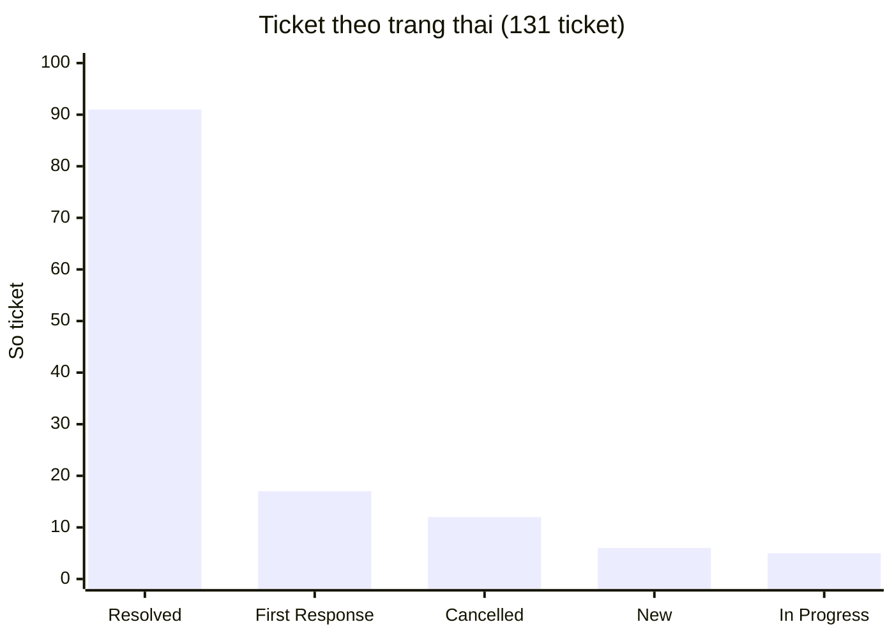
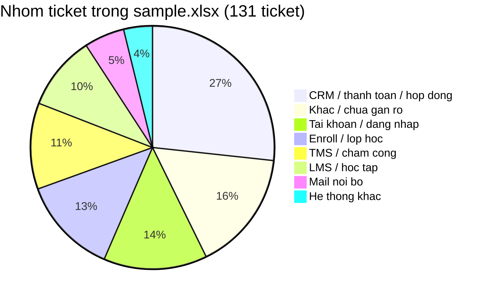

# Báo cáo phân tích ticket — Technical Support

**Nguồn:** export Helpdesk `sample.xlsx` (plan tuần 5)  
**Phạm vi:** 131 ticket Technical Support. File có 183 dòng; phần còn lại là tiêu đề nhóm trạng thái và hàng tag phụ, không tính là ticket.  
**Cách gom nhóm:** theo tiêu đề + tag. 64/131 ticket không có tag nên không dựa mỗi cột Tags.

---

## 1. Kết luận

Ticket trong kỳ **không tập trung một loại**. Ba nhóm lớn nhất:

| Thứ tự | Nhóm | Số ticket | Tỷ lệ |
| --- | --- | ---: | ---: |
| 1 | CRM / thanh toán / hợp đồng | 35 | 27% |
| 2 | Tài khoản / đăng nhập | 18 | 14% |
| 3 | Enroll / lớp học | 17 | 13% |

Tiếp theo: TMS / chấm công (15), LMS / học tập (13).

**Ưu tiên xử lý**

1. **CRM và enroll** — volume cao, nhiều phiếu nhờ thao tác hộ (QR, lead, payment, add học viên). Phù hợp giảm bằng form đủ thông tin, bài hướng dẫn, hoặc auto-reply kèm tài liệu — không phù hợp tool tự sửa CRM.
2. **Tài khoản / đăng nhập** — khoảng 10–14% (13 phiếu sát quên mật khẩu / không vào được / bị khóa). Quy trình lặp và kiểm tra được qua HR + LMS. Đã có workflow tự động khi ticket sang **Đang xử lý**.
3. **TMS / LMS lỗi hàng loạt** — cần điều tra phạm vi (một user hay cả cơ sở) trước khi chuyển Dev Team.

Một tool login **không giảm** nhóm CRM/enroll. Kế hoạch giảm ticket phải đi nhiều hướng, nêu ở mục 6.

---

## 2. Phạm vi dữ liệu

Cột dùng được: Subject, mã ticket, người gửi, Tags, Priority, trạng thái trên bảng.

Cột rating, SLA, icon gần như trống. File không ghi khoảng thời gian export và không có số người bị ảnh hưởng từng phiếu. Có vài ticket test (`Tech test`, `TEST`) vẫn nằm trong 131.

Sáu tình huống tuần 4 dùng để đối chiếu loại vấn đề (login, LMS chậm, sự cố lớn, tính năng, nhiều user, hạn chót). **Số liệu dưới đây lấy từ `sample.xlsx`, không lấy 6 phiếu luyện tập.**

---

## 3. Tổng quan vận hành

### 3.1. Trạng thái

| Trạng thái | Số ticket |
| --- | ---: |
| Resolved | 91 |
| First Response Sent | 17 |
| Cancelled | 12 |
| New | 6 |
| In Progress | 5 |
| **Tổng** | **131** |

Tỷ lệ đã đóng: 91/131 (~70%). Còn 28 phiếu đang New / First Response / In Progress.

### 3.2. Mức ưu tiên

| Priority | Số ticket |
| --- | ---: |
| High | 42 |
| Urgent | 40 |
| Low | 40 |
| Medium | 9 |

Urgent + High = **82/131 (~63%)**. File không có cột số user bị ảnh hưởng nên không quy ra Class of Service theo số người.

### 3.3. Phân loại theo việc / hệ thống

| Nhóm | Số | Tỷ lệ |
| --- | ---: | ---: |
| CRM / thanh toán / hợp đồng | 35 | 27% |
| Khác / chưa gắn rõ | 21 | 16% |
| Tài khoản / đăng nhập | 18 | 14% |
| Enroll / lớp học | 17 | 13% |
| TMS / chấm công | 15 | 11% |
| LMS / học tập | 13 | 10% |
| Mail nội bộ | 7 | 5% |
| Hệ thống khác (Crystal, dropout, book phòng) | 5 | 4% |

Tag sẵn có (khoảng nửa phiếu): CRM 23, LMS 14, TMS 9, mail 4, Denise 3 — cùng chiều với bảng trên.

---

## 4. Pattern lặp

### 4.1. CRM / thanh toán — volume lớn nhất

Tiêu đề điển hình: không tạo QR, hủy/confirm payment trên lead, điểm thưởng, hợp đồng, SMS CRM. Phần lớn cần kế toán hoặc chỉnh trên hệ thống. Support Technical không tự đóng được bằng một script.

**Gốc (giả định):** thao tác CRM phức tạp + phiếu thiếu thông tin + chưa có (hoặc khách không mở) hướng dẫn bước.

### 4.2. Enroll lớp — cùng một việc, nhiều phiếu

“Add học viên vào lớp”, “mở slot enroll”, “lỗi enroll”. Lặp, tốn thời gian, ít khi là bug lõi.

**Gốc (giả định):** BU thiếu quyền hoặc thiếu mã lớp / SĐT / tên khi gửi phiếu.

### 4.3. Tài khoản / đăng nhập — phù hợp tự động hóa

13/131 (~10%) tiêu đề có đăng nhập, mật khẩu, không vào được, tài khoản khóa, cấp lại tài khoản. Ví dụ: cấp lại mật khẩu LMS, không vào CRM/TMS, Ecount bị khóa, quên mật khẩu mail TMS.

Chuỗi xử lý giống nhau: còn làm việc không → có tài khoản không → mở khóa hoặc đặt mật khẩu → gửi thông tin. Dữ liệu lấy từ HR và LMS.

Giả định thêm: LMS khóa sau 30 ngày không đăng nhập (quy định, không phải bug). Sửa rule cần Product/Dev. Support vẫn phải xử lý phiếu từng ngày.

### 4.4. TMS / LMS — có dấu hiệu sự cố chung

“TMS không hiện thông tin”, “không thao tác được từ ngày 31”, “không xem chấm công”, ticket tỉnh Nam 2 / nhiều BU. Khác quên mật khẩu.

Trong `sample.xlsx` **ít** tiêu đề kiểu “trang LMS chậm”. Bài tuần 4 (LMS chậm, nộp bài sập, video lỗi) vẫn dùng để xếp loại sự cố hệ thống, nhưng **không phải nhóm đông nhất trong file này**.

---

## 5. Tác động

| Nhóm | Tác động lên support | Tác động lên người dùng |
| --- | --- | --- |
| CRM / enroll | Nhiều phiếu, làm tay, hay chờ đội khác | BU/kế toán chậm xong việc |
| Đăng nhập | ~8 phút/phiếu nếu làm tay (ước lượng lúc luyện tuần 4) | Giáo viên / nhân sự không vào được hệ thống |
| TMS / LMS hàng loạt | Nhiều phiếu trùng một sự cố | Cả cơ sở không chấm công / không học |

13 phiếu login làm tay ≈ **1.5–2 giờ** trong bản export này. File không ghi phút thật.

---

## 6. Khuyến nghị — giảm thời gian xử lý và giảm sinh ticket

### 6.1. Tài khoản / đăng nhập — đang chạy

Khi ticket sang **Đang xử lý**, workflow kiểm HR + LMS.

* Đủ điều kiện: mở khóa hoặc reset mật khẩu, gửi mail, ghi chú, đánh dấu đã xử lý.
* Không đủ (nghỉ việc, không thấy hồ sơ/tài khoản): chỉ ghi chú, support xem tay.
* Không chạy lúc đang soạn. Không chạy lại phiếu đã xử lý. Server bật lại thì quét phiếu còn sót.

Ước lượng: đủ điều kiện thì còn khoảng **1 phút/phiếu** (xem kết quả trên Odoo).

Nếu sau này nhiều phiếu do rule 30 ngày: mail nhắc trước ngày khóa.

Chi tiết luồng: repo `login-ticket-automation`.

### 6.2. Tài liệu hướng dẫn — hai giả định

Chưa xác nhận Helpdesk/KB đã có bài hay chưa.

**Chưa có guide** → bổ sung bài ngắn cho việc hay gặp:

* Quên mật khẩu / không đăng nhập LMS, CRM, TMS
* Enroll: đủ mã lớp, SĐT, tên
* Hủy / confirm payment trên CRM

**Đã có guide mà vẫn còn ticket** → khách không tìm thấy bài, hoặc gửi phiếu cho nhanh. Hướng tiếp: **auto-reply + gắn tài liệu** khi tiêu đề khớp từ khóa (mật khẩu, enroll, QR). Support chỉ vào nếu khách vẫn kẹt. Không thay workflow login (login vẫn phải kiểm HR/LMS).

### 6.3. CRM / enroll

* Form: thiếu field thì chưa tạo ticket.
* Phiếu “nhờ kế toán hủy confirm / sửa giá” chuyển đúng đội, không giữ lâu ở Technical Support nếu không phải lỗi hệ thống.
* Đã có guide mà vẫn vào → cùng hướng auto-reply mục 6.2.

Không tự động sửa dữ liệu CRM.

### 6.4. TMS / LMS — điều tra trước khi escalate

Checklist giả định (chưa có log trong file):

1. Một người hay cả cơ sở / tỉnh?
2. Một buổi hay nhiều ngày?
3. Chỉ TMS hay kèm CRM/LMS?
4. Vừa đổi máy, trình duyệt, hết hạn mật khẩu? (tránh nhầm với 6.1)
5. Có đợt cập nhật hệ thống trong ngày?

Nhiều người cùng lúc → một ticket chính, cập nhật chung.  
Một user → thử đăng xuất / trình duyệt khác, rồi mới chuyển Dev.

**LMS chậm (tuần 4):** hỏi số người, cơ sở, khung giờ, đã thử mạng khác chưa. Không kết luận “do server” nếu chưa có dấu hiệu chung (nhiều lớp cùng giờ, video nặng, mạng cơ sở, server).

### 6.5. Tính năng mới và việc có hạn chót

Ghi nhận, không hứa ngày ra tính năng. Việc có giờ chết: chốt phạm vi, xin người có quyền. Không để máy tự duyệt.

---

## 7. Việc cần đo tiếp

* Số ticket đăng nhập / tuần và tỷ lệ workflow xử lý hết vs xem tay
* Volume CRM / enroll sau khi có form hoặc auto-reply
* Số phiếu TMS trùng một sự cố (để biết escalate có kịp không)

---

## 8. Tóm tắt

| Phát hiện | Hướng xử lý |
| --- | --- |
| CRM + enroll chiếm ~40% | Form, guide, auto-reply, chuyển đúng team |
| Đăng nhập / mật khẩu ~10–14% | Workflow HR + LMS (đã triển khai) |
| TMS/LMS lỗi cụm | Điều tra phạm vi, rồi Dev Team |
| Guide chưa rõ có hay chưa | Chưa có → viết. Có rồi còn ticket → auto-reply + file |

Đối chiếu từng dòng: `sample.xlsx` trong plan tuần 5.
