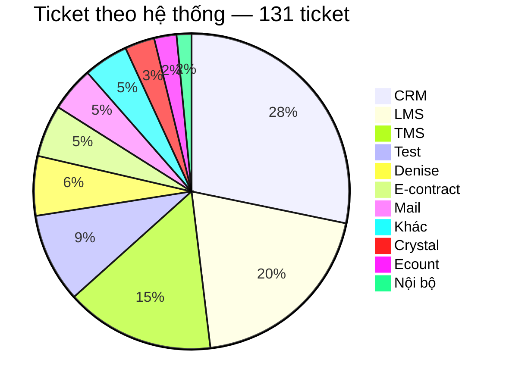
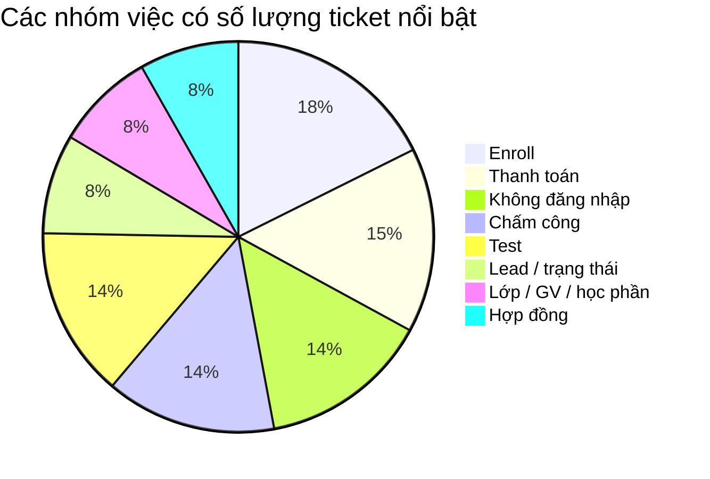
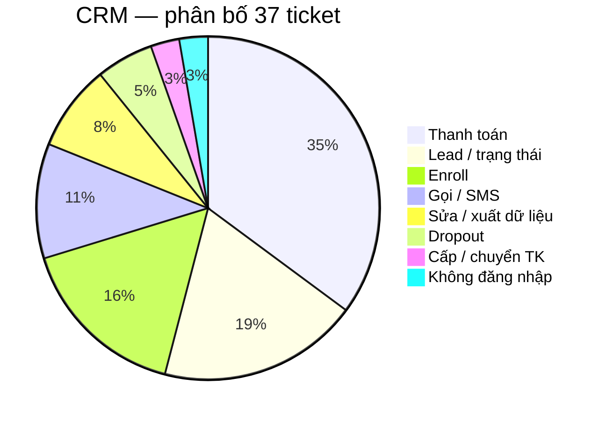
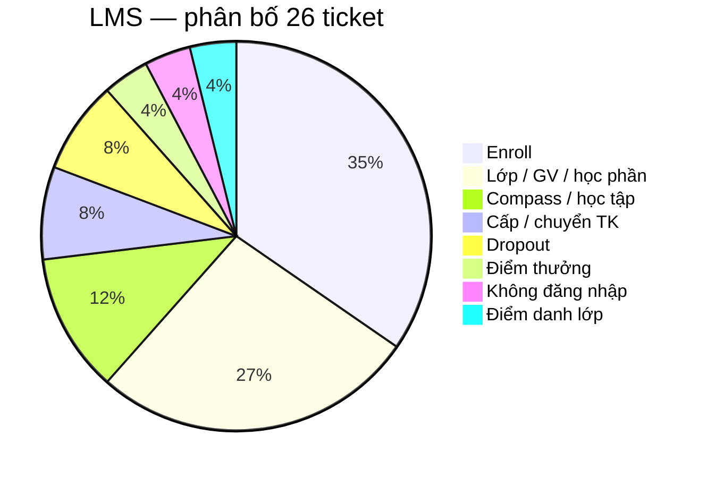
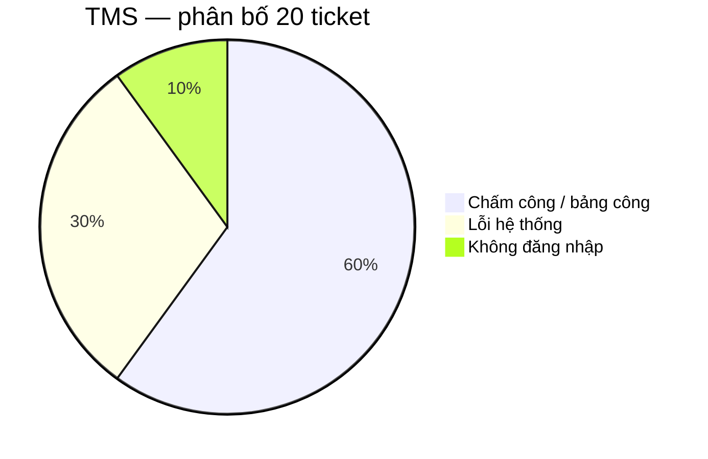
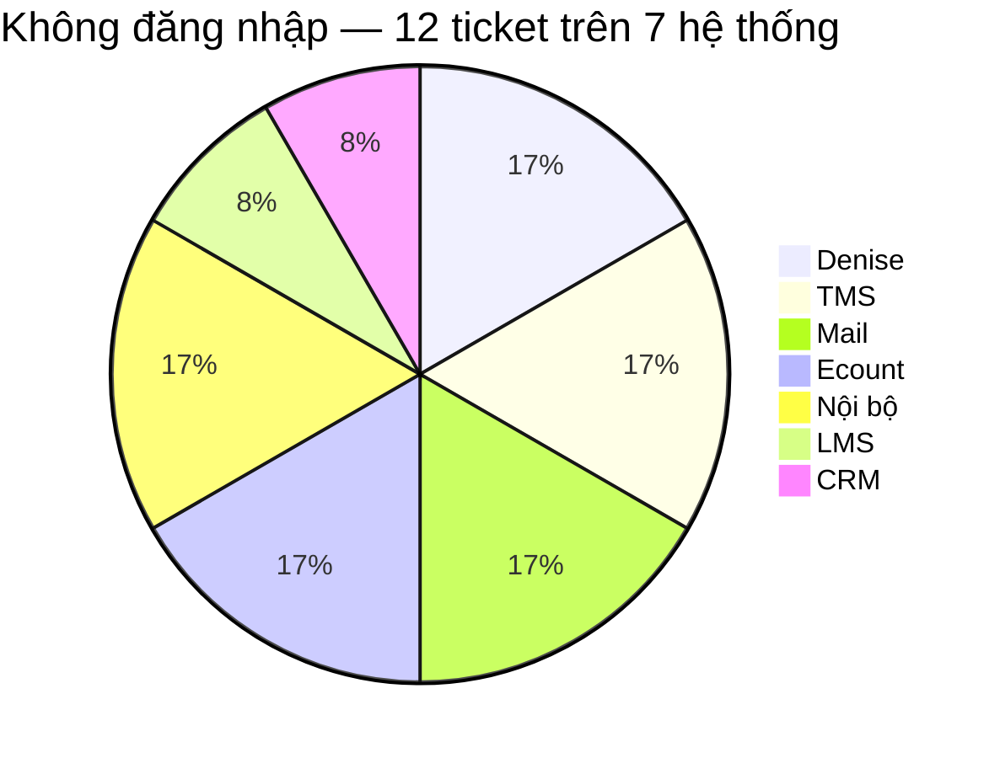
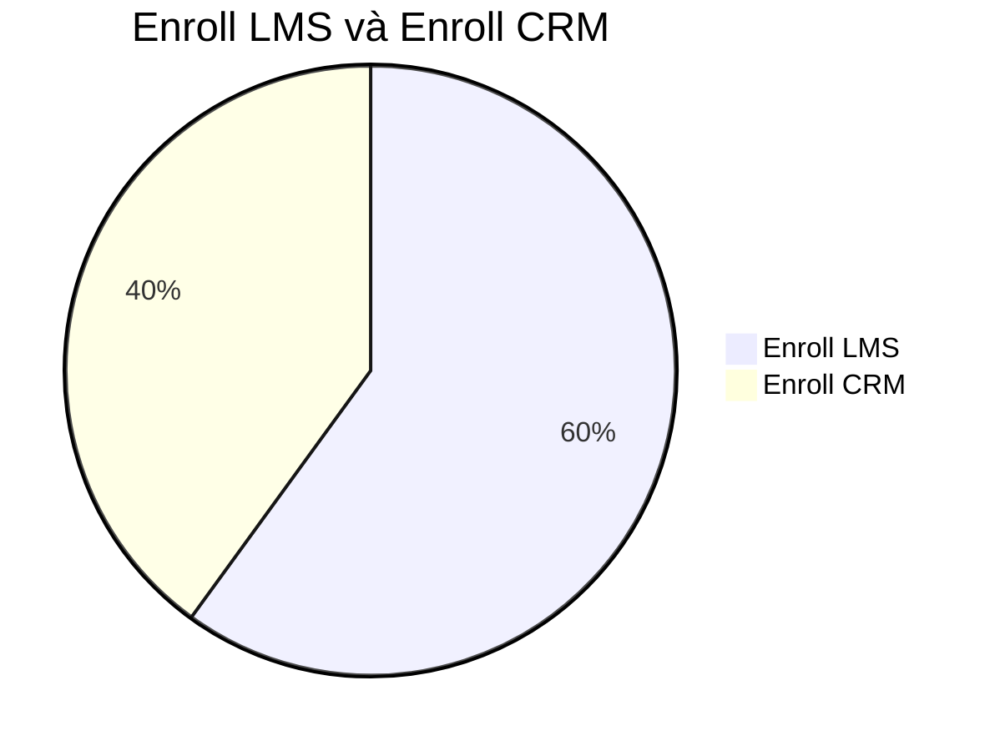
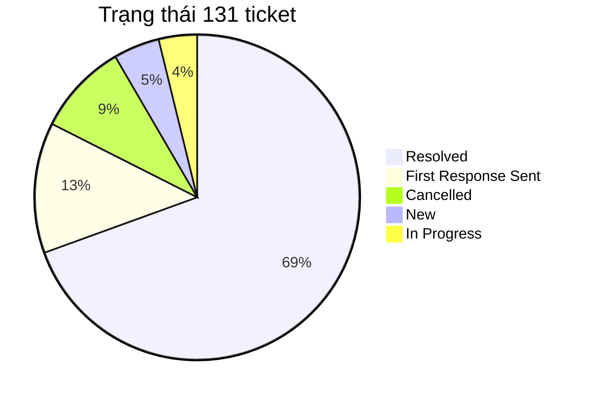
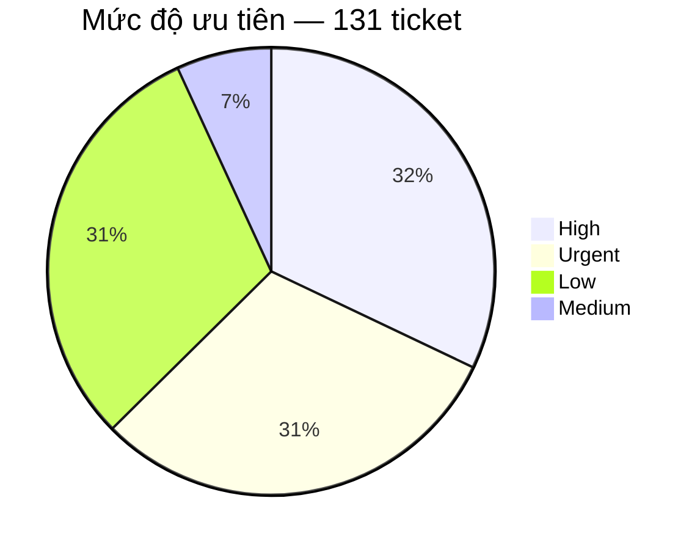

# BÁO CÁO PHÂN TÍCH TICKET — TECHNICAL SUPPORT

Nguồn dữ liệu: Helpdesk export `sample.xlsx` — Plan tuần 5  
Bản dữ liệu dùng để phân tích: `sample-tickets.csv`  
Phạm vi: 131 ticket Technical Support.

## 1. Mục tiêu

Báo cáo trả lời bốn câu hỏi:

- Ticket đang tập trung ở đâu?
- Trong các khu vực đó, người dùng thực sự đang gặp loại vấn đề nào?
- Support đang phải xử lý theo kiểu nào: hướng dẫn, xin quyền, điều tra lỗi, chuyển bộ phận hay thao tác lặp lại?
- Với từng kiểu vấn đề, hướng cải thiện nào hợp lý và cần đo thêm gì trước khi kết luận?

## 2. Bức tranh tổng thể: ticket đang tập trung ở đâu?

CRM, LMS và TMS có tổng cộng **83/131 ticket**, chiếm **63,4%** toàn bộ dữ liệu. Trong đó CRM có 37 ticket, LMS 26 và TMS 20.

Số lượng ticket cao không đồng nghĩa hệ thống đó có tỷ lệ lỗi cao. Dữ liệu hiện tại không có số người dùng của từng hệ thống, nên chưa thể tính số ticket trên mỗi người dùng. Một hệ thống có nhiều ticket có thể do lượng người dùng lớn, nghiệp vụ phức tạp, quyền hạn khó xử lý, người dùng chưa biết thao tác hoặc hệ thống thực sự lỗi.

## 3. Ticket đang tập trung vào loại công việc nào?

Các nhóm có số lượng nổi bật nhất là Enroll 15 (LMS 9, CRM 6), Thanh toán 13, Không đăng nhập 12, Chấm công 12 và Test 12.

Riêng nhóm Thanh toán có 13 ticket và toàn bộ đều phát sinh trên CRM. Vì vậy nhóm này được phân tích sâu trong phần CRM thay vì xem như một pattern xuyên nhiều hệ thống.

## 4. Phân tích ba hệ thống có nhiều ticket nhất

### 4.1. CRM — 37 ticket

Ba nhóm lớn nhất trên CRM là Thanh toán 13, Lead/trạng thái 7 và Enroll 6. Tổng cộng ba nhóm này có **26/37 ticket**, chiếm **70,3%** ticket CRM.

#### 4.1.1. Thanh toán — 13 ticket

Thanh toán là nhóm lớn nhất của CRM, chiếm **35,1%** ticket CRM.

Các ticket không phải cùng một lỗi mà gồm nhiều loại yêu cầu: tạo QR, add/gỡ payment, hủy hoặc confirm giao dịch, cập nhật trạng thái đóng tiền, hóa đơn và mã giảm giá.

13 ticket Payment cho thấy đây là một nghiệp vụ tạo ra nhiều yêu cầu support, nhưng chưa chứng minh CRM đang lặp lại cùng một lỗi 13 lần.

Các ticket có thể xuất phát từ nhiều nguyên nhân: người dùng chưa biết thao tác, không có quyền, dữ liệu hoặc CRM xảy ra lỗi, hoặc nghiệp vụ bắt buộc phải có người kiểm soát. File export không có log xử lý nên chưa xác định được nguyên nhân nào chiếm nhiều nhất.

Để đánh giá chính xác, cần bổ sung nguyên nhân cuối cùng, người hoặc bộ phận xử lý, thao tác đã thực hiện, việc support có phải hỏi thêm thông tin hay không, thời gian xử lý và kết quả. Những dữ liệu này sẽ cho biết support đang mất thời gian chủ yếu ở bước nào.

#### 4.1.2. Lead / trạng thái — 7 ticket

Nhóm này chiếm gần **19%** ticket CRM.

Cần tiếp tục phân biệt ticket thuộc yêu cầu đổi trạng thái, dữ liệu lead sai, không thao tác được, lỗi khi xử lý lead hay cần người có quyền cao hơn. Việc tách này cần thiết vì mỗi nguyên nhân dẫn tới cách xử lý khác nhau.

#### 4.1.3. Enroll trên CRM — 6 ticket

CRM có 6 ticket enroll. Nội dung chủ yếu liên quan đến enrollment hoặc chỉnh sửa thông tin trên enrollment.

### 4.2. LMS — 26 ticket

Hai nhóm lớn nhất là Enroll 9 và Lớp/GV/học phần 7, tổng cộng **16/26 ticket**, chiếm **61,5%** ticket LMS.

#### 4.2.1. Enroll trên LMS — 9 ticket

Các tình huống gồm thêm học viên, không tìm thấy lớp hoặc slot, enroll trùng và lỗi trong quá trình enroll.

Chỉ dựa trên Subject chưa thể biết root cause. Có ít nhất bốn khả năng: thao tác chưa đúng; dữ liệu học viên/lớp thiếu hoặc sai; tài khoản không đủ quyền; LMS lỗi.

File không ghi đã có guide hay chưa. Nếu chưa có thì viết bài enroll LMS. Nếu đã có mà ticket vẫn vào: user có tìm thấy bài không, bài còn đúng không, hay thực chất là quyền/lỗi hệ thống.

#### 4.2.2. Lớp / giáo viên / học phần — 7 ticket

Nhóm này gồm các yêu cầu như không thêm được giáo viên, điều chỉnh lớp hoặc lỗi liên quan đến học phần.

Nhóm này cần phân biệt giữa yêu cầu nghiệp vụ cần người có quyền chỉnh lớp/GV/học phần và trường hợp chức năng thực sự xảy ra lỗi. Nếu là lỗi chức năng, support cần ghi lại thao tác gây lỗi, dữ liệu đầu vào, ảnh lỗi và phạm vi ảnh hưởng trước khi chuyển Dev. Nếu chỉ thiếu quyền, ticket nên được chuyển đến đúng người có quyền.

### 4.3. TMS — 20 ticket

Có **18/20 ticket TMS**, tương đương **90%**, nằm ở chấm công hoặc lỗi hệ thống.

#### 4.3.1. Chấm công / bảng công — 12 ticket

Các triệu chứng gồm không hiển thị công, không duyệt được công, cần bù công, đi đúng ca nhưng hệ thống báo trễ và các vấn đề điểm danh/chấm công giáo viên.

Các ticket chấm công cần được tách theo triệu chứng, chẳng hạn không có dữ liệu, dữ liệu sai, không duyệt được hoặc ghi nhận sai thời gian. Đồng thời cần xác định phạm vi ảnh hưởng: chỉ một người, một ca, một cơ sở hay nhiều cơ sở.

Ticket TMS nên bổ sung cơ sở, thời điểm xảy ra, ca làm việc, người bị ảnh hưởng, số người cùng gặp, triệu chứng cụ thể và ảnh lỗi. Những thông tin này giúp support phân biệt vấn đề cá nhân với một sự cố có phạm vi lớn hơn.

#### 4.3.2. Lỗi hệ thống — 6 ticket

Có 6 ticket mô tả mất dữ liệu, không hiển thị thông tin hoặc không thao tác được.

Đáng chú ý, ticket **233** và **234** cùng liên quan đến Tỉnh Nam 2, có triệu chứng tương tự và cùng nhắc đến lỗi từ ngày 31. Đây là dấu hiệu để kiểm tra khả năng hai ticket thuộc cùng một incident, nhưng chưa đủ để khẳng định cùng root cause. Support cần đối chiếu thêm khu vực, thời gian và triệu chứng trước khi liên kết điều tra.

## 5. Pattern support xuất hiện trên nhiều hệ thống

### 5.1. Không đăng nhập / tài khoản — 12 ticket trên 7 hệ thống

Không có hệ thống nào chiếm phần lớn nhóm login. Chuỗi xử lý lặp: xác định user → kiểm tra trạng thái nhân sự → kiểm tra trạng thái tài khoản → xác định nguyên nhân → reset/mở khóa nếu đủ điều kiện → phản hồi.

Workflow hiện tại không cover hết 12 phiếu; chỉ phần nằm trong hệ thống tool truy cập được. Cần đo: tổng ticket vào workflow; xử lý hoàn toàn; chỉ hỗ trợ kiểm tra; không xử lý được; lý do; thời gian trước và sau.

### 5.2. Enroll LMS — 9 ticket; Enroll CRM — 6 ticket

**Enroll LMS (9):** thêm học viên, không tìm thấy lớp hoặc slot, enroll trùng, lỗi enroll.

**Enroll CRM (6):** thao tác enrollment, chỉnh sửa thông tin trên enrollment.

## 6. Các trường hợp cần phân biệt khi điều tra ticket

Một Subject giống nhau có thể xuất phát từ các nguyên nhân khác nhau. Với những ticket chưa có log xử lý, báo cáo chỉ đưa ra các trường hợp cần kiểm tra, không coi chúng là root cause đã xác nhận.

### 6.1. Hệ thống chậm / timeout / tải lâu

Dữ liệu hiện tại chưa cho thấy "LMS chậm" là một nhóm lớn. Nếu xuất hiện ticket dạng chậm, timeout hoặc tải lâu, cần kiểm tra theo các trường hợp sau:

- **Chỉ một người gặp:** kiểm tra trình duyệt, thiết bị, mạng và tài khoản của người đó.
- **Nhiều người trong cùng một cơ sở gặp:** kiểm tra mạng/cấu hình tại cơ sở và dữ liệu dùng chung.
- **Nhiều cơ sở cùng gặp trong cùng thời điểm:** kiểm tra incident phía hệ thống, server hoặc dịch vụ phụ thuộc.
- **Chỉ chậm ở một chức năng:** ghi rõ chức năng, thao tác, thời điểm và dữ liệu đầu vào để khoanh vùng.
- **Xuất hiện sau release/thay đổi cấu hình:** đối chiếu thời điểm thay đổi với thời điểm bắt đầu lỗi.

Ticket dạng này nên có: thời điểm xảy ra, người/cơ sở bị ảnh hưởng, chức năng bị chậm, ảnh/video nếu có, trình duyệt/thiết bị và thao tác đã thử.

### 6.2. Nhiều người cùng triệu chứng

Nếu nhiều ticket có triệu chứng giống nhau, có ba trường hợp chính:

- Các ticket độc lập nhưng mô tả giống nhau.
- Một lỗi dữ liệu hoặc cấu hình chung của cùng cơ sở/nhóm người dùng.
- Một incident hệ thống ảnh hưởng đồng thời nhiều người.

Support cần đối chiếu hệ thống, khu vực, thời gian, triệu chứng và số người bị ảnh hưởng. Chỉ sau khi các yếu tố này trùng nhau mới liên kết ticket để điều tra theo một incident chung.

### 6.3. Tính năng mới và yêu cầu có deadline

Ticket yêu cầu tính năng mới cần được tách khỏi bug. Support ghi nhận nhu cầu, phạm vi sử dụng và người/bộ phận có quyền quyết định; không tự cam kết thời gian release.

Với yêu cầu có deadline, cần ghi rõ thời hạn, lý do của deadline, phạm vi ảnh hưởng và người có quyền xử lý. Nếu deadline gấp nhưng thao tác có rủi ro cao, vẫn cần bước phê duyệt thay vì bỏ qua kiểm soát nghiệp vụ.

## 7. Trạng thái và priority nói được gì — và chưa nói được gì?

### 7.1. Trạng thái

Có **91/131 ticket** ở trạng thái Resolved, tương đương **69,5%**. Con số này cho biết phần lớn ticket trong export đã được đóng, nhưng chưa phản ánh support xử lý nhanh hay chậm.

Cần thêm: thời gian Created → First Response, thời gian đến Resolved, SLA, reopen, assignee, số người/cơ sở bị ảnh hưởng.

### 7.2. Priority

High và Urgent có tổng cộng **82/131 ticket**, chiếm **62,6%**. Đây là tỷ lệ đáng chú ý nhưng chưa thể kết luận 62,6% ticket đều là sự cố nghiêm trọng. Cần biết priority được gán theo phạm vi ảnh hưởng, nghiệp vụ, deadline hay do người tạo ticket tự chọn.

## 8. Phương án xử lý theo từng nhóm ticket

Phần 4 và 5 đã chỉ ra các nhóm ticket xuất hiện nhiều. Phần này tập trung vào câu hỏi thực tế hơn: với từng nhóm, support có thể làm gì để xử lý nhanh hơn và giảm việc ticket tương tự tiếp tục phát sinh?

Dữ liệu hiện tại chủ yếu cho biết nội dung ticket, chưa có đầy đủ log cho biết support đã xử lý từng ticket như thế nào. Vì vậy, các phương án dưới đây được đưa ra theo từng trường hợp có thể xảy ra. Khi triển khai thực tế cần đối chiếu lại với cách support đang làm.

### 8.1. CRM — Thanh toán (13 ticket)

Đây là nhóm lớn nhất trên CRM. Ticket gồm nhiều việc khác nhau như tạo QR thanh toán, thêm hoặc gỡ payment, hủy/confirm giao dịch, cập nhật trạng thái đóng tiền, hóa đơn và mã giảm giá.

Điểm khó của nhóm này là người dùng thường chỉ gửi yêu cầu "xử lý payment", trong khi support cần biết chính xác khách hàng nào, giao dịch nào, số tiền bao nhiêu và người dùng muốn thay đổi điều gì. Nếu thông tin ban đầu thiếu, support phải hỏi lại trước khi có thể xử lý.

**Phương án xử lý:**

Trước hết, form tạo ticket nên yêu cầu sẵn mã lead hoặc enrollment, loại yêu cầu, số tiền nếu có, trạng thái hiện tại và kết quả mong muốn. Việc này giúp support nhận ticket là có đủ thông tin cơ bản để kiểm tra.

Sau đó xử lý tùy nguyên nhân:

- Nếu người dùng chỉ chưa biết cách tạo QR, xem hóa đơn hoặc thực hiện một thao tác mà họ được phép tự làm, support có thể gửi hướng dẫn.
- Nếu chưa có tài liệu cho thao tác đó, có thể bổ sung guide. Nếu đã có tài liệu nhưng ticket vẫn được tạo, cần kiểm tra xem người dùng có tìm thấy tài liệu không và tài liệu còn đúng với giao diện hiện tại không. Nếu vấn đề chỉ là khó tìm, có thể tự động gửi đúng tài liệu ngay khi nhận diện được loại yêu cầu.
- Nếu người dùng không có quyền thực hiện, ticket nên được chuyển thẳng đến người hoặc bộ phận có quyền thay vì để support hỏi qua nhiều vòng.
- Nếu người dùng đã thao tác đúng, có đủ quyền nhưng CRM vẫn báo lỗi hoặc dữ liệu không cập nhật, lúc đó mới chuyển sang hướng điều tra lỗi hệ thống.
- Nếu đây là thao tác tài chính bắt buộc phải có người kiểm tra hoặc phê duyệt, vẫn giữ bước xử lý thủ công.

Hiện tại chưa nên để workflow tự thay đổi số tiền, trạng thái đóng tiền hoặc dữ liệu payment. Trước khi tự động hóa các thao tác này cần biết rõ support đang xử lý 13 ticket theo những bước nào và trường hợp nào được phép thay đổi dữ liệu.

### 8.2. CRM — Lead / trạng thái (7 ticket)

Nhóm này gồm các yêu cầu như đổi trạng thái lead, dữ liệu lead không đúng hoặc người dùng không thao tác được trên lead.

Với nhóm này, điều cần làm rõ đầu tiên là người dùng không biết làm, không được phép làm hay hệ thống không cho làm. Ba trường hợp nhìn từ phía người dùng có thể đều được mô tả là "không đổi được trạng thái", nhưng cách xử lý hoàn toàn khác nhau.

**Phương án xử lý:**

Form nên yêu cầu mã lead, trạng thái hiện tại, trạng thái muốn chuyển sang và lý do thay đổi.

- Nếu người dùng có quyền nhưng chưa biết cách đổi trạng thái, support có thể hướng dẫn. Nếu đã có guide nhưng người dùng vẫn tạo ticket, cần kiểm tra guide có dễ tìm và còn đúng không; nếu chỉ khó tìm thì có thể tự động gửi tài liệu phù hợp.
- Nếu người dùng không có quyền đổi trạng thái, ticket nên được chuyển đến người có quyền xử lý. Nếu người dùng có quyền, dữ liệu đầu vào hợp lệ nhưng CRM vẫn không cho thay đổi, support cần ghi lại lỗi và chuyển sang kiểm tra hệ thống.

Chưa nên tự động đổi trạng thái lead vì một số trạng thái có thể ảnh hưởng trực tiếp đến quy trình kinh doanh. Chỉ nên cân nhắc khi đã xác định rõ trạng thái nào được phép tự động thay đổi và ai có quyền yêu cầu.

### 8.3. CRM — Enroll (6 ticket)

Sáu ticket này liên quan đến enrollment trên CRM, chủ yếu là thao tác hoặc chỉnh sửa thông tin enrollment.

Mặc dù cùng gọi là "Enroll", nhóm này không nên gộp cách xử lý với LMS vì CRM và LMS lưu dữ liệu và phục vụ mục đích khác nhau.

**Phương án xử lý:**

Khi tạo ticket, người dùng nên cung cấp mã enrollment hoặc lead, thông tin đang có, thông tin muốn sửa và lý do cần sửa.

- Nếu người dùng được phép tự chỉnh nhưng chưa biết cách, support có thể hướng dẫn hoặc gửi guide. Nếu đã có guide mà ticket vẫn xuất hiện, cần kiểm tra xem tài liệu có khó tìm hoặc đã cũ hay không.
- Nếu người dùng không có quyền sửa enrollment, ticket chuyển đến người có quyền. Nếu dữ liệu đầy đủ, quyền hợp lệ nhưng CRM vẫn không lưu hoặc hiển thị sai, support chuyển sang điều tra lỗi hệ thống.

Chỉ nên tính đến workflow tự sửa enrollment khi dữ liệu sau này cho thấy support đang lặp lại cùng một thao tác nhiều lần và có quy tắc rõ ràng. Với dữ liệu hiện tại chưa đủ cơ sở để làm bước này.

### 8.4. LMS — Enroll (9 ticket)

Các ticket Enroll trên LMS gồm thêm học viên, không tìm thấy lớp hoặc slot, enroll trùng và lỗi trong quá trình enroll.

Ví dụ, cùng một yêu cầu "không enroll được học viên" có thể xảy ra vì người dùng chọn sai lớp, lớp không còn slot, học viên đã tồn tại, tài khoản không có quyền hoặc LMS thực sự bị lỗi. Vì vậy support không nên nhận ticket rồi mặc định ngay đây là lỗi hệ thống.

**Phương án xử lý:**

Ticket nên có mã lớp, thông tin học viên, slot nếu liên quan, thao tác đã thử và thông báo lỗi đang thấy.

- Nếu người dùng thao tác chưa đúng, support hướng dẫn cách enroll. Nếu chưa có guide thì có thể tạo; nếu đã có nhưng ticket vẫn vào, cần kiểm tra người dùng có tìm thấy và làm theo được hay không. Nếu tài liệu đúng nhưng khó tìm, có thể tự động gửi guide khi ticket có nội dung liên quan đến enroll.
- Nếu không tìm thấy lớp hoặc slot, support kiểm tra dữ liệu lớp trước. Nếu báo enroll trùng, cần kiểm tra học viên đã thực sự tồn tại trong lớp hay hệ thống chỉ đang hiển thị sai. Nếu tài khoản thiếu quyền thì chuyển người có quyền xử lý.

Chỉ khi dữ liệu, thao tác và quyền đều đúng nhưng LMS vẫn không hoạt động mới chuyển sang điều tra lỗi kỹ thuật. Khi đó ticket cần có ảnh lỗi và các bước đã thực hiện để Dev có thể kiểm tra lại.

Hiện chưa nên tự động enroll học viên vì dữ liệu chưa cho thấy đầy đủ các điều kiện và trường hợp ngoại lệ của nghiệp vụ này.

### 8.5. LMS — Lớp / giáo viên / học phần (7 ticket)

Nhóm này gồm các yêu cầu như không thêm được giáo viên, cần điều chỉnh lớp hoặc gặp lỗi liên quan đến học phần.

Ở đây support cần phân biệt giữa yêu cầu nhờ người có quyền chỉnh dữ liệu và người dùng đáng lẽ làm được nhưng chức năng đang lỗi.

**Phương án xử lý:**

Ticket nên có mã lớp hoặc học phần, giáo viên liên quan, nội dung cần thay đổi và ảnh lỗi nếu có.

- Nếu đây là thao tác người dùng được phép tự làm nhưng chưa biết cách, support hướng dẫn hoặc gửi tài liệu. Nếu đã có guide mà ticket vẫn vào, kiểm tra xem guide có dễ tìm, còn đúng và đủ rõ hay không.
- Nếu người dùng không có quyền thêm giáo viên hoặc chỉnh lớp, ticket được chuyển đến đúng người có quyền. Nếu người dùng có quyền nhưng chức năng vẫn lỗi, support ghi lại thao tác, dữ liệu đã nhập và ảnh lỗi rồi chuyển Dev.

Nhóm này chưa phù hợp để tự động sửa dữ liệu lớp hoặc giáo viên vì báo cáo chưa có đủ quy tắc về quyền và nghiệp vụ.

### 8.6. TMS — Chấm công (12 ticket)

Nhóm chấm công có các tình huống như không hiển thị công, không duyệt được công, cần bù công hoặc đi đúng ca nhưng hệ thống lại ghi nhận trễ.

Với nhóm này, số người cùng gặp vấn đề rất quan trọng. Một người bị sai công có thể chỉ là dữ liệu của cá nhân đó, nhưng nếu cả một ca hoặc một cơ sở cùng bị sai thì khả năng nguyên nhân nằm ở dữ liệu hoặc cấu hình chung sẽ cao hơn.

**Phương án xử lý:**

Khi tạo ticket cần có cơ sở, thời điểm xảy ra, ca làm việc, người bị ảnh hưởng, số người cùng gặp, triệu chứng cụ thể và ảnh lỗi.

- Nếu chỉ một người bị sai công, support kiểm tra lịch làm việc và dữ liệu chấm công của người đó trước. Nếu nhiều người trong cùng một ca hoặc cơ sở gặp giống nhau, support kiểm tra dữ liệu/cấu hình chung thay vì xử lý từng người riêng lẻ.
- Nếu nhiều cơ sở cùng xuất hiện lỗi trong cùng khoảng thời gian, cần xem đây có phải một sự cố chung của TMS hay không và chuyển sang điều tra theo incident.
- Nếu người dùng chỉ chưa biết cách xem hoặc duyệt công và họ có quyền thực hiện, có thể dùng guide. Nếu đã có guide nhưng người dùng vẫn hỏi, kiểm tra tài liệu có dễ tìm và còn đúng hay không.

Hệ thống có thể hỗ trợ tìm các ticket có cùng cơ sở, thời gian và triệu chứng rồi báo cho support rằng "các ticket này có thể liên quan". Support vẫn là người xác nhận. Không nên để hệ thống tự sửa bảng công hoặc tự kết luận tất cả ticket có cùng nguyên nhân.

### 8.7. TMS — Lỗi hệ thống (6 ticket)

Sáu ticket này mô tả các tình trạng như mất dữ liệu, không hiển thị thông tin hoặc không thao tác được. Ticket **233** và **234** đáng chú ý vì cùng liên quan đến Tỉnh Nam 2, có triệu chứng tương tự và cùng nhắc đến lỗi từ ngày 31.

Điều này chưa đủ để nói hai ticket chắc chắn cùng một lỗi, nhưng là dấu hiệu để support kiểm tra xem có phải nhiều người đang báo cùng một sự cố hay không.

**Phương án xử lý:**

Mỗi ticket cần ghi rõ cơ sở, thời điểm bắt đầu lỗi, chức năng bị ảnh hưởng, số người cùng gặp và ảnh lỗi.

- Nếu chỉ một người gặp, support kiểm tra tài khoản và dữ liệu của người đó trước. Nếu nhiều người trong cùng một cơ sở gặp giống nhau, kiểm tra dữ liệu hoặc cấu hình chung của cơ sở. Nếu nhiều cơ sở cùng gặp trong cùng thời điểm, ưu tiên kiểm tra sự cố ở mức hệ thống.

Khi có nhiều ticket trùng thời gian, khu vực và triệu chứng, hệ thống có thể gợi ý chúng có liên quan để support gom lại điều tra. Cách này giúp tránh trường hợp nhiều support cùng mất thời gian điều tra một lỗi dưới nhiều ticket khác nhau.

Guide không phải giải pháp chính của nhóm này, trừ khi kiểm tra cuối cùng cho thấy hệ thống không lỗi và nguyên nhân chỉ là người dùng thao tác chưa đúng.

### 8.8. Không đăng nhập / khóa / quên mật khẩu (12 ticket trên 7 hệ thống)

Nhóm Login xuất hiện trên Denise, TMS, Mail, Ecount, hệ thống nội bộ, LMS và CRM. Dù nằm ở nhiều hệ thống khác nhau, support thường phải thực hiện một chuỗi kiểm tra khá giống nhau: xác định người dùng, kiểm tra người đó còn làm việc hay không, kiểm tra trạng thái tài khoản, tìm nguyên nhân rồi mới quyết định reset, mở khóa hoặc chuyển xử lý.

Đây là lý do nhóm Login phù hợp với workflow hơn một số nhóm có số lượng ticket lớn hơn.

**Phương án xử lý:**

Khi tạo ticket cần có tên hệ thống, user/email, tình trạng đang gặp và thông báo lỗi nếu có.

- Nếu người dùng chỉ quên mật khẩu và hệ thống có chức năng tự reset, có thể gửi ngay hướng dẫn reset. Nếu hướng dẫn đã tồn tại nhưng người dùng không tìm thấy, có thể tự động gửi đúng tài liệu theo hệ thống.
- Nếu tài khoản bị khóa, workflow có thể kiểm tra trạng thái nhân sự và trạng thái tài khoản. Khi các điều kiện cho phép, workflow thực hiện bước xử lý mà tool có quyền làm; nếu không đủ điều kiện thì chuyển support thay vì cố xử lý tiếp.
- Nếu nhân sự đã nghỉ hoặc tài khoản không hợp lệ, không reset tài khoản mà chuyển theo quy trình quản lý tài khoản. Nếu tool không truy cập được hệ thống mà người dùng đang gặp lỗi, workflow chỉ hỗ trợ phần kiểm tra mà nó có dữ liệu, sau đó chuyển cho support.

Một trường hợp khác cần chú ý là nhiều người cùng lúc không đăng nhập được vào cùng một hệ thống. Khi đó không nên xử lý thành hàng loạt ticket quên mật khẩu riêng lẻ mà cần kiểm tra khả năng hệ thống đang gặp sự cố chung.

Workflow Login đã được triển khai trong tuần 5. Để biết workflow có thực sự giúp support hay không, cần đo số ticket workflow xử lý hoàn toàn, số ticket vẫn cần người can thiệp, lý do không xử lý được và thời gian xử lý trước/sau.

### 8.9. Test — 12 ticket

Nhóm Test có 12 ticket, bằng số lượng Login và Chấm công. Tuy nhiên, dữ liệu hiện tại chưa cho biết đủ nội dung và cách xử lý của 12 ticket này để kết luận chúng cùng một loại vấn đề.

Vì vậy, trước khi đề xuất một giải pháp chung cho Test cần đọc sâu nội dung của từng ticket và xác định chúng thuộc loại nào.

**Phương án xử lý theo từng trường hợp có thể gặp:**

- Nếu đây là yêu cầu nhờ support kiểm tra một chức năng hoặc nghiệp vụ, ticket cần ghi rõ cần test chức năng nào, dữ liệu nào được sử dụng và kết quả mong muốn là gì.
- Nếu người dùng tạo ticket vì chưa biết quy trình test, cần kiểm tra xem đã có SOP hoặc guide chưa. Chưa có thì bổ sung; đã có mà người dùng vẫn hỏi thì kiểm tra khả năng tìm thấy và độ rõ ràng của tài liệu.
- Nếu người dùng không có quyền hoặc không có môi trường để test, ticket nên được chuyển đến người quản lý quyền hoặc môi trường.
- Nếu trong quá trình test phát hiện bug, ticket cần ghi rõ các bước để tái hiện, kết quả mong muốn, kết quả thực tế và ảnh/video lỗi rồi chuyển Dev.
- Nếu nhiều ticket Test đang báo cùng một lỗi, support cần kiểm tra xem chúng có liên quan đến cùng một bug hoặc sự cố thay vì xử lý từng ticket độc lập.

Do chưa có log xử lý chi tiết, báo cáo chưa đề xuất automation cho nhóm Test ở thời điểm này.

### 8.10. Các hệ thống còn lại

Denise (8), E-contract (7), Mail (6), Crystal (4), Ecount (3) và Nội bộ (2) có ít ticket hơn CRM, LMS và TMS nên chưa được tách thành từng phần phân tích riêng.

Điều này không có nghĩa các hệ thống này không cần cải thiện. Thay vì nhìn từng hệ thống riêng lẻ, có thể tìm những vấn đề giống nhau xuất hiện trên nhiều hệ thống. Nhóm Login là một ví dụ: mỗi hệ thống chỉ có một hoặc hai ticket nhưng khi gom theo cách support phải xử lý thì có tổng cộng 12 ticket và xuất hiện một quy trình lặp lại rõ ràng.

Nếu sau này một trong các hệ thống này xuất hiện nhiều ticket cùng một vấn đề hoặc support phải lặp lại cùng một cách xử lý, khi đó nên tách nhóm đó ra để phân tích riêng.

## 9. Kết luận

Trong 131 ticket, CRM, LMS và TMS chiếm **83 ticket (63,4%)**, nên đây vẫn là ba hệ thống cần ưu tiên theo workload. Tuy nhiên, phân tích theo nhóm cho thấy không thể dùng một giải pháp chung cho các ticket có volume cao.

**CRM** cần ưu tiên làm rõ nguyên nhân của Payment, Lead và Enroll; trước mắt có thể chuẩn hóa field đầu vào, bổ sung routing và kiểm tra khả năng sử dụng guide/auto-reply. Các thao tác thay đổi dữ liệu nghiệp vụ chưa nên tự động hóa khi chưa có rule và log xử lý đủ rõ.

**LMS** cần tách rõ ticket do thao tác, dữ liệu, quyền và lỗi chức năng. Với guide, dữ liệu hiện tại không cho biết tài liệu đã tồn tại hay chưa, nên cần kiểm tra hai trường hợp: chưa có thì bổ sung; đã có mà ticket vẫn phát sinh thì kiểm tra khả năng tìm thấy, độ cập nhật và việc vấn đề có thực sự giải quyết được bằng tài liệu hay không.

**TMS** cần ưu tiên bổ sung thông tin về thời gian, cơ sở và phạm vi ảnh hưởng. Với các ticket trùng thời gian, khu vực và triệu chứng, hệ thống có thể gợi ý incident để support xác nhận, thay vì nhiều người điều tra riêng lẻ.

**Login** tiếp tục là nhóm phù hợp để thử workflow vì chuỗi kiểm tra có tính lặp lại và điều kiện xử lý tương đối rõ. Bước đánh giá tiếp theo của workflow là đo coverage, tỷ lệ xử lý hoàn toàn, tỷ lệ cần support can thiệp và thời gian xử lý thực tế.

**Nhóm Test** có 12 ticket nên được đưa vào phạm vi rà soát tiếp theo về nội dung xử lý. Báo cáo hiện chưa có đủ dữ liệu để gán root cause hoặc chọn một giải pháp cụ thể cho nhóm này; vì vậy phần Test chỉ nêu các trường hợp cần kiểm tra thay vì tự suy đoán.

Các hướng ưu tiên từ báo cáo hiện tại là:

1. Đo hiệu quả workflow Login đã triển khai.
2. Bổ sung root cause và thao tác xử lý thực tế cho Payment, Enroll, Lead và Test.
3. Chuẩn hóa field đầu vào cho các nhóm thường phải hỏi lại thông tin.
4. Kiểm tra tình trạng guide hiện có trước khi viết thêm; dùng auto-reply khi vấn đề là khả năng tìm thấy tài liệu.
5. Bổ sung dữ liệu phạm vi ảnh hưởng cho TMS và hỗ trợ gợi ý các ticket có khả năng thuộc cùng incident.
6. Chỉ mở rộng automation sang thao tác ghi/sửa dữ liệu khi đã có rule nghiệp vụ, quyền và các trường hợp ngoại lệ đủ rõ.
