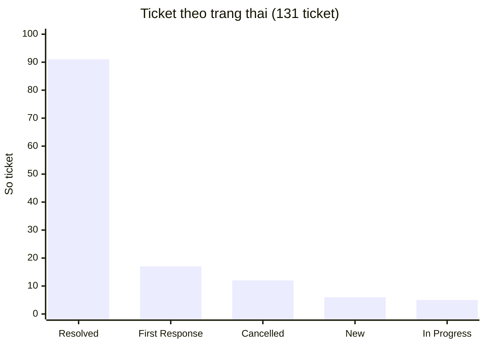
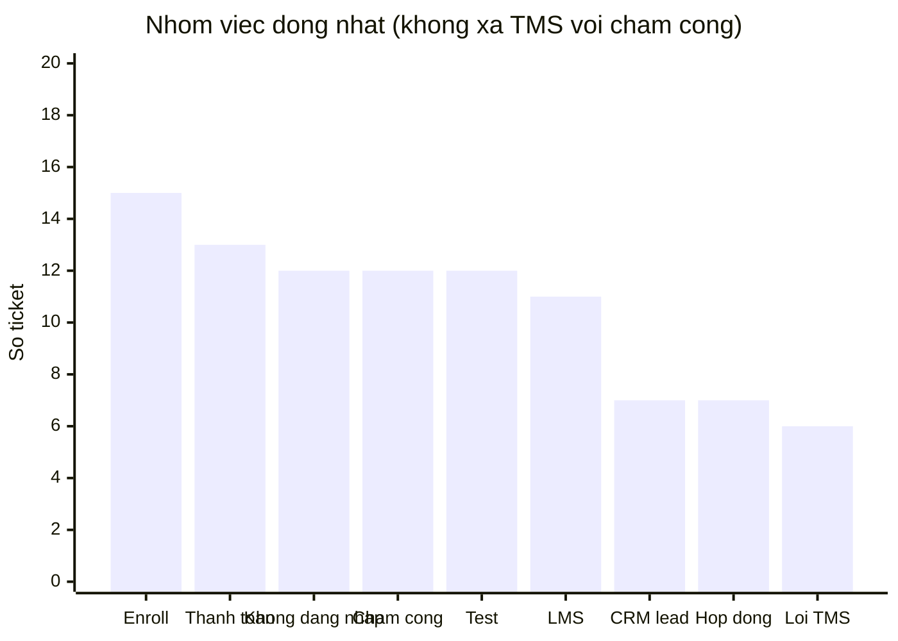

# Báo cáo phân tích ticket — Technical Support

**Nguồn:** export Helpdesk `sample.xlsx` (plan tuần 5)  
**Phạm vi:** 131 ticket (mã không trùng). File có 183 dòng: 1 hàng cột, 5 hàng nhóm trạng thái, 46 hàng tag phụ — không tính là ticket.  
**Cách xếp:** mỗi phiếu vào **một** nhóm việc, theo tiêu đề + tag phụ. Cột `Tags` không dùng một mình: 64/131 trống tag; tag `CRM` / `TMS` / `LMS` chỉ nói hệ thống, không nói việc.

Quy tắc tách hai nhóm dễ lẫn:

* **Lỗi hệ thống TMS** — TMS không hiện thông tin, mất dữ liệu, không thao tác được, hoặc tiêu đề chỉ ghi “lỗi TMS” / “check TMS”. Không nhắc công hay chấm công.
* **Lỗi chấm công / bảng công** — không xem công, không duyệt công, bù công, phần mềm chấm công, điểm danh giáo viên, đi đúng ca bị báo trễ. Việc nằm trên TMS nhưng **việc cần xử lý là bảng công**, không phải TMS sập.
* **Điểm danh lớp** (có mã lớp, tag LMS) xếp **LMS**, không xếp chấm công.

---

## 1. Kết luận

Ticket trong kỳ **không dồn một loại**. Nhóm việc đông nhất:

| Thứ tự | Việc | Số | Tỷ lệ |
| --- | --- | ---: | ---: |
| 1 | Enroll học viên vào lớp | 15 | 11% |
| 2 | Thanh toán (QR / payment / hóa đơn) | 13 | 10% |
| 3 | Không đăng nhập / bị khóa / quên mật khẩu | 12 | 9% |
| 3 | Lỗi chấm công / bảng công | 12 | 9% |

**Lỗi hệ thống TMS** chỉ **6 phiếu (5%)** — khác nhóm chấm công. Gộp “TMS / chấm công” sẽ làm tưởng TMS sập là nhóm lớn nhất; số thật không phải vậy.

12 phiếu (9%) là ticket test, không phải pattern vận hành.

CRM, thanh toán và hợp đồng là **ba việc**, ba đội đóng:

| Việc | Số | Việc điển hình | Đội đóng |
| --- | ---: | --- | --- |
| CRM — lead / gọi / sửa dữ liệu | 7 + 4 + 3 = 14 | Trạng thái lead, gọi/SMS, import, xóa field | Technical Support / CRM |
| Thanh toán | 13 | QR, add/gỡ payment, hủy–confirm, hóa đơn | Kế toán |
| Hợp đồng | 7 | Tạo, xem, gửi link, sai số e-contract | E-contract |

**Ưu tiên**

1. **Enroll (15)** — cùng thao tác add học viên / mở slot / lỗi enroll. Giảm bằng form (mã lớp, SĐT, tên) hoặc auto-reply kèm hướng dẫn.
2. **Thanh toán (13)** — phần lớn nhờ kế toán. Chuyển đúng đội; không giữ trong hàng “ticket CRM”.
3. **Không đăng nhập (12)** — bước xử lý giống nhau, kiểm được qua HR + LMS. Đã có workflow khi ticket sang **Đang xử lý**. Năm phiếu **cấp / chuyển tài khoản** không nằm trong workflow này.
4. **Chấm công / bảng công (12)** — user không xem hoặc không duyệt được công. Điều tra một người hay cả cơ sở; khác hẳn 6 phiếu TMS mất dữ liệu / không thao tác.
5. **Lỗi hệ thống TMS (6)** — có cụm tỉnh Nam 2 (không hiện thông tin, không thao tác từ ngày 31). Điều tra phạm vi rồi mới chuyển Dev.

Tool login **không giảm** enroll, thanh toán, hợp đồng, chấm công hay TMS. Các hướng còn lại ở mục 6.

---

## 2. Phạm vi dữ liệu

Cột dùng được: Subject, mã ticket, người gửi, Tags, Priority, trạng thái trên bảng.

Cột rating, SLA, icon gần như trống. File không ghi khoảng thời gian export và không có số người bị ảnh hưởng từng phiếu.

Sáu tình huống tuần 4 dùng để đối chiếu loại vấn đề (login, LMS chậm, sự cố lớn, tính năng, nhiều user, hạn chót). **Số liệu lấy từ `sample.xlsx`, không lấy 6 phiếu luyện tập.**

Danh sách mã từng nhóm: mục 9.

---

## 3. Tổng quan vận hành

### 3.1. Trạng thái

| Trạng thái | Số ticket |
| --- | ---: |
| Resolved | 91 |
| First Response Sent | 17 |
| Cancelled | 12 |
| New | 6 |
| In Progress | 5 |
| **Tổng** | **131** |

Đã đóng: 91/131 (~70%). Còn 28 phiếu New / First Response / In Progress.

### 3.2. Mức ưu tiên

| Priority | Số ticket |
| --- | ---: |
| High | 42 |
| Urgent | 40 |
| Low | 40 |
| Medium | 9 |

Urgent + High = **82/131 (~63%)**. Không có cột số user bị ảnh hưởng nên không quy Class of Service theo số người.

### 3.3. Phân loại theo việc (một phiếu một nhóm)

| Việc | Số | Tỷ lệ |
| --- | ---: | ---: |
| Enroll học viên vào lớp | 15 | 11% |
| Thanh toán (QR / payment / hóa đơn) | 13 | 10% |
| Không đăng nhập / bị khóa / quên mật khẩu | 12 | 9% |
| Lỗi chấm công / bảng công | 12 | 9% |
| Ticket test | 12 | 9% |
| LMS (lớp, GV, học phần, Compass, điểm danh lớp) | 11 | 8% |
| CRM — trạng thái / kiểm tra lead | 7 | 5% |
| Hợp đồng (e-contract) | 7 | 5% |
| Tiêu đề không đủ để xếp | 7 | 5% |
| Lỗi hệ thống TMS | 6 | 5% |
| Cấp hoặc chuyển tài khoản | 5 | 4% |
| Denise / điểm thưởng | 5 | 4% |
| CRM — gọi / SMS | 4 | 3% |
| Cấp mail nội bộ | 4 | 3% |
| Phiếu dropout | 4 | 3% |
| Crystal / đặt phòng | 4 | 3% |
| CRM — sửa dữ liệu | 3 | 2% |
| **Tổng** | **131** | — |

Tỷ lệ làm tròn theo 131 phiếu.

Tag trên hàng ticket: CRM 23, LMS 14, TMS 9, mail 4, Denise 3, Bug 4. **23 tag CRM ≠ 23 việc CRM.** Nhiều phiếu thanh toán / enroll / hợp đồng / đăng nhập cũng gắn tag CRM.

---

## 4. Pattern lặp

### 4.1. Enroll học viên vào lớp — 15 phiếu

Add học viên, mở slot, lỗi enroll, enroll trùng lớp, sửa tên trên enrollment. Cùng một thao tác, ít khi là bug lõi.

**Gốc (giả định):** BU thiếu quyền hoặc thiếu mã lớp / SĐT / tên trên phiếu.

### 4.2. Thanh toán — 13 phiếu

Không tạo QR, add / gỡ payment, hủy–confirm giao dịch trên lead, lead đã add payment vẫn L5A, chuyển trạng thái đóng tiền, mã giảm giá, sửa giá hóa đơn / order chuyển nhượng.

**Gốc (giả định):** add trùng, confirm sai lead, thiếu mã giao dịch / số tiền. Phần lớn cần kế toán, không phải script Technical Support.

### 4.3. Không đăng nhập / bị khóa / quên mật khẩu — 12 phiếu

Không vào được TMS, CRM, hệ thống nội bộ, Ecount; khóa Ecount; quên / cấp lại mật khẩu LMS, mail, mail TMS; tài khoản Denise lỗi (tag: HV không đăng nhập được).

Chuỗi xử lý giống nhau: còn làm việc không → có tài khoản không → mở khóa hoặc đặt mật khẩu → gửi thông tin. Dữ liệu: HR + LMS.

Giả định: LMS khóa sau 30 ngày không đăng nhập (quy định, không phải bug). Sửa rule cần Product/Dev.

Không gồm 5 phiếu **cấp / chuyển tài khoản** (cấp Ecount, cấp nhân sự, chuyển LMS/CRM cơ sở, chuyển CRM đổi cơ sở, hỗ trợ TK Denise) — người dùng chưa hoặc không phải đang kẹt mật khẩu.

### 4.4. Lỗi chấm công / bảng công — 12 phiếu

TMS không hiển thị công, không xem bảng chấm công, không duyệt công trước hết tháng, lỗi bù công, phần mềm chấm công (đi đúng ca báo trễ), điểm danh giáo viên bị uncheck / không điểm danh được.

**Gốc (giả định):** đồng bộ công hoặc rule ca. Một user thì xử lý phiếu đó; nhiều user cùng lúc thì xem như sự cố bảng công.

### 4.5. Lỗi hệ thống TMS — 6 phiếu

Không hiện thông tin, mất dữ liệu, không thao tác trên hệ thống; 2 phiếu tỉnh Nam 2 cùng nội dung “lỗi TMS từ ngày 31”. Hai phiếu chỉ ghi “Lỗi TMS” / “check TMS”, không đủ chi tiết — vẫn xếp đây vì không nhắc công.

**Gốc (giả định):** sự cố TMS hoặc mất đồng bộ. Khác quên mật khẩu (mục 4.3) và khác không thấy dòng công (mục 4.4).

### 4.6. CRM — 14 phiếu, ba việc

* **Lead (7):** không đổi / chuyển trạng thái lead, import lead, kiểm tra lead học viên.
* **Gọi / SMS (4):** không gửi tin, không bấm gọi, report thiếu dữ liệu cuộc gọi.
* **Sửa dữ liệu (3):** xuất L6, không xóa mail Family, xóa order.

Không gồm thanh toán và hợp đồng dù nhiều phiếu gắn tag CRM.

**Gốc (giả định):** thao tác CRM phức tạp, phiếu thiếu field, hoặc chưa có (khách không mở) hướng dẫn từng việc.

### 4.7. Hợp đồng — 7 phiếu

Không tạo được HĐ, đã ký không ghi nhận, số tiền trên HĐ sai, gửi lại link e-contract, không xem / lấy file, duyệt tiền–hợp đồng pending. Đối tượng là e-contract, không phải payment trên lead.

### 4.8. LMS và Denise

LMS (11): Compass, giờ học, add GV, học phần, trạng thái học viên, chạy lại demo, **điểm danh lớp** (HTLO-XART-MDB01). Denise (5): điểm thưởng / đổi quà lệch Ecount.

File **ít** tiêu đề “trang LMS chậm”. Tình huống tuần 4 (LMS chậm, nộp bài sập) dùng để xếp loại sự cố hệ thống, không phải nhóm đông trong export này.

---

## 5. Tác động

| Việc | Hậu quả với support | Hậu quả với user |
| --- | --- | --- |
| Enroll | Lặp thao tác tay | Học viên chưa vào lớp |
| Thanh toán | Chờ kế toán; dễ giữ nhầm ở Technical Support | Lead / đóng tiền chậm |
| Không đăng nhập | ~8 phút/phiếu nếu làm tay (ước lượng tuần 4) | Không vào LMS, CRM, TMS, Ecount, Denise |
| Chấm công / bảng công | Nhiều phiếu đơn lẻ; nếu cùng ca lỗi thì nhân ticket | Không duyệt công, ảnh hưởng lương |
| Lỗi hệ thống TMS | Cụm phiếu cùng sự cố nếu escalate chậm | Cả tỉnh / cơ sở không dùng TMS |
| CRM lead / gọi | Sửa tay, hỏi thêm thông tin | Sale/BU kẹt lead hoặc không gọi được |
| Hợp đồng | Phải chuyển e-contract | PH chưa ký hoặc HĐ sai số |

12 phiếu không đăng nhập làm tay ≈ **1.5 giờ** trên bản export này. File không ghi phút thật.

---

## 6. Khuyến nghị

### 6.1. Không đăng nhập — đang chạy

Khi ticket sang **Đang xử lý**, workflow kiểm HR + LMS.

* Đủ điều kiện: mở khóa hoặc reset mật khẩu, gửi mail, ghi chú, đánh dấu đã xử lý.
* Không đủ (nghỉ việc, không thấy hồ sơ/tài khoản): chỉ ghi chú, support xem tay.
* Không chạy lúc đang soạn. Không chạy lại phiếu đã xử lý. Server bật lại thì quét phiếu còn sót.
* Không bắt phiếu cấp / chuyển tài khoản.

Ước lượng khi đủ điều kiện: khoảng **1 phút/phiếu** (xem trên Odoo).

Nếu sau này nhiều phiếu do rule 30 ngày: mail nhắc trước ngày khóa.

Chi tiết luồng: repo `login-ticket-automation`.

### 6.2. Hướng dẫn — hai giả định

Chưa xác nhận Helpdesk/KB đã có bài hay chưa. Viết **từng việc**, không viết một bài “CRM” hay “TMS” chung.

**Chưa có guide** → bài ngắn:

* Quên mật khẩu / không đăng nhập (từng hệ thống)
* Enroll: mã lớp, SĐT, tên
* CRM: chuyển trạng thái lead; lỗi gọi/SMS
* Thanh toán: hủy / confirm / gỡ payment — mã lead, số tiền, lý do
* Hợp đồng: tạo / gửi lại link e-contract
* Chấm công: không thấy công / cần duyệt trước hết tháng — khác bài “TMS sập”

**Đã có guide mà vẫn còn ticket** → khách không tìm thấy bài, hoặc gửi phiếu cho nhanh. Hướng tiếp: **auto-reply + gắn tài liệu** khi tiêu đề khớp từ khóa (mật khẩu, enroll, QR, hợp đồng, chấm công). Support chỉ vào nếu khách vẫn kẹt. Login vẫn đi workflow HR/LMS, không thay bằng mỗi file hướng dẫn.

### 6.3. Enroll

Form bắt buộc mã lớp, SĐT, tên. Thiếu field thì chưa tạo ticket. Còn ticket sau khi có guide → auto-reply mục 6.2.

### 6.4. Thanh toán

Phiếu nhờ kế toán hủy confirm / gỡ payment / sửa giá → **kế toán**. Technical Support chỉ giữ nếu QR hoặc hệ thống thanh toán lỗi. Checklist: mã lead, số tiền, giao dịch trùng lần nào. Không gộp vào hàng CRM.

### 6.5. Hợp đồng

Chuyển e-contract. Không xử lý như payment trên lead.

### 6.6. CRM (lead / gọi / dữ liệu)

Form: mã lead, SĐT, việc cần làm. Guide riêng cho chuyển trạng thái và lỗi gọi/SMS. Không tự sửa dữ liệu CRM bằng script.

### 6.7. Chấm công và lỗi hệ thống TMS — hai checklist

**Chấm công / bảng công**

1. Một giáo viên hay cả cơ sở?
2. Không thấy dòng công, hay thấy nhưng sai (đi trễ, bị uncheck)?
3. Đã hết hạn mật khẩu TMS chưa? (tránh nhầm mục 6.1)
4. Nhiều người cùng triệu chứng → một ticket chính, cập nhật chung.

**Lỗi hệ thống TMS** (không hiện / mất dữ liệu / không bấm được)

1. Một người hay cả tỉnh (ví dụ Nam 2)?
2. Một buổi hay nhiều ngày?
3. Chỉ TMS hay kèm CRM/LMS?
4. Có đợt cập nhật trong ngày?

Nhiều người cùng lúc → điều tra rồi Dev Team. Một user → đăng xuất / trình duyệt khác, rồi mới escalate.

**LMS chậm (tuần 4):** hỏi số người, cơ sở, khung giờ, đã thử mạng khác chưa. Không kết luận “do server” nếu chưa có dấu hiệu chung.

### 6.8. Tính năng mới và việc có hạn chót

Ghi nhận, không hứa ngày ra tính năng. Việc có giờ chết: chốt phạm vi, xin người có quyền. Không để máy tự duyệt.

---

## 7. Việc cần đo tiếp

* Số phiếu không đăng nhập / tuần; tỷ lệ workflow xử lý hết vs xem tay
* Volume enroll, thanh toán, hợp đồng, CRM lead — **từng việc**, không đo chung “CRM”
* Số phiếu chấm công trùng một ca lỗi, so với số phiếu TMS mất dữ liệu / không thao tác

---

## 8. Tóm tắt

| Phát hiện | Hướng xử lý |
| --- | --- |
| Enroll 15 (11%) | Form, guide, auto-reply |
| Thanh toán 13 (10%) | Chuyển kế toán; checklist lead / số tiền |
| Không đăng nhập 12 (9%) | Workflow HR + LMS (đã triển khai) |
| Chấm công / bảng công 12 (9%) | Điều tra một user vs cả cơ sở; không gọi là “lỗi TMS” |
| Lỗi hệ thống TMS 6 (5%) | Điều tra phạm vi, rồi Dev Team |
| Hợp đồng 7 (5%) | Chuyển e-contract |
| Guide chưa rõ có hay chưa | Chưa có → viết từng việc. Có rồi còn ticket → auto-reply + file |

Đối chiếu từng dòng: `sample.xlsx` trong plan tuần 5. Mã ticket từng nhóm ở mục 9.

---

## 9. Phụ lục — mã ticket từng nhóm

| Việc | Mã |
| --- | --- |
| Enroll học viên vào lớp | 288, 286, 302, 224, 60, 274, 267, 210, 219, 54, 47, 246, 243, 221, 06 |
| Thanh toán | 287, 278, 249, 305, 226, 225, 247, 186, 135, 125, 159, 155, 153 |
| Không đăng nhập / khóa / quên mật khẩu | 241, 253, 143, 165, 162, 331, 220, 41, 172, 265, 255, 294 |
| Lỗi chấm công / bảng công | 232, 228, 238, 218, 231, 215, 235, 124, 194, 152, 291, 211 |
| Ticket test | 58, 310, 312, 309, 138, 137, 136, 57, 26, 25, 20, 19 |
| LMS | 280, 176, 222, 201, 290, 269, 268, 207, 37, 39, 297 |
| CRM — lead | 140, 187, 150, 46, 245, 75, 315 |
| Hợp đồng | 157, 254, 173, 161, 145, 42, 63 |
| Tiêu đề không đủ để xếp | 209, 189, 175, 61, 229, 101, 203 |
| Lỗi hệ thống TMS | 239, 236, 234, 233, 227, 206 |
| Cấp hoặc chuyển tài khoản | 308, 248, 276, 237, 141 |
| Denise / điểm thưởng | 325, 296, 104, 295, 87 |
| CRM — gọi / SMS | 275, 260, 318, 05 |
| Cấp mail nội bộ | 129, 230, 174, 259 |
| Phiếu dropout | 336, 335, 72, 62 |
| Crystal / đặt phòng | 158, 99, 179, 156 |
| CRM — sửa dữ liệu | 324, 284, 134 |
