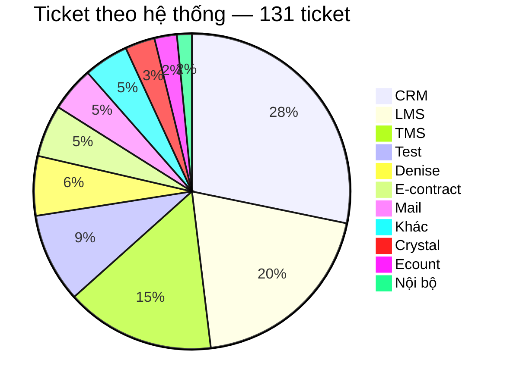
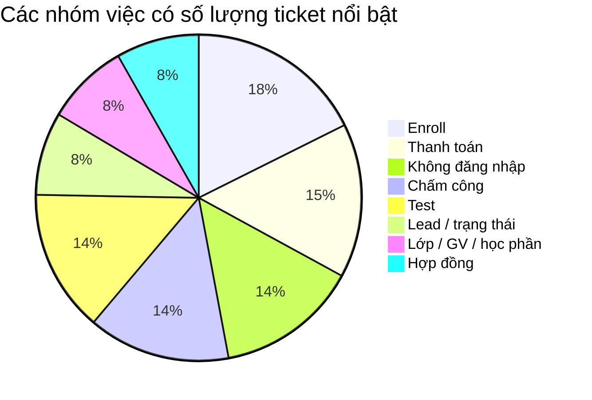
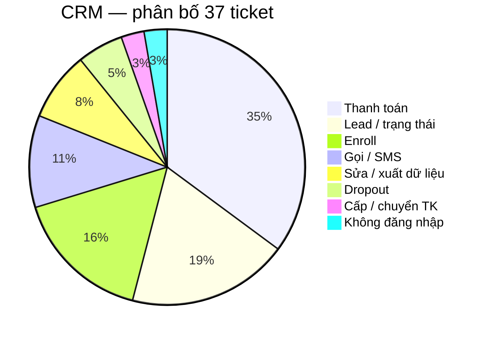
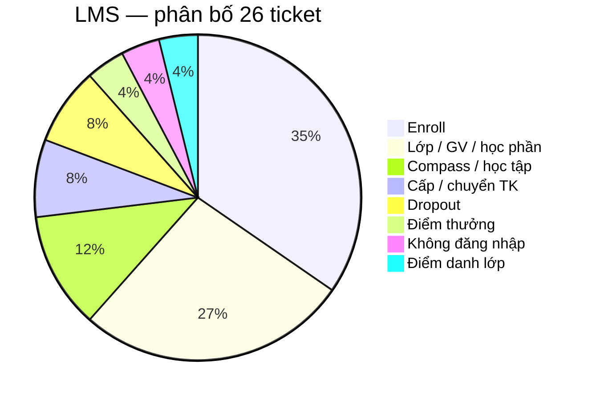
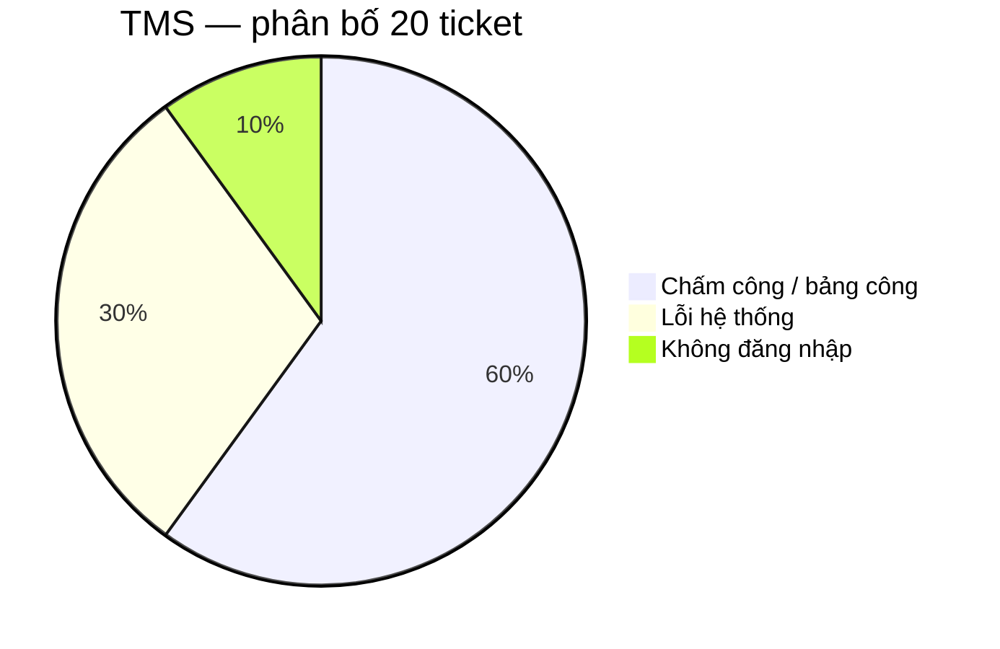
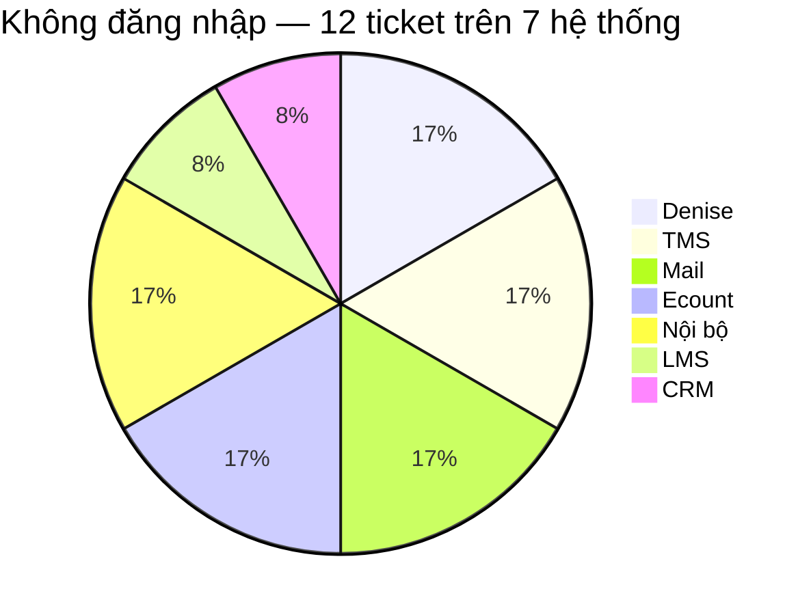
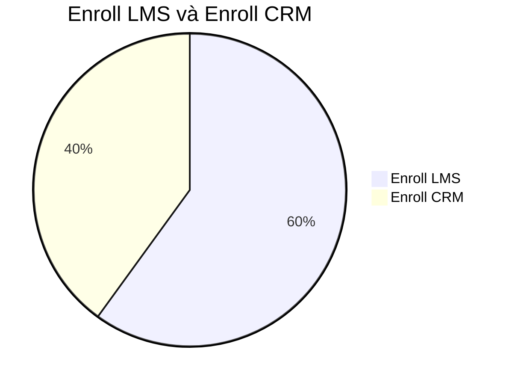
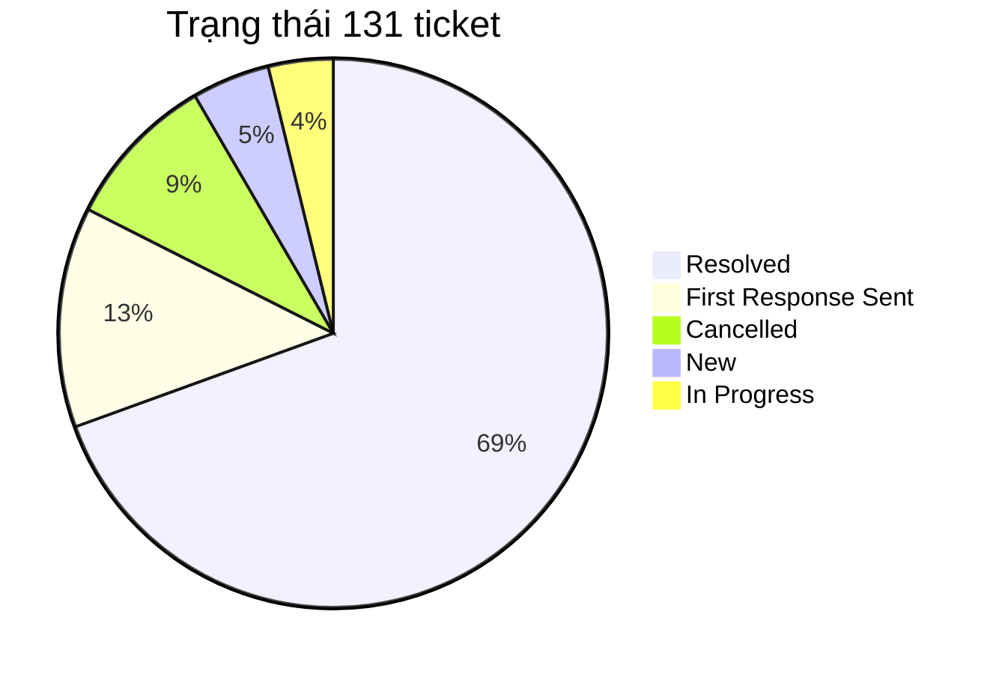
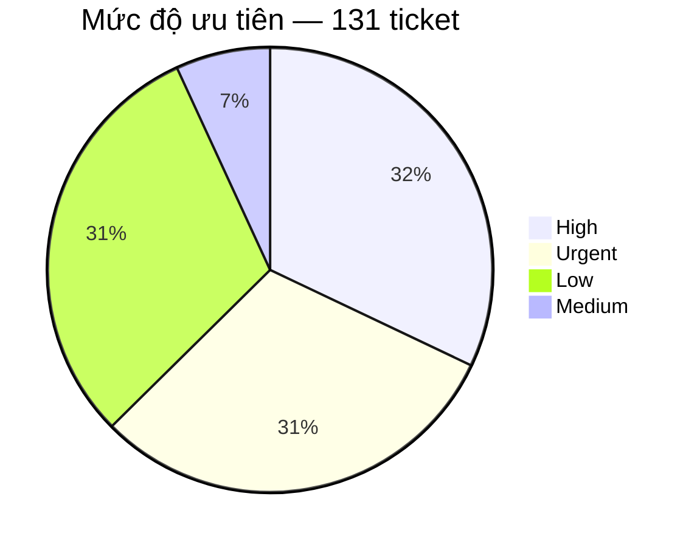

# BÁO CÁO PHÂN TÍCH TICKET — TECHNICAL SUPPORT

Nguồn dữ liệu: Helpdesk export `sample.xlsx` — Plan tuần 5  
Bản dữ liệu dùng để phân tích: `sample-tickets.csv`  
Phạm vi: 131 ticket Technical Support.

## 1. Mục tiêu

Báo cáo trả lời bốn câu hỏi:

- Ticket đang tập trung ở đâu?
- Trong các khu vực đó, người dùng thực sự đang gặp loại vấn đề nào?
- Support đang phải xử lý theo kiểu nào: hướng dẫn, xin quyền, điều tra lỗi, chuyển bộ phận hay thao tác lặp lại?
- Với từng kiểu vấn đề, hướng cải thiện nào hợp lý và cần đo thêm gì trước khi kết luận?

## 2. Bức tranh tổng thể: ticket đang tập trung ở đâu?

CRM, LMS và TMS có tổng cộng **83/131 ticket**, chiếm **63,4%** toàn bộ dữ liệu. Trong đó CRM có 37 ticket, LMS 26 và TMS 20.

Số lượng ticket cao không đồng nghĩa hệ thống đó có tỷ lệ lỗi cao. Dữ liệu hiện tại không có số người dùng của từng hệ thống, nên chưa thể tính số ticket trên mỗi người dùng. Một hệ thống có nhiều ticket có thể do lượng người dùng lớn, nghiệp vụ phức tạp, quyền hạn khó xử lý, người dùng chưa biết thao tác hoặc hệ thống thực sự lỗi.

## 3. Ticket đang tập trung vào loại công việc nào?

Các nhóm có số lượng nổi bật nhất là Enroll 15 (LMS 9, CRM 6), Thanh toán 13, Không đăng nhập 12, Chấm công 12 và Test 12.

Riêng nhóm Thanh toán có 13 ticket và toàn bộ đều phát sinh trên CRM. Vì vậy nhóm này được phân tích sâu trong phần CRM thay vì xem như một pattern xuyên nhiều hệ thống.

## 4. Phân tích ba hệ thống có nhiều ticket nhất

### 4.1. CRM — 37 ticket

Ba nhóm lớn nhất trên CRM là Thanh toán 13, Lead/trạng thái 7 và Enroll 6. Tổng cộng ba nhóm này có **26/37 ticket**, chiếm **70,3%** ticket CRM.

#### 4.1.1. Thanh toán — 13 ticket

Thanh toán là nhóm lớn nhất của CRM, chiếm **35,1%** ticket CRM.

Các ticket không phải cùng một lỗi mà gồm nhiều loại yêu cầu: tạo QR, add/gỡ payment, hủy hoặc confirm giao dịch, cập nhật trạng thái đóng tiền, hóa đơn và mã giảm giá.

13 ticket Payment cho thấy đây là một nghiệp vụ tạo ra nhiều yêu cầu support, nhưng chưa chứng minh CRM đang lặp lại cùng một lỗi 13 lần.

Các ticket có thể xuất phát từ nhiều nguyên nhân: người dùng chưa biết thao tác, không có quyền, dữ liệu hoặc CRM xảy ra lỗi, hoặc nghiệp vụ bắt buộc phải có người kiểm soát. File export không có log xử lý nên chưa xác định được nguyên nhân nào chiếm nhiều nhất.

Để đánh giá chính xác, cần bổ sung nguyên nhân cuối cùng, người hoặc bộ phận xử lý, thao tác đã thực hiện, việc support có phải hỏi thêm thông tin hay không, thời gian xử lý và kết quả. Những dữ liệu này sẽ cho biết support đang mất thời gian chủ yếu ở bước nào.

#### 4.1.2. Lead / trạng thái — 7 ticket

Nhóm này chiếm gần **19%** ticket CRM.

Cần tiếp tục phân biệt ticket thuộc yêu cầu đổi trạng thái, dữ liệu lead sai, không thao tác được, lỗi khi xử lý lead hay cần người có quyền cao hơn. Việc tách này cần thiết vì mỗi nguyên nhân dẫn tới cách xử lý khác nhau.

#### 4.1.3. Enroll trên CRM — 6 ticket

CRM có 6 ticket enroll. Nội dung chủ yếu liên quan đến enrollment hoặc chỉnh sửa thông tin trên enrollment.

### 4.2. LMS — 26 ticket

Hai nhóm lớn nhất là Enroll 9 và Lớp/GV/học phần 7, tổng cộng **16/26 ticket**, chiếm **61,5%** ticket LMS.

#### 4.2.1. Enroll trên LMS — 9 ticket

Các tình huống gồm thêm học viên, không tìm thấy lớp hoặc slot, enroll trùng và lỗi trong quá trình enroll.

Chỉ dựa trên Subject chưa thể biết root cause. Có ít nhất bốn khả năng: thao tác chưa đúng; dữ liệu học viên/lớp thiếu hoặc sai; tài khoản không đủ quyền; LMS lỗi.

File không ghi đã có guide hay chưa. Nếu chưa có thì viết bài enroll LMS. Nếu đã có mà ticket vẫn vào: user có tìm thấy bài không, bài còn đúng không, hay thực chất là quyền/lỗi hệ thống.

#### 4.2.2. Lớp / giáo viên / học phần — 7 ticket

Nhóm này gồm các yêu cầu như không thêm được giáo viên, điều chỉnh lớp hoặc lỗi liên quan đến học phần.

Nhóm này cần phân biệt giữa yêu cầu nghiệp vụ cần người có quyền chỉnh lớp/GV/học phần và trường hợp chức năng thực sự xảy ra lỗi. Nếu là lỗi chức năng, support cần ghi lại thao tác gây lỗi, dữ liệu đầu vào, ảnh lỗi và phạm vi ảnh hưởng trước khi chuyển Dev. Nếu chỉ thiếu quyền, ticket nên được chuyển đến đúng người có quyền.

### 4.3. TMS — 20 ticket

Có **18/20 ticket TMS**, tương đương **90%**, nằm ở chấm công hoặc lỗi hệ thống.

#### 4.3.1. Chấm công / bảng công — 12 ticket

Các triệu chứng gồm không hiển thị công, không duyệt được công, cần bù công, đi đúng ca nhưng hệ thống báo trễ và các vấn đề điểm danh/chấm công giáo viên.

Các ticket chấm công cần được tách theo triệu chứng, chẳng hạn không có dữ liệu, dữ liệu sai, không duyệt được hoặc ghi nhận sai thời gian. Đồng thời cần xác định phạm vi ảnh hưởng: chỉ một người, một ca, một cơ sở hay nhiều cơ sở.

Ticket TMS nên bổ sung cơ sở, thời điểm xảy ra, ca làm việc, người bị ảnh hưởng, số người cùng gặp, triệu chứng cụ thể và ảnh lỗi. Những thông tin này giúp support phân biệt vấn đề cá nhân với một sự cố có phạm vi lớn hơn.

#### 4.3.2. Lỗi hệ thống — 6 ticket

Có 6 ticket mô tả mất dữ liệu, không hiển thị thông tin hoặc không thao tác được.

Đáng chú ý, ticket **233** và **234** cùng liên quan đến Tỉnh Nam 2, có triệu chứng tương tự và cùng nhắc đến lỗi từ ngày 31. Đây là dấu hiệu để kiểm tra khả năng hai ticket thuộc cùng một incident, nhưng chưa đủ để khẳng định cùng root cause. Support cần đối chiếu thêm khu vực, thời gian và triệu chứng trước khi liên kết điều tra.

## 5. Pattern support xuất hiện trên nhiều hệ thống

### 5.1. Không đăng nhập / tài khoản — 12 ticket trên 7 hệ thống

Không có hệ thống nào chiếm phần lớn nhóm login. Chuỗi xử lý lặp: xác định user → kiểm tra trạng thái nhân sự → kiểm tra trạng thái tài khoản → xác định nguyên nhân → reset/mở khóa nếu đủ điều kiện → phản hồi.

Workflow hiện tại không cover hết 12 phiếu; chỉ phần nằm trong hệ thống tool truy cập được. Cần đo: tổng ticket vào workflow; xử lý hoàn toàn; chỉ hỗ trợ kiểm tra; không xử lý được; lý do; thời gian trước và sau.

### 5.2. Enroll LMS — 9 ticket; Enroll CRM — 6 ticket

**Enroll LMS (9):** thêm học viên, không tìm thấy lớp hoặc slot, enroll trùng, lỗi enroll.

**Enroll CRM (6):** thao tác enrollment, chỉnh sửa thông tin trên enrollment.

## 6. Các trường hợp cần phân biệt khi điều tra ticket

Một Subject giống nhau có thể xuất phát từ các nguyên nhân khác nhau. Với những ticket chưa có log xử lý, báo cáo chỉ đưa ra các trường hợp cần kiểm tra, không coi chúng là root cause đã xác nhận.

### 6.1. Hệ thống chậm / timeout / tải lâu

Dữ liệu hiện tại chưa cho thấy "LMS chậm" là một nhóm lớn. Nếu xuất hiện ticket dạng chậm, timeout hoặc tải lâu, cần kiểm tra theo các trường hợp sau:

- **Chỉ một người gặp:** kiểm tra trình duyệt, thiết bị, mạng và tài khoản của người đó.
- **Nhiều người trong cùng một cơ sở gặp:** kiểm tra mạng/cấu hình tại cơ sở và dữ liệu dùng chung.
- **Nhiều cơ sở cùng gặp trong cùng thời điểm:** kiểm tra incident phía hệ thống, server hoặc dịch vụ phụ thuộc.
- **Chỉ chậm ở một chức năng:** ghi rõ chức năng, thao tác, thời điểm và dữ liệu đầu vào để khoanh vùng.
- **Xuất hiện sau release/thay đổi cấu hình:** đối chiếu thời điểm thay đổi với thời điểm bắt đầu lỗi.

Ticket dạng này nên có: thời điểm xảy ra, người/cơ sở bị ảnh hưởng, chức năng bị chậm, ảnh/video nếu có, trình duyệt/thiết bị và thao tác đã thử.

### 6.2. Nhiều người cùng triệu chứng

Nếu nhiều ticket có triệu chứng giống nhau, có ba trường hợp chính:

- Các ticket độc lập nhưng mô tả giống nhau.
- Một lỗi dữ liệu hoặc cấu hình chung của cùng cơ sở/nhóm người dùng.
- Một incident hệ thống ảnh hưởng đồng thời nhiều người.

Support cần đối chiếu hệ thống, khu vực, thời gian, triệu chứng và số người bị ảnh hưởng. Chỉ sau khi các yếu tố này trùng nhau mới liên kết ticket để điều tra theo một incident chung.

### 6.3. Tính năng mới và yêu cầu có deadline

Ticket yêu cầu tính năng mới cần được tách khỏi bug. Support ghi nhận nhu cầu, phạm vi sử dụng và người/bộ phận có quyền quyết định; không tự cam kết thời gian release.

Với yêu cầu có deadline, cần ghi rõ thời hạn, lý do của deadline, phạm vi ảnh hưởng và người có quyền xử lý. Nếu deadline gấp nhưng thao tác có rủi ro cao, vẫn cần bước phê duyệt thay vì bỏ qua kiểm soát nghiệp vụ.

## 7. Trạng thái và priority nói được gì — và chưa nói được gì?

### 7.1. Trạng thái

Có **91/131 ticket** ở trạng thái Resolved, tương đương **69,5%**. Con số này cho biết phần lớn ticket trong export đã được đóng, nhưng chưa phản ánh support xử lý nhanh hay chậm.

Cần thêm: thời gian Created → First Response, thời gian đến Resolved, SLA, reopen, assignee, số người/cơ sở bị ảnh hưởng.

### 7.2. Priority

High và Urgent có tổng cộng **82/131 ticket**, chiếm **62,6%**. Đây là tỷ lệ đáng chú ý nhưng chưa thể kết luận 62,6% ticket đều là sự cố nghiêm trọng. Cần biết priority được gán theo phạm vi ảnh hưởng, nghiệp vụ, deadline hay do người tạo ticket tự chọn.

## 8. Phương án xử lý theo từng nhóm ticket

Các phương án dưới đây được tách theo từng trường hợp nguyên nhân. Với guide, file hiện tại không ghi nhận nhóm nào đã có tài liệu và nhóm nào chưa có, vì vậy các đề xuất guide/auto-reply là **giả định** cần kiểm tra trước khi triển khai.

### 8.1. CRM — Thanh toán (13 ticket)

Nhóm này gồm tạo QR, add/gỡ payment, hủy/confirm giao dịch, cập nhật trạng thái đóng tiền, hóa đơn và mã giảm giá.

**Thông tin cần có ngay khi tạo ticket:** mã lead/enrollment, loại yêu cầu, số tiền nếu liên quan, trạng thái hiện tại, kết quả mong muốn, thao tác đã thử và ảnh lỗi nếu có.

**Các trường hợp xử lý:**

- **User chưa biết thao tác:** nếu thao tác được phép tự làm, gửi đúng guide Payment CRM.
- **Đã có guide nhưng ticket vẫn vào:** kiểm tra guide có dễ tìm, còn đúng giao diện và đủ bước không. Nếu chỉ khó tìm, auto-reply theo loại yêu cầu và gắn đúng tài liệu.
- **Thiếu thông tin:** form bắt buộc các field cần thiết trước khi ticket được chuyển xử lý.
- **Thiếu quyền:** route đến đúng người/bộ phận có quyền sau khi ticket đủ thông tin.
- **CRM/dữ liệu lỗi:** ghi thao tác, ảnh lỗi, bản ghi liên quan và phạm vi ảnh hưởng rồi chuyển điều tra kỹ thuật.
- **Nghiệp vụ bắt buộc người kiểm soát:** giữ bước xử lý/phê duyệt thủ công.

Không auto sửa số tiền, trạng thái đóng tiền hoặc bản ghi payment ở giai đoạn này. Cần ghi root cause và thao tác xử lý thực tế của 13 ticket để biết trường hợp nào chiếm nhiều nhất.

### 8.2. CRM — Lead / trạng thái (7 ticket)

**Thông tin đầu vào:** mã lead, trạng thái hiện tại, trạng thái mong muốn, lý do đổi và ảnh lỗi nếu không thao tác được.

**Các trường hợp xử lý:**

- **User chưa biết cách đổi trạng thái và có quyền tự làm:** guide Lead CRM.
- **Guide đã có nhưng khó tìm:** auto-reply kèm đúng bài hướng dẫn.
- **Không đủ quyền:** route đến người có quyền đổi trạng thái.
- **Thiếu dữ liệu bắt buộc:** form yêu cầu đủ field trước khi chuyển ticket.
- **CRM báo lỗi dù dữ liệu/quyền hợp lệ:** thu thập lỗi và chuyển kỹ thuật.
- **Trạng thái nhạy cảm hoặc có ảnh hưởng nghiệp vụ:** giữ bước xác nhận của người phụ trách.

Chưa auto đổi trạng thái lead cho đến khi có quy tắc nghiệp vụ và danh sách trường hợp được phép xử lý tự động.

### 8.3. CRM — Enroll (6 ticket)

**Thông tin đầu vào:** mã enrollment/lead, trường cần sửa, giá trị hiện tại, giá trị mong muốn và thao tác đã thử.

**Các trường hợp xử lý:**

- **User được phép tự sửa nhưng chưa biết thao tác:** dùng guide Enroll CRM.
- **Guide đã có nhưng ticket vẫn phát sinh:** kiểm tra khả năng tìm thấy và độ cập nhật; nếu chỉ khó tìm thì auto-reply kèm guide.
- **Thiếu quyền:** route đến người có quyền.
- **Dữ liệu đầu vào thiếu/sai:** yêu cầu bổ sung ngay từ form.
- **CRM lỗi khi dữ liệu và quyền đều đúng:** chuyển điều tra kỹ thuật.
- **Support phải lặp cùng một thao tác ghi dữ liệu:** chỉ xem xét workflow sau khi đo được tần suất, rule và rủi ro.

Hiện chưa đủ dữ liệu để auto ghi enrollment.

### 8.4. LMS — Enroll (9 ticket)

**Thông tin đầu vào:** mã lớp, thông tin học viên, slot nếu liên quan, thao tác đã thử và ảnh/thông báo lỗi.

**Các trường hợp xử lý:**

- **Thao tác chưa đúng:** dùng guide Enroll LMS.
- **Đã có guide nhưng ticket vẫn vào:** kiểm tra guide có dễ tìm, còn đúng giao diện và giải quyết đúng tình huống không; nếu chỉ khó tìm thì auto-reply kèm guide.
- **Không tìm thấy lớp/slot do dữ liệu:** kiểm tra dữ liệu lớp, học viên và điều kiện enroll.
- **Enroll trùng:** xác định đây là dữ liệu đã tồn tại hay lỗi hiển thị trước khi sửa.
- **Thiếu quyền:** route đến người có quyền enroll.
- **LMS lỗi dù dữ liệu/quyền đúng:** thu thập ảnh lỗi, thao tác tái hiện và phạm vi ảnh hưởng rồi chuyển Dev.

Chưa auto enroll học viên vì chưa có đủ rule và trường hợp ngoại lệ để đảm bảo an toàn.

### 8.5. LMS — Lớp / giáo viên / học phần (7 ticket)

**Thông tin đầu vào:** mã lớp/học phần, giáo viên liên quan, yêu cầu cần thực hiện, thao tác đã thử và ảnh lỗi.

**Các trường hợp xử lý:**

- **User được phép tự thao tác nhưng chưa biết cách:** nếu chưa có guide thì tạo guide; nếu đã có thì kiểm tra khả năng tìm thấy và độ cập nhật.
- **Guide đúng nhưng khó tìm:** auto-reply kèm đúng tài liệu theo loại yêu cầu.
- **Thiếu quyền chỉnh lớp/GV/học phần:** route đến người có quyền.
- **Dữ liệu đầu vào không hợp lệ:** phản hồi rõ field cần sửa/bổ sung.
- **Chức năng lỗi:** ghi bước tái hiện, dữ liệu đầu vào, ảnh lỗi và phạm vi ảnh hưởng rồi chuyển Dev.

Không auto sửa lớp/GV/học phần khi chưa có rule nghiệp vụ và quyền rõ ràng.

### 8.6. TMS — Chấm công (12 ticket)

**Thông tin đầu vào:** cơ sở, thời điểm, ca làm việc, người bị ảnh hưởng, số người cùng gặp, triệu chứng và ảnh lỗi.

**Các trường hợp xử lý:**

- **Một người bị sai công:** kiểm tra dữ liệu cá nhân, ca làm việc và lịch sử ghi nhận.
- **Nhiều người cùng ca/cơ sở:** kiểm tra dữ liệu hoặc cấu hình chung tại cơ sở.
- **Nhiều cơ sở cùng thời điểm:** mở hướng điều tra incident hệ thống.
- **User chưa biết xem/duyệt công và có quyền tự làm:** dùng guide TMS.
- **Đã có guide nhưng khó tìm:** auto-reply kèm tài liệu; nếu guide không giải quyết được thì chuyển sang kiểm tra dữ liệu/hệ thống.
- **Không duyệt được dù quyền và dữ liệu đúng:** thu thập lỗi và chuyển kỹ thuật.
- Có thể tự động gợi ý các ticket trùng cơ sở + thời gian + triệu chứng để support kiểm tra. Không auto sửa bảng công và không để máy tự kết luận các ticket có cùng root cause.

### 8.7. TMS — Lỗi hệ thống (6 ticket)

Ticket **233** và **234** cùng liên quan đến Tỉnh Nam 2, có triệu chứng tương tự và cùng nhắc lỗi từ ngày 31. Đây là tín hiệu để kiểm tra incident, chưa phải bằng chứng hai ticket có cùng root cause.

**Thông tin đầu vào:** cơ sở, thời điểm bắt đầu, triệu chứng, chức năng bị ảnh hưởng, số người cùng gặp và ảnh lỗi.

**Các trường hợp xử lý:**

- **Chỉ một user:** kiểm tra tài khoản/dữ liệu cá nhân trước.
- **Nhiều user cùng cơ sở:** kiểm tra dữ liệu/cấu hình chung.
- **Nhiều cơ sở cùng thời điểm:** ưu tiên điều tra incident hệ thống.
- **Các ticket trùng khu vực + thời gian + triệu chứng:** hệ thống gợi ý liên kết; support xác nhận trước khi gom incident.
- **Lỗi tái hiện được:** bổ sung bước tái hiện và chuyển Dev.

Guide không phải hướng chính của nhóm này, trừ khi điều tra cho thấy nguyên nhân thực tế chỉ là thao tác người dùng.

### 8.8. Không đăng nhập / khóa / quên mật khẩu (12 ticket trên 7 hệ thống)

Login xuất hiện trên Denise, TMS, Mail, Ecount, Nội bộ, LMS và CRM. Điểm chung là chuỗi kiểm tra: xác định user → trạng thái nhân sự → trạng thái tài khoản → nguyên nhân → reset/mở khóa nếu đủ điều kiện → phản hồi.

**Thông tin đầu vào:** hệ thống, user/email, triệu chứng, thông báo lỗi và thao tác đã thử.

**Các trường hợp xử lý:**

- **Quên mật khẩu và hệ thống có self-service:** gửi hướng dẫn reset.
- **Guide/self-service đã có nhưng user không tìm thấy:** auto-reply kèm đúng tài liệu của hệ thống.
- **Tài khoản bị khóa và workflow có quyền kiểm tra/xử lý:** workflow kiểm tra điều kiện rồi thực hiện trong phạm vi được phép.
- **Nhân sự đã nghỉ hoặc tài khoản không hợp lệ:** không reset; route theo quy trình quản lý tài khoản.
- **Tool không truy cập được hệ thống:** workflow chỉ hỗ trợ phân loại/kiểm tra phần dữ liệu có sẵn, phần còn lại chuyển support.
- **Nhiều user cùng hệ thống không đăng nhập được:** không xử lý như nhiều case reset độc lập; kiểm tra incident.

Workflow Login đã được triển khai trong tuần 5. Hiệu quả cần đo bằng số ticket vào workflow, tỷ lệ xử lý hoàn toàn, tỷ lệ chỉ hỗ trợ một phần, tỷ lệ phải xử lý thủ công, lý do thất bại và thời gian trước/sau.

### 8.9. Test — 12 ticket

Test có 12 ticket, bằng số lượng Login và Chấm công, nên không nên bỏ qua chỉ vì không thuộc ba hệ thống có volume cao nhất.

Tuy nhiên, dữ liệu hiện có trong báo cáo chưa cho biết đủ nội dung xử lý/root cause để chia 12 ticket Test thành các tình huống cụ thể mà không suy đoán.

**Các trường hợp cần kiểm tra trước khi chọn giải pháp:**

- **Ticket thực chất là yêu cầu test/kiểm tra nghiệp vụ:** xác định người yêu cầu, phạm vi test và kết quả mong muốn.
- **User chưa biết quy trình test:** kiểm tra guide/SOP; nếu đã có nhưng khó tìm thì auto-reply kèm tài liệu.
- **Cần quyền hoặc môi trường test:** route đến người quản lý quyền/môi trường.
- **Test phát hiện bug:** ghi bước tái hiện, expected/actual result, dữ liệu test, ảnh/video và chuyển Dev.
- **Nhiều ticket Test cùng một lỗi:** kiểm tra khả năng cùng một defect/incident thay vì xử lý độc lập.

Trước khi đề xuất automation cho nhóm Test, cần đọc nội dung chi tiết và log xử lý của 12 ticket để xác định chúng thực sự thuộc trường hợp nào.

### 8.10. Các hệ thống còn lại

Denise (8), E-contract (7), Mail (6), Crystal (4), Ecount (3) và Nội bộ (2) có volume riêng lẻ thấp hơn CRM/LMS/TMS. Không nên vì vậy mà mặc định chúng không cần cải thiện.

Cách xử lý là tiếp tục nhìn theo pattern xuyên hệ thống thay vì cố tạo một giải pháp cho từng hệ thống nhỏ. Ví dụ Login đã gom được ticket từ Denise, Mail, Ecount và Nội bộ vào cùng một pattern xử lý.

Nếu ở các kỳ dữ liệu sau một hệ thống phụ xuất hiện nhiều ticket cùng triệu chứng hoặc cùng quy trình support, khi đó tách thành nhóm riêng để phân tích root cause và phương án.

## 9. Kết luận

Trong 131 ticket, CRM, LMS và TMS chiếm **83 ticket (63,4%)**, nên đây vẫn là ba hệ thống cần ưu tiên theo workload. Tuy nhiên, phân tích theo nhóm cho thấy không thể dùng một giải pháp chung cho các ticket có volume cao.

**CRM** cần ưu tiên làm rõ nguyên nhân của Payment, Lead và Enroll; trước mắt có thể chuẩn hóa field đầu vào, bổ sung routing và kiểm tra khả năng sử dụng guide/auto-reply. Các thao tác thay đổi dữ liệu nghiệp vụ chưa nên tự động hóa khi chưa có rule và log xử lý đủ rõ.

**LMS** cần tách rõ ticket do thao tác, dữ liệu, quyền và lỗi chức năng. Với guide, dữ liệu hiện tại không cho biết tài liệu đã tồn tại hay chưa, nên cần kiểm tra hai trường hợp: chưa có thì bổ sung; đã có mà ticket vẫn phát sinh thì kiểm tra khả năng tìm thấy, độ cập nhật và việc vấn đề có thực sự giải quyết được bằng tài liệu hay không.

**TMS** cần ưu tiên bổ sung thông tin về thời gian, cơ sở và phạm vi ảnh hưởng. Với các ticket trùng thời gian, khu vực và triệu chứng, hệ thống có thể gợi ý incident để support xác nhận, thay vì nhiều người điều tra riêng lẻ.

**Login** tiếp tục là nhóm phù hợp để thử workflow vì chuỗi kiểm tra có tính lặp lại và điều kiện xử lý tương đối rõ. Bước đánh giá tiếp theo của workflow là đo coverage, tỷ lệ xử lý hoàn toàn, tỷ lệ cần support can thiệp và thời gian xử lý thực tế.

**Nhóm Test** có 12 ticket nên được đưa vào phạm vi rà soát tiếp theo về nội dung xử lý. Báo cáo hiện chưa có đủ dữ liệu để gán root cause hoặc chọn một giải pháp cụ thể cho nhóm này; vì vậy phần Test chỉ nêu các trường hợp cần kiểm tra thay vì tự suy đoán.

Các hướng ưu tiên từ báo cáo hiện tại là:

1. Đo hiệu quả workflow Login đã triển khai.
2. Bổ sung root cause và thao tác xử lý thực tế cho Payment, Enroll, Lead và Test.
3. Chuẩn hóa field đầu vào cho các nhóm thường phải hỏi lại thông tin.
4. Kiểm tra tình trạng guide hiện có trước khi viết thêm; dùng auto-reply khi vấn đề là khả năng tìm thấy tài liệu.
5. Bổ sung dữ liệu phạm vi ảnh hưởng cho TMS và hỗ trợ gợi ý các ticket có khả năng thuộc cùng incident.
6. Chỉ mở rộng automation sang thao tác ghi/sửa dữ liệu khi đã có rule nghiệp vụ, quyền và các trường hợp ngoại lệ đủ rõ.
