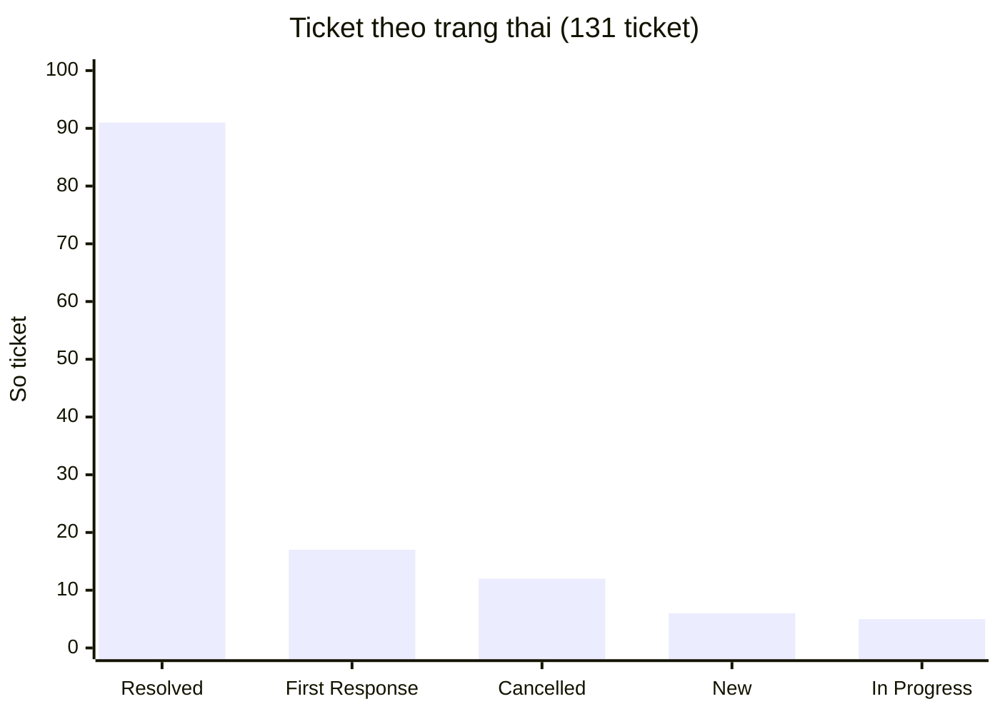
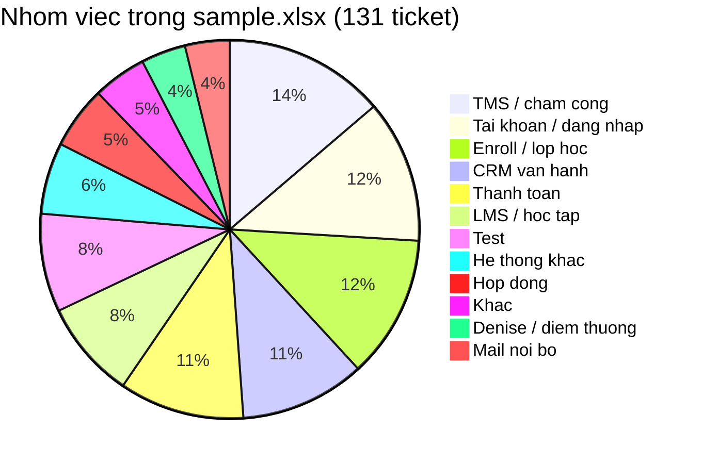

# Báo cáo phân tích ticket — Technical Support

**Nguồn:** export Helpdesk `sample.xlsx` (plan tuần 5)  
**Phạm vi:** 131 ticket Technical Support. File có 183 dòng; phần còn lại là tiêu đề nhóm trạng thái và hàng tag phụ, không tính là ticket.  
**Cách gom nhóm:** theo việc trên tiêu đề + tag phụ. Tag cột `Tags` không đủ: 64/131 phiếu trống tag; nhiều phiếu gắn tag `CRM` nhưng việc thật là enroll, thanh toán, hợp đồng hoặc đăng nhập.

---

## 1. Kết luận

Ticket trong kỳ **không tập trung một loại**. Ba nhóm việc lớn nhất:

| Thứ tự | Nhóm việc | Số ticket | Tỷ lệ |
| --- | --- | ---: | ---: |
| 1 | TMS / chấm công | 18 | 14% |
| 2 | Tài khoản / đăng nhập | 16 | 12% |
| 3 | Enroll / lớp học | 16 | 12% |

Tiếp theo: CRM vận hành 14 (11%), thanh toán 14 (11%), LMS 11 (8%). Hợp đồng đứng riêng: 7 phiếu (5%).

CRM, thanh toán và hợp đồng **không cùng một việc**, dù nhiều phiếu thao tác trên CRM:

| Nhóm | Việc điển hình | Ai thường đóng |
| --- | --- | --- |
| CRM vận hành | Trạng thái lead, gọi/SMS, import, sửa dữ liệu | Technical Support / CRM |
| Thanh toán | QR, add/gỡ payment, hủy–confirm giao dịch | Kế toán |
| Hợp đồng | Tạo, xem, gửi lại, sửa số trên e-contract | E-contract / pháp lý |

Gộp ba nhóm này thành “CRM” làm volume trông lớn hơn bản chất và che mất đội xử lý khác nhau.

**Ưu tiên xử lý**

1. **TMS / chấm công** — volume cao nhất; có cụm phiếu cùng sự cố (tỉnh Nam 2, không hiện công). Điều tra phạm vi trước khi chuyển Dev Team.
2. **Tài khoản / đăng nhập** — 16 phiếu; khoảng 11 phiếu sát quên mật khẩu / không vào được / bị khóa. Quy trình lặp, kiểm tra được qua HR + LMS. Đã có workflow khi ticket sang **Đang xử lý**.
3. **Enroll** — cùng một thao tác (add học viên, mở slot, lỗi enroll). Giảm bằng form đủ mã lớp / SĐT / tên, hoặc auto-reply kèm hướng dẫn.
4. **CRM vận hành** và **thanh toán** — cùng volume (14). CRM: form + guide. Thanh toán: chuyển kế toán, không giữ ở Technical Support nếu không phải lỗi hệ thống.
5. **Hợp đồng** — ít hơn, nhưng không xử lý như payment. Chuyển đúng e-contract.

Một tool login **không giảm** enroll, CRM, thanh toán, hợp đồng hay TMS. Kế hoạch giảm ticket đi nhiều hướng, mục 6.

---

## 2. Phạm vi dữ liệu

Cột dùng được: Subject, mã ticket, người gửi, Tags, Priority, trạng thái trên bảng.

Cột rating, SLA, icon gần như trống. File không ghi khoảng thời gian export và không có số người bị ảnh hưởng từng phiếu. 11 phiếu test (`Tech test`, `TEST`) vẫn nằm trong 131; tách riêng ở bảng phân loại, không trộn vào pattern vận hành.

Sáu tình huống tuần 4 dùng để đối chiếu loại vấn đề (login, LMS chậm, sự cố lớn, tính năng, nhiều user, hạn chót). **Số liệu dưới đây lấy từ `sample.xlsx`, không lấy 6 phiếu luyện tập.**

---

## 3. Tổng quan vận hành

### 3.1. Trạng thái

| Trạng thái | Số ticket |
| --- | ---: |
| Resolved | 91 |
| First Response Sent | 17 |
| Cancelled | 12 |
| New | 6 |
| In Progress | 5 |
| **Tổng** | **131** |

Tỷ lệ đã đóng: 91/131 (~70%). Còn 28 phiếu đang New / First Response / In Progress.

### 3.2. Mức ưu tiên

| Priority | Số ticket |
| --- | ---: |
| High | 42 |
| Urgent | 40 |
| Low | 40 |
| Medium | 9 |

Urgent + High = **82/131 (~63%)**. File không có cột số user bị ảnh hưởng nên không quy ra Class of Service theo số người.

### 3.3. Phân loại theo việc

| Nhóm việc | Số | Tỷ lệ |
| --- | ---: | ---: |
| TMS / chấm công | 18 | 14% |
| Tài khoản / đăng nhập | 16 | 12% |
| Enroll / lớp học | 16 | 12% |
| CRM vận hành (lead / gọi / SMS / dữ liệu) | 14 | 11% |
| Thanh toán | 14 | 11% |
| LMS / học tập | 11 | 8% |
| Test | 11 | 8% |
| Hệ thống khác (Crystal, dropout, book phòng) | 8 | 6% |
| Hợp đồng / e-contract | 7 | 5% |
| Khác / chưa gắn rõ | 6 | 5% |
| Denise / điểm thưởng | 5 | 4% |
| Mail nội bộ | 5 | 4% |
| **Tổng** | **131** | **100%** |

Tag sẵn có (khoảng nửa phiếu): CRM 23, LMS 14, TMS 9, mail 4, Denise 3. Cột tag mô tả **hệ thống**, không mô tả việc — vì vậy 23 tag CRM không bằng 23 ticket loại CRM.

---

## 4. Pattern lặp

### 4.1. TMS / chấm công — volume lớn nhất

Tiêu đề điển hình: không hiện thông tin, mất dữ liệu, không xem / không duyệt công, lỗi bù công, điểm danh bị uncheck. Có cụm cùng nội dung ([Tỉnh Nam 2] lỗi từ ngày 31).

**Gốc (giả định):** sự cố hệ thống hoặc đồng bộ công; một phần là user đơn lẻ. Cần tách hai trường hợp trước khi escalate.

### 4.2. Tài khoản / đăng nhập — phù hợp tự động hóa

16/131 (~12%) liên quan cấp tài khoản, chuyển tài khoản, quên mật khẩu, không vào được, bị khóa. Trong đó khoảng 11 phiếu sát “không đăng nhập / khóa / cấp lại mật khẩu” (LMS, CRM, TMS, Ecount, Denise, mail).

Chuỗi xử lý giống nhau: còn làm việc không → có tài khoản không → mở khóa hoặc đặt mật khẩu → gửi thông tin. Dữ liệu lấy từ HR và LMS.

Giả định thêm: LMS khóa sau 30 ngày không đăng nhập (quy định, không phải bug). Sửa rule cần Product/Dev. Support vẫn phải xử lý phiếu từng ngày.

### 4.3. Enroll lớp — cùng một việc, nhiều phiếu

“Add học viên vào lớp”, “mở slot enroll”, “lỗi enroll”, sửa tên trên enrollment. Lặp, tốn thời gian, ít khi là bug lõi.

**Gốc (giả định):** BU thiếu quyền hoặc thiếu mã lớp / SĐT / tên khi gửi phiếu.

### 4.4. CRM vận hành — thao tác trên CRM, không phải thanh toán

Tiêu đề điển hình: không đổi / chuyển trạng thái lead, CRM không gọi được, không gửi SMS, import lead, xuất dữ liệu, xóa field Family, chuyển CRM đổi cơ sở.

Đây là **sửa dữ liệu hoặc lỗi chức năng CRM**. Không lẫn với hủy payment hay tạo hợp đồng.

**Gốc (giả định):** thao tác CRM phức tạp + phiếu thiếu thông tin + chưa có (hoặc khách không mở) hướng dẫn bước.

### 4.5. Thanh toán — cùng hệ thống CRM, việc khác

QR không tạo được, add / gỡ payment, hủy–confirm giao dịch trên lead, chuyển trạng thái đóng tiền, mã giảm giá, sửa giá hóa đơn. Phần lớn cần **kế toán**.

**Gốc (giả định):** add trùng, confirm sai lead, thiếu mã giao dịch / số tiền trên phiếu.

### 4.6. Hợp đồng — việc thứ ba, đội khác

Không tạo được hợp đồng, đã ký nhưng hệ thống không ghi nhận, số tiền trên HĐ sai, gửi lại link e-contract, không xem / lấy lại file hợp đồng. Đối tượng là **e-contract**, không phải payment trên lead.

### 4.7. LMS / Denise

LMS: chỉnh giờ học, add GV, học phần, Compass, link bài tập. Denise: điểm thưởng / đổi quà lệch Ecount.

Trong `sample.xlsx` **ít** tiêu đề kiểu “trang LMS chậm”. Bài tuần 4 (LMS chậm, nộp bài sập, video lỗi) vẫn dùng để xếp loại sự cố hệ thống, nhưng **không phải nhóm đông nhất trong file này**.

---

## 5. Tác động

| Nhóm | Tác động lên support | Tác động lên người dùng |
| --- | --- | --- |
| TMS / chấm công | Nhiều phiếu; nếu cùng sự cố thì escalate chậm sẽ nhân ticket | Giáo viên / BU không duyệt công, ảnh hưởng lương |
| Đăng nhập | ~8 phút/phiếu nếu làm tay (ước lượng lúc luyện tuần 4) | Giáo viên / nhân sự không vào được hệ thống |
| Enroll | Lặp thao tác tay | Học viên chưa vào lớp |
| CRM vận hành | Sửa tay trên CRM, hay hỏi thêm thông tin | Sale/BU kẹt lead, gọi, SMS |
| Thanh toán | Chờ kế toán, dễ giữ nhầm ở Technical Support | Lead/đóng tiền chậm |
| Hợp đồng | Phải chuyển e-contract | PH chưa ký hoặc HĐ sai số |

Khoảng 11 phiếu login làm tay ≈ **1.5 giờ** trong bản export này. File không ghi phút thật.

---

## 6. Khuyến nghị — giảm thời gian xử lý và giảm sinh ticket

### 6.1. Tài khoản / đăng nhập — đang chạy

Khi ticket sang **Đang xử lý**, workflow kiểm HR + LMS.

* Đủ điều kiện: mở khóa hoặc reset mật khẩu, gửi mail, ghi chú, đánh dấu đã xử lý.
* Không đủ (nghỉ việc, không thấy hồ sơ/tài khoản): chỉ ghi chú, support xem tay.
* Không chạy lúc đang soạn. Không chạy lại phiếu đã xử lý. Server bật lại thì quét phiếu còn sót.

Ước lượng: đủ điều kiện thì còn khoảng **1 phút/phiếu** (xem kết quả trên Odoo).

Nếu sau này nhiều phiếu do rule 30 ngày: mail nhắc trước ngày khóa.

Chi tiết luồng: repo `login-ticket-automation`.

### 6.2. Tài liệu hướng dẫn — hai giả định

Chưa xác nhận Helpdesk/KB đã có bài hay chưa.

**Chưa có guide** → bổ sung bài ngắn cho từng việc, không viết một bài “CRM” chung:

* Quên mật khẩu / không đăng nhập LMS, CRM, TMS
* Enroll: đủ mã lớp, SĐT, tên
* CRM: chuyển trạng thái lead, lỗi gọi/SMS
* Thanh toán: hủy / confirm / gỡ payment — kèm mã lead, số tiền, lý do
* Hợp đồng: tạo / gửi lại link e-contract

**Đã có guide mà vẫn còn ticket** → khách không tìm thấy bài, hoặc gửi phiếu cho nhanh. Hướng tiếp: **auto-reply + gắn tài liệu** khi tiêu đề khớp từ khóa (mật khẩu, enroll, QR, hợp đồng). Support chỉ vào nếu khách vẫn kẹt. Không thay workflow login (login vẫn phải kiểm HR/LMS).

### 6.3. CRM vận hành

* Form: thiếu field (mã lead, SĐT, việc cần làm) thì chưa tạo ticket.
* Guide / auto-reply cho chuyển trạng thái lead và lỗi gọi/SMS.
* Không tự động sửa dữ liệu CRM.

### 6.4. Thanh toán

* Phiếu “nhờ kế toán hủy confirm / gỡ payment / sửa giá” chuyển **kế toán**, không giữ lâu ở Technical Support nếu không phải lỗi QR/hệ thống.
* Checklist: mã lead, số tiền, giao dịch trùng lần nào.
* Không gộp vào hàng đợi “ticket CRM”.

### 6.5. Hợp đồng

* Chuyển e-contract: tạo HĐ, gửi lại link, HĐ không ghi nhận, sai số, lấy file.
* Không xử lý như payment trên lead.

### 6.6. Enroll

* Form bắt buộc mã lớp, SĐT, tên học viên.
* Đã có guide mà vẫn vào → cùng hướng auto-reply mục 6.2.

### 6.7. TMS / LMS — điều tra trước khi escalate

Checklist giả định (chưa có log trong file):

1. Một người hay cả cơ sở / tỉnh?
2. Một buổi hay nhiều ngày?
3. Chỉ TMS hay kèm CRM/LMS?
4. Vừa đổi máy, trình duyệt, hết hạn mật khẩu? (tránh nhầm với 6.1)
5. Có đợt cập nhật hệ thống trong ngày?

Nhiều người cùng lúc → một ticket chính, cập nhật chung.  
Một user → thử đăng xuất / trình duyệt khác, rồi mới chuyển Dev.

**LMS chậm (tuần 4):** hỏi số người, cơ sở, khung giờ, đã thử mạng khác chưa. Không kết luận “do server” nếu chưa có dấu hiệu chung (nhiều lớp cùng giờ, video nặng, mạng cơ sở, server).

### 6.8. Tính năng mới và việc có hạn chót

Ghi nhận, không hứa ngày ra tính năng. Việc có giờ chết: chốt phạm vi, xin người có quyền. Không để máy tự duyệt.

---

## 7. Việc cần đo tiếp

* Số ticket đăng nhập / tuần và tỷ lệ workflow xử lý hết vs xem tay
* Volume enroll / CRM / thanh toán / hợp đồng **từng nhóm** sau khi có form hoặc auto-reply — không đo chung “CRM”
* Số phiếu TMS trùng một sự cố (để biết escalate có kịp không)

---

## 8. Tóm tắt

| Phát hiện | Hướng xử lý |
| --- | --- |
| TMS / chấm công 14% | Điều tra phạm vi, rồi Dev Team |
| Đăng nhập / tài khoản 12% | Workflow HR + LMS (đã triển khai) |
| Enroll 12% | Form, guide, auto-reply |
| CRM vận hành 11% | Form + guide; không script sửa CRM |
| Thanh toán 11% | Chuyển kế toán; checklist lead / số tiền |
| Hợp đồng 5% | Chuyển e-contract; không gộp với payment |
| Guide chưa rõ có hay chưa | Chưa có → viết từng việc. Có rồi còn ticket → auto-reply + file |

Đối chiếu từng dòng: `sample.xlsx` trong plan tuần 5.
